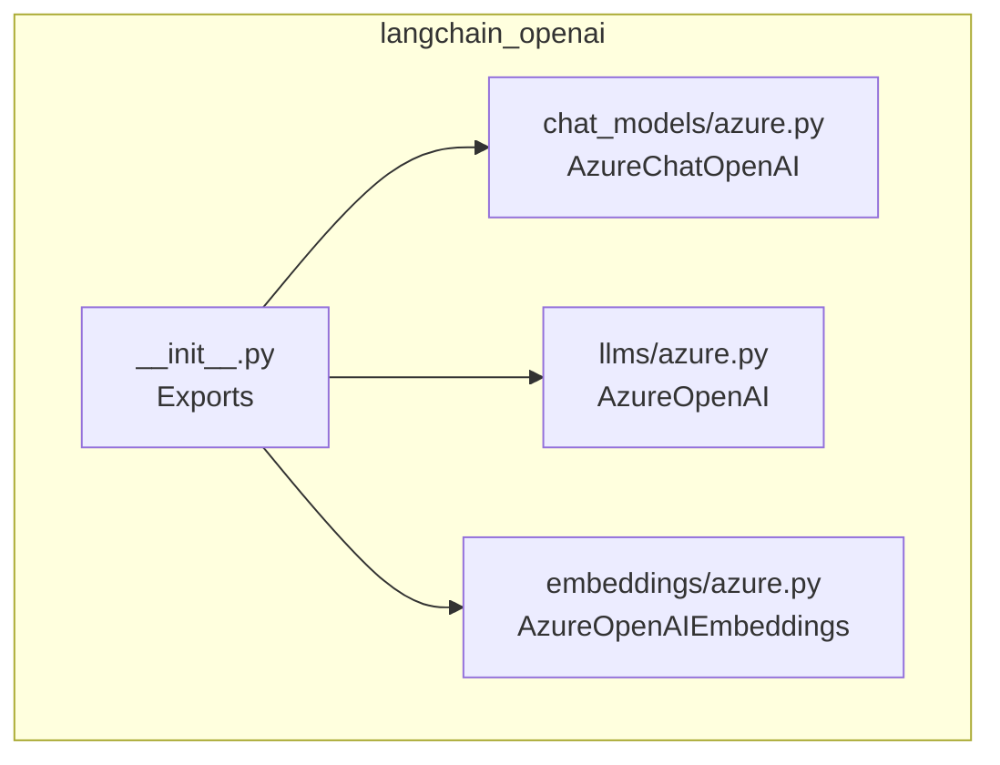
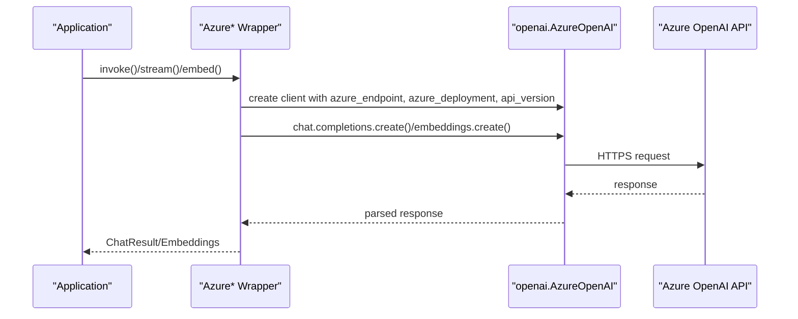
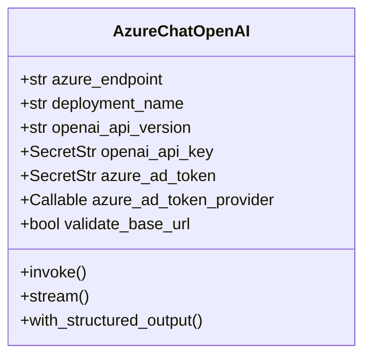
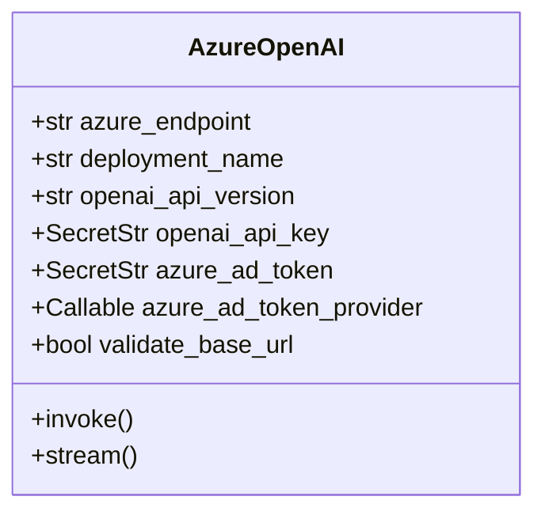
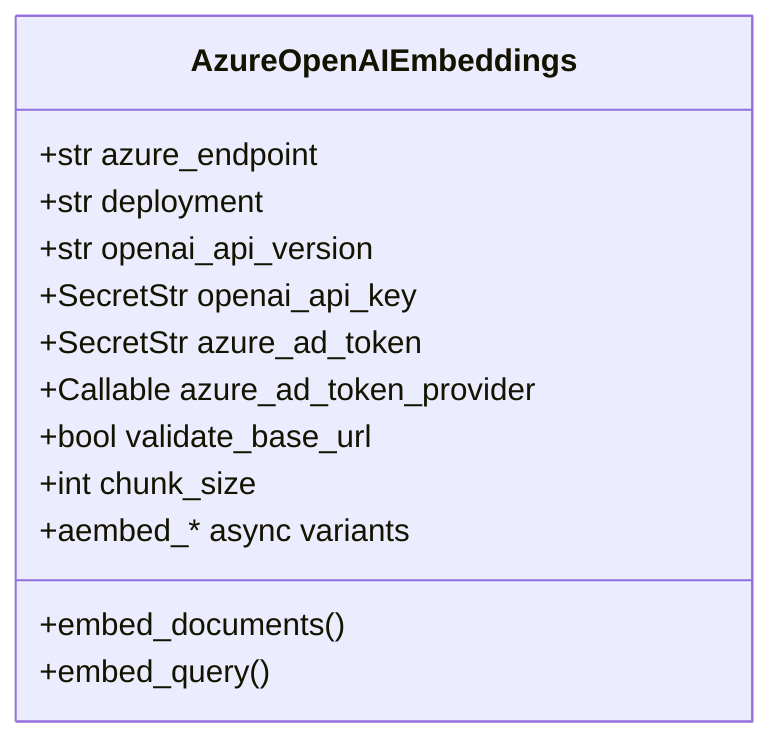
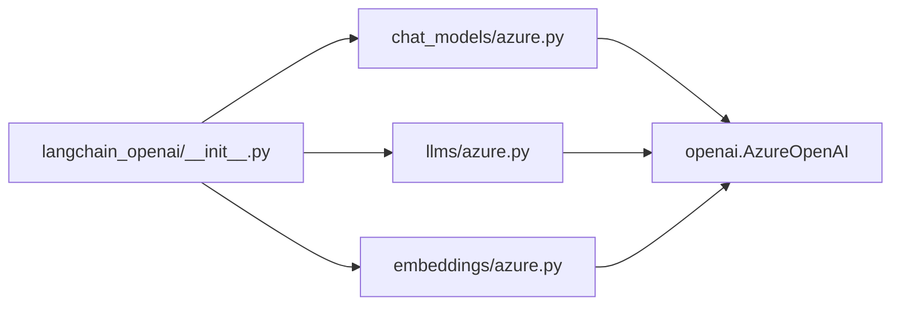

# Azure OpenAI Integration

<cite>
**Referenced Files in This Document**
- [azure.py](file://libs/partners/openai/langchain_openai/chat_models/azure.py)
- [azure.py](file://libs/partners/openai/langchain_openai/llms/azure.py)
- [azure.py](file://libs/partners/openai/langchain_openai/embeddings/azure.py)
- [__init__.py](file://libs/partners/openai/langchain_openai/__init__.py)
- [test_azure_embeddings.py](file://libs/partners/openai/tests/unit_tests/embeddings/test_azure_embeddings.py)
- [test_azure.py](file://libs/partners/openai/tests/unit_tests/llms/test_azure.py)
- [test_secrets.py](file://libs/partners/openai/tests/unit_tests/test_secrets.py)
</cite>

## Table of Contents
1. [Introduction](#introduction)
2. [Project Structure](#project-structure)
3. [Core Components](#core-components)
4. [Architecture Overview](#architecture-overview)
5. [Detailed Component Analysis](#detailed-component-analysis)
6. [Dependency Analysis](#dependency-analysis)
7. [Performance Considerations](#performance-considerations)
8. [Troubleshooting Guide](#troubleshooting-guide)
9. [Conclusion](#conclusion)

## Introduction
This document explains how LangChain integrates with Azure OpenAI through dedicated model wrappers for chat, text completions, and embeddings. It covers authentication mechanisms (API keys, Azure Active Directory tokens, and token providers), resource configuration (endpoints, deployments, API versions), and operational guidance for enterprise scenarios. It also outlines best practices for reliability, monitoring, and troubleshooting in cloud environments.

## Project Structure
LangChain’s Azure OpenAI integration lives in the `langchain_openai` partner package. The relevant components are:
- Chat models: AzureChatOpenAI
- Text completions: AzureOpenAI
- Embeddings: AzureOpenAIEmbeddings
- Public exports: exposed via langchain_openai.__init__

**Diagram sources**
- [azure.py](file://libs/partners/openai/langchain_openai/chat_models/azure.py#L34-L1165)
- [azure.py](file://libs/partners/openai/langchain_openai/llms/azure.py#L20-L233)
- [azure.py](file://libs/partners/openai/langchain_openai/embeddings/azure.py#L16-L231)
- [__init__.py](file://libs/partners/openai/langchain_openai/__init__.py#L3-L16)

**Section sources**
- [__init__.py](file://libs/partners/openai/langchain_openai/__init__.py#L3-L16)

## Core Components
- AzureChatOpenAI: Chat model wrapper supporting structured output, streaming, tool calling, and Azure-specific parameters (endpoint, deployment, API version).
- AzureOpenAI: Legacy text completion model wrapper with Azure-specific parameters.
- AzureOpenAIEmbeddings: Embedding model wrapper with Azure-specific parameters and batching support.

Key Azure-specific configuration fields:
- azure_endpoint: Azure OpenAI resource endpoint.
- deployment_name (chat) or azure_deployment (embeddings): Deployment identifier used to route requests.
- openai_api_version: Azure OpenAI REST API version.
- openai_api_key: API key credential.
- azure_ad_token / azure_ad_token_provider: Azure Active Directory token(s) and provider(s) for token-based auth.
- openai_api_type: Legacy field retained for compatibility.

Validation and defaults:
- Environment variables are automatically inferred for AZURE_OPENAI_API_KEY, AZURE_OPENAI_ENDPOINT, AZURE_OPENAI_API_VERSION, AZURE_OPENAI_AD_TOKEN.
- Strict validation prevents mixing legacy base_url with deployment-based routing.
- Default headers include a partner-specific User-Agent.

**Section sources**
- [azure.py](file://libs/partners/openai/langchain_openai/chat_models/azure.py#L461-L536)
- [azure.py](file://libs/partners/openai/langchain_openai/llms/azure.py#L37-L96)
- [azure.py](file://libs/partners/openai/langchain_openai/embeddings/azure.py#L98-L158)

## Architecture Overview
The Azure wrappers construct Azure OpenAI clients internally and delegate invocations to the underlying SDK. They enforce Azure-specific routing (deployment-based vs base_url) and provide consistent LangChain interfaces.

**Diagram sources**
- [azure.py](file://libs/partners/openai/langchain_openai/chat_models/azure.py#L662-L701)
- [azure.py](file://libs/partners/openai/langchain_openai/llms/azure.py#L177-L194)
- [azure.py](file://libs/partners/openai/langchain_openai/embeddings/azure.py#L208-L225)

## Detailed Component Analysis

### AzureChatOpenAI
- Purpose: Chat model integration with Azure OpenAI.
- Authentication:
  - AZURE_OPENAI_API_KEY environment variable or explicit api_key.
  - AZURE_OPENAI_AD_TOKEN or azure_ad_token_provider for AAD-based auth.
- Routing:
  - Prefer azure_endpoint + azure_deployment for deployment-based routing.
  - Reject legacy base_url mixing with deployment routing.
- Features:
  - Streaming and async streaming.
  - Structured output via with_structured_output().
  - Tool calling and function calling.
  - Responses API routing when applicable.

**Diagram sources**
- [azure.py](file://libs/partners/openai/langchain_openai/chat_models/azure.py#L461-L536)
- [azure.py](file://libs/partners/openai/langchain_openai/chat_models/azure.py#L796-L814)

**Section sources**
- [azure.py](file://libs/partners/openai/langchain_openai/chat_models/azure.py#L34-L459)
- [azure.py](file://libs/partners/openai/langchain_openai/chat_models/azure.py#L595-L702)
- [azure.py](file://libs/partners/openai/langchain_openai/chat_models/azure.py#L816-L832)
- [azure.py](file://libs/partners/openai/langchain_openai/chat_models/azure.py#L833-L1165)

### AzureOpenAI (Text Completions)
- Purpose: Legacy text completion model wrapper for Azure OpenAI.
- Authentication and routing mirror AzureChatOpenAI.
- Validation ensures correct endpoint semantics for Azure.

**Diagram sources**
- [azure.py](file://libs/partners/openai/langchain_openai/llms/azure.py#L37-L96)
- [azure.py](file://libs/partners/openai/langchain_openai/llms/azure.py#L120-L196)

**Section sources**
- [azure.py](file://libs/partners/openai/langchain_openai/llms/azure.py#L20-L233)

### AzureOpenAIEmbeddings
- Purpose: Embedding model wrapper for Azure OpenAI.
- Supports dimensionality specification for compatible models.
- Batch embedding with configurable chunk size.

**Diagram sources**
- [azure.py](file://libs/partners/openai/langchain_openai/embeddings/azure.py#L98-L160)
- [azure.py](file://libs/partners/openai/langchain_openai/embeddings/azure.py#L162-L226)

**Section sources**
- [azure.py](file://libs/partners/openai/langchain_openai/embeddings/azure.py#L16-L231)

### Authentication Methods

#### API Keys
- Configure AZURE_OPENAI_API_KEY or pass api_key directly.
- Environment variable AZURE_OPENAI_ENDPOINT is required for azure_endpoint.
- Environment variable AZURE_OPENAI_API_VERSION is recommended for openai_api_version.

**Section sources**
- [azure.py](file://libs/partners/openai/langchain_openai/chat_models/azure.py#L486-L491)
- [azure.py](file://libs/partners/openai/langchain_openai/llms/azure.py#L63-L68)
- [azure.py](file://libs/partners/openai/langchain_openai/embeddings/azure.py#L119-L124)

#### Azure Active Directory Tokens
- Use AZURE_OPENAI_AD_TOKEN or azure_ad_token_provider for AAD-based auth.
- Providers are invoked per request (sync/async) when supplied.

**Section sources**
- [azure.py](file://libs/partners/openai/langchain_openai/chat_models/azure.py#L493-L513)
- [azure.py](file://libs/partners/openai/langchain_openai/llms/azure.py#L69-L84)
- [azure.py](file://libs/partners/openai/langchain_openai/embeddings/azure.py#L135-L150)

#### Token Providers
- azure_ad_token_provider: synchronous provider invoked for each sync request.
- azure_ad_async_token_provider: asynchronous provider invoked for each async request.

**Section sources**
- [azure.py](file://libs/partners/openai/langchain_openai/chat_models/azure.py#L502-L513)
- [azure.py](file://libs/partners/openai/langchain_openai/llms/azure.py#L78-L84)
- [azure.py](file://libs/partners/openai/langchain_openai/embeddings/azure.py#L144-L150)

### Resource Configuration and Deployment Management
- azure_endpoint: Full Azure OpenAI resource endpoint (e.g., https://{resource}.openai.azure.com/).
- deployment_name (chat) or azure_deployment (embeddings): Identifies the model deployment.
- openai_api_version: Azure OpenAI REST API version string.
- Routing rules:
  - If azure_deployment is set, do not set base_url/base.
  - Legacy base_url mixing with deployment routing is rejected with guidance.

**Section sources**
- [azure.py](file://libs/partners/openai/langchain_openai/chat_models/azure.py#L461-L482)
- [azure.py](file://libs/partners/openai/langchain_openai/chat_models/azure.py#L637-L661)
- [azure.py](file://libs/partners/openai/langchain_openai/embeddings/azure.py#L98-L129)
- [azure.py](file://libs/partners/openai/langchain_openai/embeddings/azure.py#L167-L186)

### Regional Considerations
- azure_endpoint determines the region and sovereign cloud selection.
- Ensure the selected region supports the chosen model and API version.
- Keep AZURE_OPENAI_API_VERSION aligned with the target region’s capabilities.

**Section sources**
- [azure.py](file://libs/partners/openai/langchain_openai/chat_models/azure.py#L478-L482)
- [azure.py](file://libs/partners/openai/langchain_openai/embeddings/azure.py#L126-L129)

### Azure-Specific Features and Enterprise Security
- Structured output and tool calling are supported via AzureChatOpenAI.
- Token providers enable dynamic AAD token acquisition for secure, short-lived access.
- Default headers include a partner-specific User-Agent for telemetry.

**Section sources**
- [azure.py](file://libs/partners/openai/langchain_openai/chat_models/azure.py#L833-L1165)
- [azure.py](file://libs/partners/openai/langchain_openai/chat_models/azure.py#L676-L680)

### Examples and Usage Patterns
- Initialize AzureChatOpenAI with azure_deployment, api_version, and environment variables.
- Initialize AzureOpenAI with azure_endpoint, azure_deployment, and api_version.
- Initialize AzureOpenAIEmbeddings with model, azure_endpoint, azure_deployment, and api_version.

**Section sources**
- [azure.py](file://libs/partners/openai/langchain_openai/chat_models/azure.py#L82-L96)
- [azure.py](file://libs/partners/openai/langchain_openai/llms/azure.py#L29-L34)
- [azure.py](file://libs/partners/openai/langchain_openai/embeddings/azure.py#L49-L60)

## Dependency Analysis
The Azure wrappers depend on the official Azure OpenAI Python SDK and expose consistent LangChain interfaces. They validate inputs, construct client parameters, and route calls appropriately.

**Diagram sources**
- [__init__.py](file://libs/partners/openai/langchain_openai/__init__.py#L3-L16)
- [azure.py](file://libs/partners/openai/langchain_openai/chat_models/azure.py#L685-L701)
- [azure.py](file://libs/partners/openai/langchain_openai/llms/azure.py#L177-L194)
- [azure.py](file://libs/partners/openai/langchain_openai/embeddings/azure.py#L208-L225)

**Section sources**
- [__init__.py](file://libs/partners/openai/langchain_openai/__init__.py#L3-L16)

## Performance Considerations
- Use streaming for latency-sensitive scenarios (AzureChatOpenAI supports stream and astream).
- Configure max_retries and timeouts thoughtfully to balance resilience and latency.
- For embeddings, adjust chunk_size to optimize throughput while respecting service limits.
- Prefer deployment-based routing (azure_endpoint + azure_deployment) for predictable performance.

**Section sources**
- [azure.py](file://libs/partners/openai/langchain_openai/chat_models/azure.py#L682-L683)
- [azure.py](file://libs/partners/openai/langchain_openai/embeddings/azure.py#L158-L160)

## Troubleshooting Guide
Common issues and resolutions:
- Mixing base_url with deployment routing: The wrappers reject this configuration and provide guidance on correct usage.
- Missing AZURE_OPENAI_API_KEY or invalid AZURE_OPENAI_ENDPOINT: Ensure environment variables are set or pass credentials explicitly.
- Incorrect AZURE_OPENAI_API_VERSION: Align with the target region and model capabilities.
- Content filter errors: Responses with content_filter finish reasons raise errors; review prompts and filters.

Validation and masking:
- API keys and tokens are stored as SecretStr and masked in logs/secrets exposure.
- Unit tests verify secrets masking and proper initialization.

**Section sources**
- [azure.py](file://libs/partners/openai/langchain_openai/chat_models/azure.py#L637-L661)
- [azure.py](file://libs/partners/openai/langchain_openai/llms/azure.py#L132-L155)
- [azure.py](file://libs/partners/openai/langchain_openai/embeddings/azure.py#L167-L186)
- [test_secrets.py](file://libs/partners/openai/tests/unit_tests/test_secrets.py#L62-L100)
- [test_azure_embeddings.py](file://libs/partners/openai/tests/unit_tests/embeddings/test_azure_embeddings.py#L7-L28)
- [test_azure.py](file://libs/partners/openai/tests/unit_tests/llms/test_azure.py#L6-L23)

## Conclusion
LangChain’s Azure OpenAI integration provides robust, enterprise-grade wrappers for chat, text completions, and embeddings. By leveraging environment variables, AAD token providers, and strict routing validation, it simplifies secure and reliable deployment in Azure environments. Follow the configuration guidance, monitor performance, and apply the troubleshooting tips to operate effectively at scale.