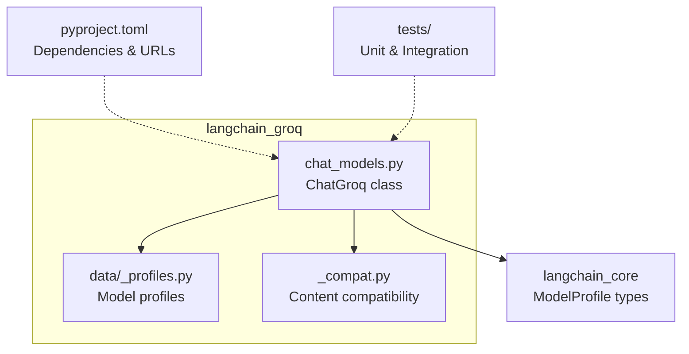
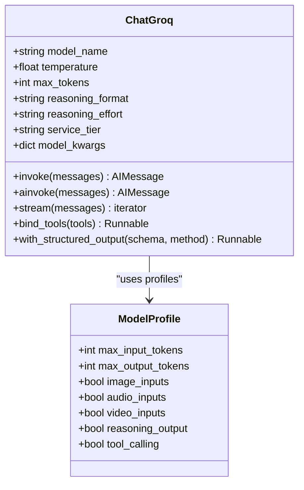
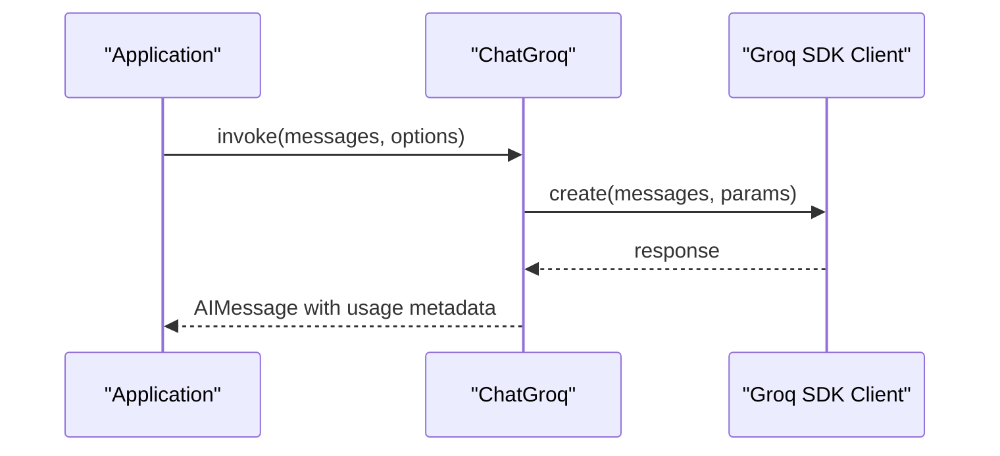
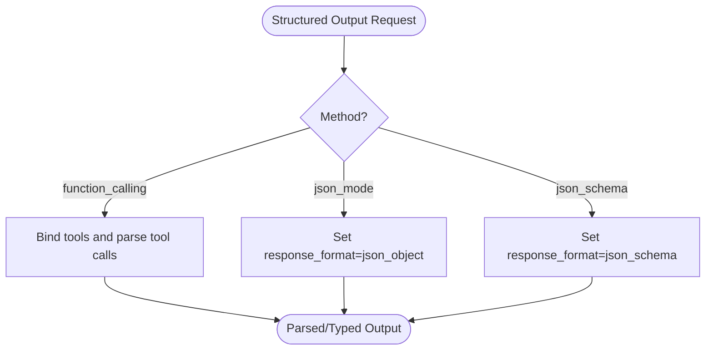
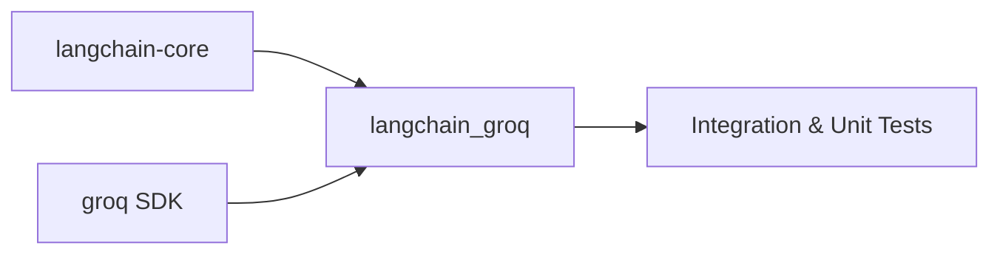

# Groq Integration

<cite>
**Referenced Files in This Document**
- [chat_models.py](file://libs/partners/groq/langchain_groq/chat_models.py)
- [_profiles.py](file://libs/partners/groq/langchain_groq/data/_profiles.py)
- [_compat.py](file://libs/partners/groq/langchain_groq/_compat.py)
- [pyproject.toml](file://libs/partners/groq/pyproject.toml)
- [README.md](file://libs/partners/groq/README.md)
- [test_chat_models.py](file://libs/partners/groq/tests/unit_tests/test_chat_models.py)
- [test_chat_models.py](file://libs/partners/groq/tests/integration_tests/test_chat_models.py)
- [model_profile.py](file://libs/core/langchain_core/language_models/model_profile.py)
</cite>

## Table of Contents
1. [Introduction](#introduction)
2. [Project Structure](#project-structure)
3. [Core Components](#core-components)
4. [Architecture Overview](#architecture-overview)
5. [Detailed Component Analysis](#detailed-component-analysis)
6. [Dependency Analysis](#dependency-analysis)
7. [Performance Considerations](#performance-considerations)
8. [Troubleshooting Guide](#troubleshooting-guide)
9. [Conclusion](#conclusion)

## Introduction
This document explains how to integrate Groq with LangChain to achieve high-performance inference. It covers authentication, model selection, Groq-specific features such as reasoning output, service tiers, and structured outputs, plus practical guidance for latency optimization and performance monitoring. The integration exposes a ChatGroq class that conforms to LangChain's chat model interface and leverages the official Groq SDK under the hood.

## Project Structure
The Groq integration is implemented as a LangChain partner package with:
- A primary chat model implementation
- Model capability profiles
- Compatibility helpers for content translation
- Package metadata and tests

**Diagram sources**
- [chat_models.py](file://libs/partners/groq/langchain_groq/chat_models.py#L81-L1564)
- [_profiles.py](file://libs/partners/groq/langchain_groq/data/_profiles.py#L1-L224)
- [_compat.py](file://libs/partners/groq/langchain_groq/_compat.py#L1-L72)
- [pyproject.toml](file://libs/partners/groq/pyproject.toml#L1-L116)
- [model_profile.py](file://libs/core/langchain_core/language_models/model_profile.py#L1-L86)

**Section sources**
- [chat_models.py](file://libs/partners/groq/langchain_groq/chat_models.py#L1-L1564)
- [_profiles.py](file://libs/partners/groq/langchain_groq/data/_profiles.py#L1-L224)
- [_compat.py](file://libs/partners/groq/langchain_groq/_compat.py#L1-L72)
- [pyproject.toml](file://libs/partners/groq/pyproject.toml#L1-L116)
- [README.md](file://libs/partners/groq/README.md#L1-L29)

## Core Components
- ChatGroq: The main chat model class exposing LangChain’s chat interface and integrating with the Groq SDK. It supports synchronous and asynchronous invocation, streaming, tool calling, structured outputs, and reasoning features.
- Model Profiles: A registry mapping model names to capabilities such as input/output modalities, tool calling, and reasoning support.
- Compatibility Helpers: Utilities to translate between LangChain message formats and Groq payload formats, including reasoning and tool execution blocks.

Key capabilities:
- Authentication via environment variables or explicit API key
- Service tiers (on-demand, flex, auto) for balancing performance and reliability
- Structured output modes (function calling, JSON mode, JSON schema)
- Reasoning output formats (parsed, raw, hidden) and effort levels
- Streaming with token usage metadata and tool call chunks

**Section sources**
- [chat_models.py](file://libs/partners/groq/langchain_groq/chat_models.py#L81-L1564)
- [_profiles.py](file://libs/partners/groq/langchain_groq/data/_profiles.py#L18-L224)
- [_compat.py](file://libs/partners/groq/langchain_groq/_compat.py#L9-L72)
- [model_profile.py](file://libs/core/langchain_core/language_models/model_profile.py#L6-L86)

## Architecture Overview
The ChatGroq class wraps the Groq SDK client and translates LangChain messages to Groq-compatible payloads. It supports both sync and async flows, streaming, and structured outputs.

**Diagram sources**
- [chat_models.py](file://libs/partners/groq/langchain_groq/chat_models.py#L81-L1564)
- [_profiles.py](file://libs/partners/groq/langchain_groq/data/_profiles.py#L18-L224)
- [model_profile.py](file://libs/core/langchain_core/language_models/model_profile.py#L6-L86)

## Detailed Component Analysis

### ChatGroq Class
- Purpose: Provide a LangChain-compatible chat interface backed by Groq.
- Authentication: Reads GROQ_API_KEY from environment by default; can also accept an explicit api_key parameter.
- Service Tiers: on_demand, flex, auto; configurable at initialization or per-request.
- Structured Outputs: Supports function_calling, json_mode, and json_schema depending on model support.
- Reasoning: Supports reasoning_format (parsed/raw/hidden) and reasoning_effort (low/medium/high/none).
- Streaming: Emits token chunks with usage metadata and tool call deltas.
- Tool Calling: Converts LangChain tool definitions to Groq-compatible tool calls.

**Diagram sources**
- [chat_models.py](file://libs/partners/groq/langchain_groq/chat_models.py#L600-L640)

**Section sources**
- [chat_models.py](file://libs/partners/groq/langchain_groq/chat_models.py#L81-L1564)

### Model Profiles
- Provides capability metadata for models (context windows, multimodality, tool calling, reasoning).
- Used to set defaults on ChatGroq instances when not explicitly configured.

Supported model capabilities include:
- Context window sizes (max_input_tokens, max_output_tokens)
- Multimodal inputs/outputs (images, audio, video)
- Reasoning output support
- Tool calling support

**Section sources**
- [_profiles.py](file://libs/partners/groq/langchain_groq/data/_profiles.py#L18-L224)
- [model_profile.py](file://libs/core/langchain_core/language_models/model_profile.py#L6-L86)

### Content Compatibility
- Translates LangChain v1 content blocks to Groq payloads, including reasoning and server-side tool execution.
- Ensures tool call arguments are normalized and compatible with Groq expectations.

**Section sources**
- [_compat.py](file://libs/partners/groq/langchain_groq/_compat.py#L9-L72)

### Structured Output Modes
- Function Calling: Uses tool-calling APIs; returns tool calls parsed into structured data.
- JSON Mode: Forces JSON output via response_format; requires instructions to format output.
- JSON Schema: Uses Groq’s native structured output API for supported models.

**Diagram sources**
- [chat_models.py](file://libs/partners/groq/langchain_groq/chat_models.py#L894-L1256)

**Section sources**
- [chat_models.py](file://libs/partners/groq/langchain_groq/chat_models.py#L894-L1256)

### Reasoning Features
- reasoning_format controls how reasoning is returned:
  - parsed: separate reasoning_content field
  - raw: reasoning embedded in think tags
  - hidden: reasoning suppressed, still performed unless effort is disabled
- reasoning_effort controls reasoning intensity (low/medium/high/none) and is supported by select models.

**Section sources**
- [chat_models.py](file://libs/partners/groq/langchain_groq/chat_models.py#L357-L380)
- [test_chat_models.py](file://libs/partners/groq/tests/integration_tests/test_chat_models.py#L227-L361)

### Streaming and Usage Metadata
- Streaming emits chunks with incremental content and usage metadata.
- Usage metadata includes input/output token counts and details such as cached tokens and reasoning tokens.

**Section sources**
- [chat_models.py](file://libs/partners/groq/langchain_groq/chat_models.py#L641-L747)
- [test_chat_models.py](file://libs/partners/groq/tests/unit_tests/test_chat_models.py#L712-L798)

## Dependency Analysis
- LangChain Core: Depends on langchain-core>=1.1.0,<2.0.0 for base chat model interfaces and utilities.
- Groq SDK: Depends on groq>=0.30.0,<1.0.0 for API access.
- Tests: Use pytest and VCR fixtures for integration tests.

**Diagram sources**
- [pyproject.toml](file://libs/partners/groq/pyproject.toml#L14-L17)

**Section sources**
- [pyproject.toml](file://libs/partners/groq/pyproject.toml#L1-L116)

## Performance Considerations
- Service Tier Selection
  - on_demand: default, fastest throughput when capacity is available
  - flex: balances performance and reliability; may timeout under resource constraints
  - auto: falls back to flex when on-demand limits are exceeded
- Latency Optimization
  - Prefer streaming for real-time feedback and early token availability
  - Reduce max_tokens for shorter responses
  - Use tool_choice to constrain model behavior and reduce unnecessary reasoning
- Monitoring
  - Inspect response_metadata for token usage and service tier
  - Aggregate usage across runs using _combine_llm_outputs
  - Track finish_reason and system_fingerprint for diagnostics

Practical tips:
- Set service_tier="flex" for bursty workloads expecting occasional timeouts
- Set service_tier="auto" to dynamically adapt to capacity
- Use structured outputs to reduce post-processing overhead
- Enable streaming to surface usage metadata incrementally

**Section sources**
- [chat_models.py](file://libs/partners/groq/langchain_groq/chat_models.py#L419-L432)
- [test_chat_models.py](file://libs/partners/groq/tests/integration_tests/test_chat_models.py#L555-L668)
- [test_chat_models.py](file://libs/partners/groq/tests/unit_tests/test_chat_models.py#L809-L843)

## Troubleshooting Guide
Common issues and resolutions:
- Missing GROQ_API_KEY
  - Ensure the environment variable is set or pass api_key explicitly
- Invalid service_tier
  - Only "on_demand", "flex", "auto" are accepted; invalid values raise errors
- Streaming with n>1
  - Streaming requires n=1; raises ValueError otherwise
- Tool Choice Constraints
  - tool_choice=True is only valid with a single tool; otherwise raises ValueError
- Structured Output Method
  - json_mode disables streaming and stop sequences; ensure instructions are clear
- Usage Metadata Variants
  - Both new Responses API and legacy Chat Completions API formats are supported

**Section sources**
- [chat_models.py](file://libs/partners/groq/langchain_groq/chat_models.py#L484-L530)
- [test_chat_models.py](file://libs/partners/groq/tests/integration_tests/test_chat_models.py#L582-L586)
- [test_chat_models.py](file://libs/partners/groq/tests/integration_tests/test_chat_models.py#L244-L254)
- [test_chat_models.py](file://libs/partners/groq/tests/integration_tests/test_chat_models.py#L434-L456)
- [test_chat_models.py](file://libs/partners/groq/tests/unit_tests/test_chat_models.py#L295-L495)

## Conclusion
The Groq integration for LangChain provides a robust, high-performance pathway to leverage Groq’s optimized inference runtime. By combining service tier tuning, structured outputs, and streaming, applications can achieve low-latency, reliable responses. Use model profiles to understand capabilities, monitor usage metadata for observability, and configure authentication and timeouts thoughtfully for production deployments.