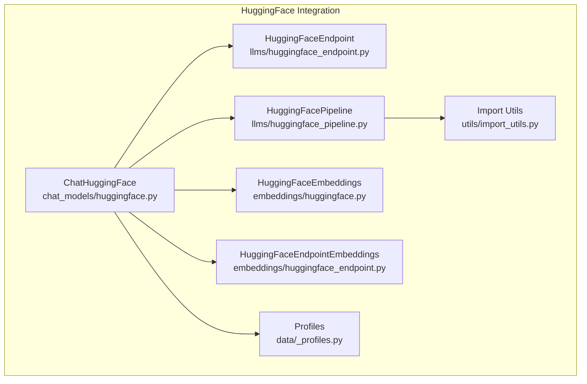
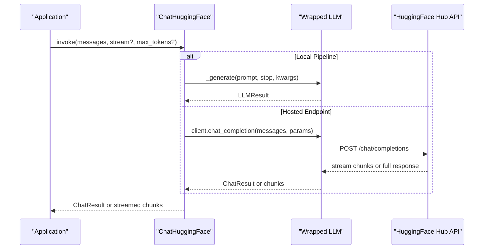
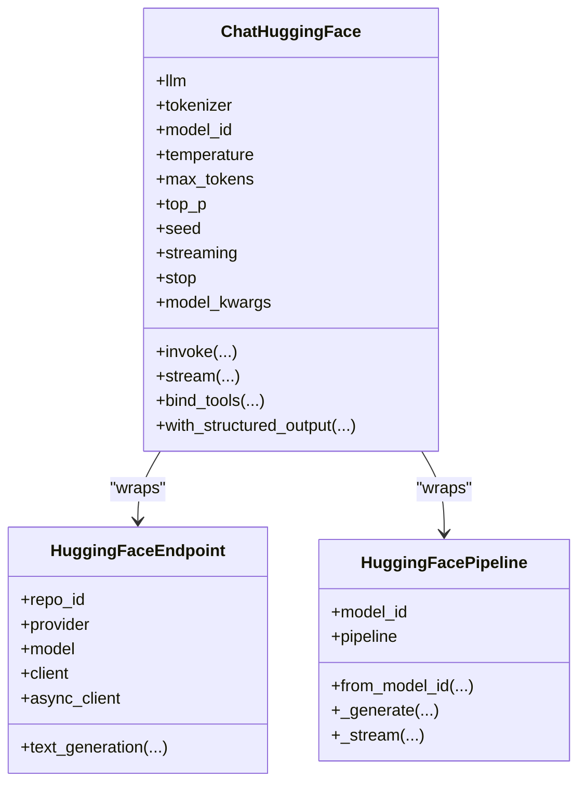
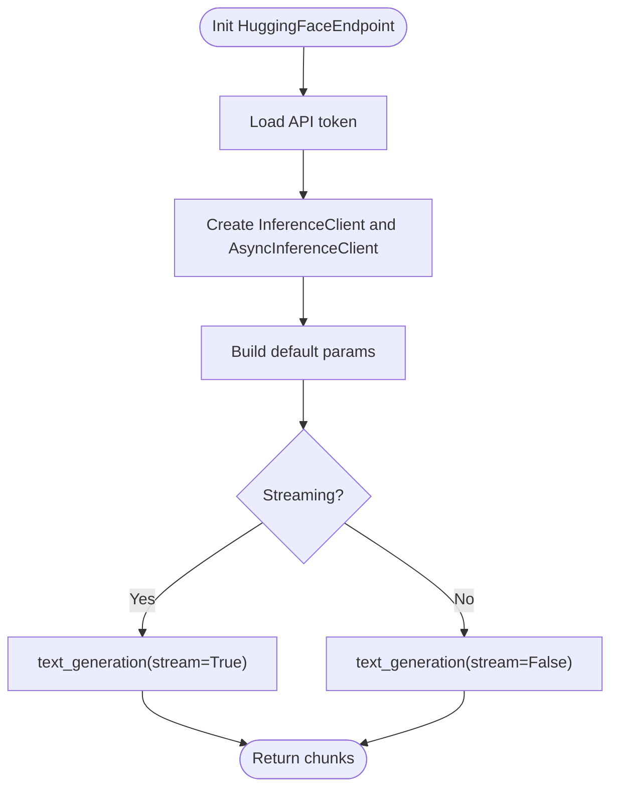
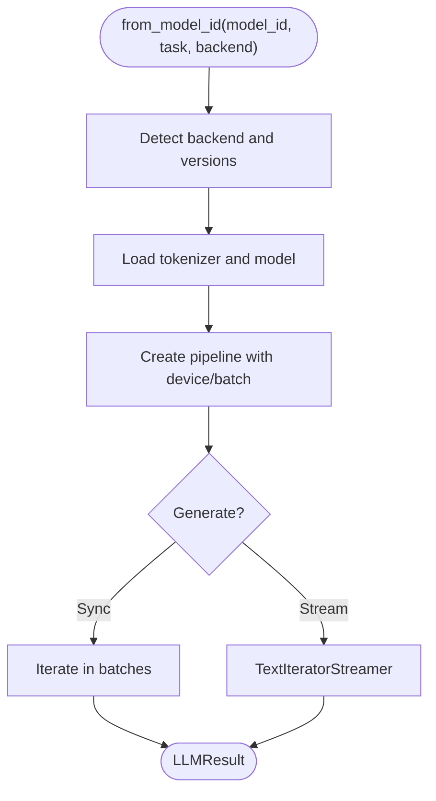
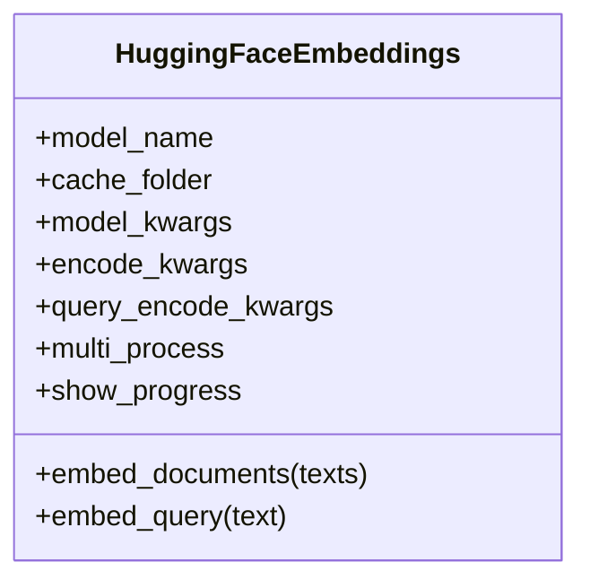
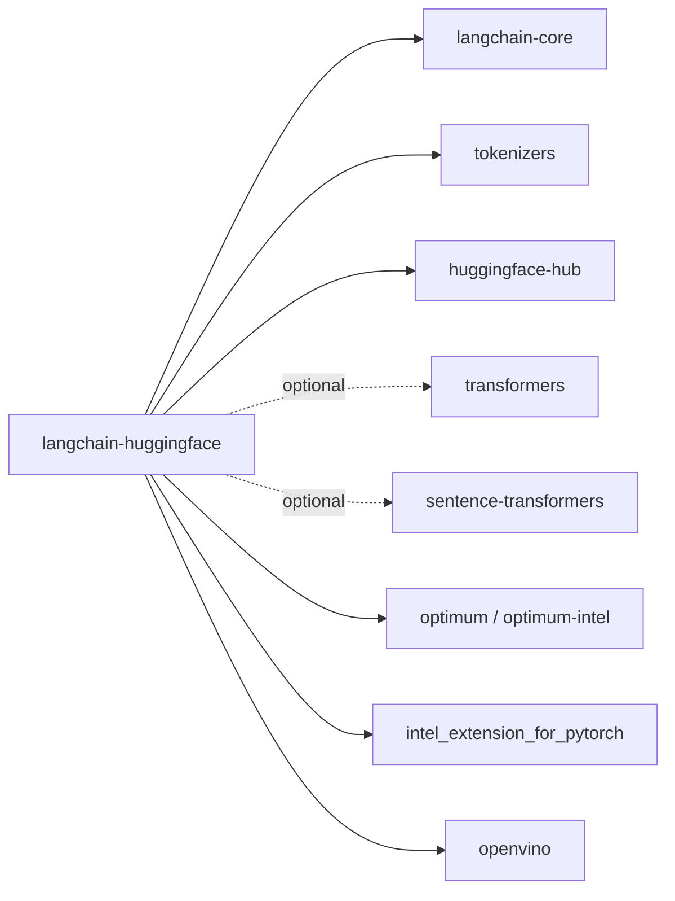

# HuggingFace Integration

<cite>
**Referenced Files in This Document**
- [__init__.py](file://libs/partners/huggingface/langchain_huggingface/__init__.py)
- [huggingface.py](file://libs/partners/huggingface/langchain_huggingface/chat_models/huggingface.py)
- [huggingface_endpoint.py](file://libs/partners/huggingface/langchain_huggingface/llms/huggingface_endpoint.py)
- [huggingface_pipeline.py](file://libs/partners/huggingface/langchain_huggingface/llms/huggingface_pipeline.py)
- [huggingface.py](file://libs/partners/huggingface/langchain_huggingface/embeddings/huggingface.py)
- [huggingface_endpoint.py](file://libs/partners/huggingface/langchain_huggingface/embeddings/huggingface_endpoint.py)
- [import_utils.py](file://libs/partners/huggingface/langchain_huggingface/utils/import_utils.py)
- [_profiles.py](file://libs/partners/huggingface/langchain_huggingface/data/_profiles.py)
- [README.md](file://libs/partners/huggingface/README.md)
- [pyproject.toml](file://libs/partners/huggingface/pyproject.toml)
- [test_huggingface_pipeline.py](file://libs/partners/huggingface/tests/unit_tests/test_huggingface_pipeline.py)
- [test_llms.py](file://libs/partners/huggingface/tests/integration_tests/test_llms.py)
- [test_chat_models.py](file://libs/partners/huggingface/tests/unit_tests/test_chat_models.py)
</cite>

## Table of Contents
1. [Introduction](#introduction)
2. [Project Structure](#project-structure)
3. [Core Components](#core-components)
4. [Architecture Overview](#architecture-overview)
5. [Detailed Component Analysis](#detailed-component-analysis)
6. [Dependency Analysis](#dependency-analysis)
7. [Performance Considerations](#performance-considerations)
8. [Troubleshooting Guide](#troubleshooting-guide)
9. [Conclusion](#conclusion)
10. [Appendices](#appendices)

## Introduction
This document explains how LangChain integrates with HuggingFace across three primary capabilities:
- HuggingFace Hub integration for hosted inference endpoints
- Local model loading via HuggingFace Transformers pipelines
- Embedding generation using both local and hosted models

It covers authentication setup, model selection, configuration options for different model types (text-generation, embeddings, etc.), HuggingFace-specific features such as quantization, GPU acceleration, and batch processing, plus practical examples and best practices for performance optimization, model management, caching, and cost considerations.

## Project Structure
The HuggingFace integration lives under libs/partners/huggingface and exposes:
- Chat models wrapper for unified chat interface
- LLMs for hosted endpoints and local pipelines
- Embeddings for sentence-transformers and hosted inference
- Utilities for hardware acceleration detection
- Data profiles for model metadata

**Diagram sources**
- [huggingface.py](file://libs/partners/huggingface/langchain_huggingface/chat_models/huggingface.py#L324-L1248)
- [huggingface_endpoint.py](file://libs/partners/huggingface/langchain_huggingface/llms/huggingface_endpoint.py#L29-L456)
- [huggingface_pipeline.py](file://libs/partners/huggingface/langchain_huggingface/llms/huggingface_pipeline.py#L37-L423)
- [huggingface.py](file://libs/partners/huggingface/langchain_huggingface/embeddings/huggingface.py#L18-L173)
- [huggingface_endpoint.py](file://libs/partners/huggingface/langchain_huggingface/embeddings/huggingface_endpoint.py#L15-L173)
- [import_utils.py](file://libs/partners/huggingface/langchain_huggingface/utils/import_utils.py#L1-L115)
- [_profiles.py](file://libs/partners/huggingface/langchain_huggingface/data/_profiles.py#L1-L188)

**Section sources**
- [__init__.py](file://libs/partners/huggingface/langchain_huggingface/__init__.py#L1-L22)
- [README.md](file://libs/partners/huggingface/README.md#L1-L33)

## Core Components
- ChatHuggingFace: Unified chat interface supporting hosted endpoints, local pipelines, and embedding models. Handles message conversion, streaming, tool/function calling, and structured output binding.
- HuggingFaceEndpoint: Hosted inference client backed by HuggingFace Hub’s Inference API, supporting streaming and various generation parameters.
- HuggingFacePipeline: Local model loader using Transformers pipelines with optional hardware acceleration backends (OpenVINO, IPEX) and batching.
- HuggingFaceEmbeddings: Local embeddings using sentence-transformers with multi-process encoding support.
- HuggingFaceEndpointEmbeddings: Hosted embeddings via HuggingFace Hub’s Inference API.
- Import Utils: Detects availability of hardware acceleration libraries and versions.
- Profiles: Predefined model metadata for capability hints (tool calling, reasoning, inputs/outputs).

**Section sources**
- [huggingface.py](file://libs/partners/huggingface/langchain_huggingface/chat_models/huggingface.py#L324-L1248)
- [huggingface_endpoint.py](file://libs/partners/huggingface/langchain_huggingface/llms/huggingface_endpoint.py#L29-L456)
- [huggingface_pipeline.py](file://libs/partners/huggingface/langchain_huggingface/llms/huggingface_pipeline.py#L37-L423)
- [huggingface.py](file://libs/partners/huggingface/langchain_huggingface/embeddings/huggingface.py#L18-L173)
- [huggingface_endpoint.py](file://libs/partners/huggingface/langchain_huggingface/embeddings/huggingface_endpoint.py#L15-L173)
- [import_utils.py](file://libs/partners/huggingface/langchain_huggingface/utils/import_utils.py#L1-L115)
- [_profiles.py](file://libs/partners/huggingface/langchain_huggingface/data/_profiles.py#L1-L188)

## Architecture Overview
The integration provides two primary paths:
- Hosted path: Uses HuggingFaceEndpoint and HuggingFaceEndpointEmbeddings to call the Hub’s Inference API.
- Local path: Uses HuggingFacePipeline to run models locally with optional hardware acceleration.

ChatHuggingFace unifies both paths and normalizes message formats, tool/function calling, and streaming.

**Diagram sources**
- [huggingface.py](file://libs/partners/huggingface/langchain_huggingface/chat_models/huggingface.py#L723-L801)
- [huggingface_endpoint.py](file://libs/partners/huggingface/langchain_huggingface/llms/huggingface_endpoint.py#L324-L382)

## Detailed Component Analysis

### ChatHuggingFace
- Purpose: Provides a unified chat interface across hosted endpoints, local pipelines, and embeddings.
- Key features:
  - Message conversion between LangChain and ChatML/HuggingFace formats
  - Parameter inheritance from wrapped LLMs (e.g., temperature, max_new_tokens, streaming)
  - Tool/function calling binding and structured output modes
  - Streaming support for hosted endpoints and local pipelines
  - Model profile resolution for capability hints
- Supported backends: HuggingFaceEndpoint, HuggingFacePipeline, and legacy integrations.

**Diagram sources**
- [huggingface.py](file://libs/partners/huggingface/langchain_huggingface/chat_models/huggingface.py#L324-L1248)
- [huggingface_endpoint.py](file://libs/partners/huggingface/langchain_huggingface/llms/huggingface_endpoint.py#L29-L456)
- [huggingface_pipeline.py](file://libs/partners/huggingface/langchain_huggingface/llms/huggingface_pipeline.py#L37-L423)

**Section sources**
- [huggingface.py](file://libs/partners/huggingface/langchain_huggingface/chat_models/huggingface.py#L324-L1248)

### HuggingFaceEndpoint
- Purpose: Connects to hosted inference endpoints via HuggingFace Hub’s Inference API.
- Authentication: Requires an API token via environment variable or constructor parameter.
- Configuration: Supports streaming, stop sequences, temperature, top-p, repetition penalty, watermarking, and provider selection.
- Backends: Works with any model/task supported by the Hub’s Inference API.

**Diagram sources**
- [huggingface_endpoint.py](file://libs/partners/huggingface/langchain_huggingface/llms/huggingface_endpoint.py#L232-L280)
- [huggingface_endpoint.py](file://libs/partners/huggingface/langchain_huggingface/llms/huggingface_endpoint.py#L324-L456)

**Section sources**
- [huggingface_endpoint.py](file://libs/partners/huggingface/langchain_huggingface/llms/huggingface_endpoint.py#L29-L456)

### HuggingFacePipeline
- Purpose: Runs models locally using Transformers pipelines.
- Hardware acceleration: Detects and uses OpenVINO and IPEX backends when available and meet version requirements.
- Batching: Processes prompts in batches to improve throughput.
- Streaming: Uses TextIteratorStreamer for token streaming with stopping criteria.

**Diagram sources**
- [huggingface_pipeline.py](file://libs/partners/huggingface/langchain_huggingface/llms/huggingface_pipeline.py#L105-L301)
- [huggingface_pipeline.py](file://libs/partners/huggingface/langchain_huggingface/llms/huggingface_pipeline.py#L316-L423)
- [import_utils.py](file://libs/partners/huggingface/langchain_huggingface/utils/import_utils.py#L1-L115)

**Section sources**
- [huggingface_pipeline.py](file://libs/partners/huggingface/langchain_huggingface/llms/huggingface_pipeline.py#L37-L423)
- [import_utils.py](file://libs/partners/huggingface/langchain_huggingface/utils/import_utils.py#L1-L115)

### HuggingFaceEmbeddings
- Purpose: Computes embeddings using sentence-transformers locally.
- Features: Multi-process encoding, progress reporting, and backend selection (IPEX via Optimum).
- Configuration: model_name, cache_folder, model_kwargs, encode_kwargs, query_encode_kwargs.

**Diagram sources**
- [huggingface.py](file://libs/partners/huggingface/langchain_huggingface/embeddings/huggingface.py#L18-L173)

**Section sources**
- [huggingface.py](file://libs/partners/huggingface/langchain_huggingface/embeddings/huggingface.py#L18-L173)

### HuggingFaceEndpointEmbeddings
- Purpose: Computes embeddings via hosted inference endpoints.
- Task: feature-extraction.
- Provider: Selectable provider for inference.

**Section sources**
- [huggingface_endpoint.py](file://libs/partners/huggingface/langchain_huggingface/embeddings/huggingface_endpoint.py#L15-L173)

### Profiles and Model Management
- Profiles: Predefined metadata for models (max input/output tokens, tool calling, reasoning, media inputs/outputs).
- Usage: ChatHuggingFace resolves model profiles based on model_id for capability hints.

**Section sources**
- [_profiles.py](file://libs/partners/huggingface/langchain_huggingface/data/_profiles.py#L1-L188)
- [huggingface.py](file://libs/partners/huggingface/langchain_huggingface/chat_models/huggingface.py#L79-L82)

## Dependency Analysis
External dependencies and optional extras:
- Required: langchain-core, tokenizers, huggingface-hub
- Optional extras: transformers and sentence-transformers for local pipelines and embeddings
- Internal dependencies: import_utils for hardware acceleration checks

**Diagram sources**
- [pyproject.toml](file://libs/partners/huggingface/pyproject.toml#L14-L33)
- [import_utils.py](file://libs/partners/huggingface/langchain_huggingface/utils/import_utils.py#L1-L115)

**Section sources**
- [pyproject.toml](file://libs/partners/huggingface/pyproject.toml#L1-L151)

## Performance Considerations
- Local acceleration:
  - OpenVINO and IPEX backends can improve throughput on supported hardware. Version checks are enforced.
  - Device selection and device_map influence GPU/CPU utilization; conflicts are detected and warned.
- Batching:
  - HuggingFacePipeline supports configurable batch_size to process multiple prompts efficiently.
- Streaming:
  - Both hosted and local paths support streaming for responsive generation.
- Embeddings:
  - sentence-transformers multi-process encoding can utilize multiple CPUs/GPUs.
- Token limits and costs:
  - Profiles provide max input/output tokens per model; use them to estimate usage and costs for hosted endpoints.

[No sources needed since this section provides general guidance]

## Troubleshooting Guide
Common issues and resolutions:
- Missing API token:
  - Ensure the HuggingFace API token is configured via environment variable or constructor parameter for hosted models.
- Import errors:
  - Install optional dependencies (transformers, sentence-transformers) when using local pipelines or embeddings.
- Backend version mismatches:
  - Hardware acceleration backends require minimum versions; ImportError messages indicate required packages and versions.
- Device/device_map conflicts:
  - Avoid setting both device and device_map; warnings are issued when models are already loaded in low-bit configurations.
- Model not found or access denied:
  - Confirm model visibility and permissions for hosted endpoints; model_id resolution relies on endpoint lists.

**Section sources**
- [huggingface_endpoint.py](file://libs/partners/huggingface/langchain_huggingface/llms/huggingface_endpoint.py#L232-L280)
- [huggingface_pipeline.py](file://libs/partners/huggingface/langchain_huggingface/llms/huggingface_pipeline.py#L118-L178)
- [huggingface.py](file://libs/partners/huggingface/langchain_huggingface/embeddings/huggingface.py#L67-L95)
- [huggingface.py](file://libs/partners/huggingface/langchain_huggingface/chat_models/huggingface.py#L994-L1030)

## Conclusion
LangChain’s HuggingFace integration offers a cohesive developer experience across hosted and local model execution, unified chat interfaces, and embeddings. It supports modern performance features like hardware acceleration backends, batching, and streaming, while providing model profiles and robust error handling. Choose the hosted path for managed scalability and the local path for privacy and customization, and leverage profiles and batching to optimize performance and costs.

[No sources needed since this section summarizes without analyzing specific files]

## Appendices

### Practical Examples and Patterns
- Connecting to hosted models:
  - Use HuggingFaceEndpoint with repo_id and provider to target hosted inference endpoints.
  - Enable streaming for real-time generation and configure stop sequences and generation parameters.
- Running local models:
  - Use HuggingFacePipeline.from_model_id with model_id and task; select backend (default/OpenVINO/IPEX) and device.
  - Adjust batch_size for throughput and enable streaming for responsive output.
- Embeddings:
  - Use HuggingFaceEmbeddings for local embeddings with multi-process encoding.
  - Use HuggingFaceEndpointEmbeddings for hosted embeddings with feature-extraction task.

**Section sources**
- [huggingface_endpoint.py](file://libs/partners/huggingface/langchain_huggingface/llms/huggingface_endpoint.py#L29-L165)
- [huggingface_pipeline.py](file://libs/partners/huggingface/langchain_huggingface/llms/huggingface_pipeline.py#L105-L301)
- [huggingface.py](file://libs/partners/huggingface/langchain_huggingface/embeddings/huggingface.py#L18-L96)
- [huggingface_endpoint.py](file://libs/partners/huggingface/langchain_huggingface/embeddings/huggingface_endpoint.py#L15-L113)

### Best Practices
- Authentication:
  - Store HuggingFace API tokens securely via environment variables or secret managers.
- Model selection:
  - Prefer hosted endpoints for large models or when compute is constrained; use local pipelines for sensitive data or offline scenarios.
- Hardware acceleration:
  - Validate backend availability and versions before enabling OpenVINO/IPEX.
- Caching:
  - Use cache_folder for sentence-transformers and leverage model downloads caching to reduce latency.
- Cost considerations:
  - Monitor token usage via profiles and streaming metadata; adjust max_new_tokens and stop sequences to control costs.

**Section sources**
- [huggingface.py](file://libs/partners/huggingface/langchain_huggingface/embeddings/huggingface.py#L42-L48)
- [huggingface.py](file://libs/partners/huggingface/langchain_huggingface/chat_models/huggingface.py#L803-L820)