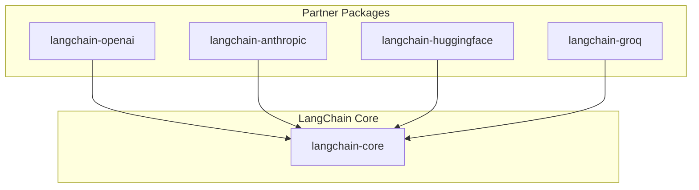
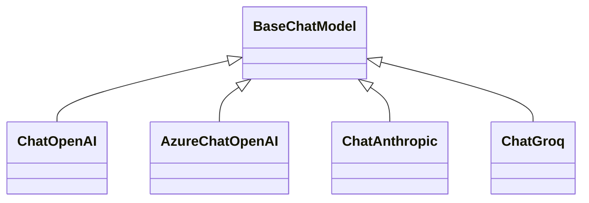
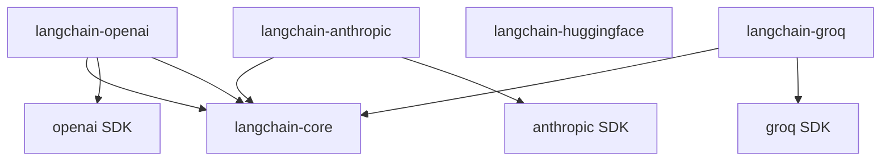

# Major Providers

<cite>
**Referenced Files in This Document**
- [libs/partners/openai/README.md](file://libs/partners/openai/README.md)
- [libs/partners/openai/pyproject.toml](file://libs/partners/openai/pyproject.toml)
- [libs/partners/openai/langchain_openai/__init__.py](file://libs/partners/openai/langchain_openai/__init__.py)
- [libs/partners/anthropic/README.md](file://libs/partners/anthropic/README.md)
- [libs/partners/anthropic/langchain_anthropic/__init__.py](file://libs/partners/anthropic/langchain_anthropic/__init__.py)
- [libs/partners/anthropic/langchain_anthropic/chat_models.py](file://libs/partners/anthropic/langchain_anthropic/chat_models.py)
- [libs/partners/huggingface/README.md](file://libs/partners/huggingface/README.md)
- [libs/partners/huggingface/langchain_huggingface/__init__.py](file://libs/partners/huggingface/langchain_huggingface/__init__.py)
- [libs/partners/groq/README.md](file://libs/partners/groq/README.md)
- [libs/partners/groq/langchain_groq/__init__.py](file://libs/partners/groq/langchain_groq/__init__.py)
- [libs/partners/groq/langchain_groq/chat_models.py](file://libs/partners/groq/langchain_groq/chat_models.py)
</cite>

## Table of Contents
1. [Introduction](#introduction)
2. [Project Structure](#project-structure)
3. [Core Components](#core-components)
4. [Architecture Overview](#architecture-overview)
5. [Detailed Provider Analysis](#detailed-provider-analysis)
6. [Dependency Analysis](#dependency-analysis)
7. [Performance Considerations](#performance-considerations)
8. [Troubleshooting Guide](#troubleshooting-guide)
9. [Conclusion](#conclusion)

## Introduction
This document provides a comprehensive guide to major provider integrations in LangChain, focusing on OpenAI, Anthropic, HuggingFace, Azure OpenAI, and Groq. It covers authentication setup, configuration parameters, provider-specific features, capabilities, limitations, practical configuration examples, performance optimization, migration strategies, and troubleshooting. The goal is to help developers configure and operate these providers effectively within LangChain applications.

## Project Structure
LangChain’s major provider integrations are distributed across dedicated partner packages under libs/partners. Each provider package encapsulates its own chat models, LLMs, embeddings, and utilities, exposing a consistent public API surface through its package __init__.py. The OpenAI package depends on langchain-core and the official openai Python SDK, while Anthropic, HuggingFace, and Groq integrate via their respective SDKs and LangChain’s core abstractions.

**Diagram sources**
- [libs/partners/openai/pyproject.toml](file://libs/partners/openai/pyproject.toml#L14-L18)
- [libs/partners/openai/langchain_openai/__init__.py](file://libs/partners/openai/langchain_openai/__init__.py#L3-L6)
- [libs/partners/anthropic/langchain_anthropic/__init__.py](file://libs/partners/anthropic/langchain_anthropic/__init__.py#L3-L7)
- [libs/partners/huggingface/langchain_huggingface/__init__.py](file://libs/partners/huggingface/langchain_huggingface/__init__.py#L3-L13)
- [libs/partners/groq/langchain_groq/__init__.py](file://libs/partners/groq/langchain_groq/__init__.py#L3-L4)

**Section sources**
- [libs/partners/openai/pyproject.toml](file://libs/partners/openai/pyproject.toml#L1-L157)
- [libs/partners/openai/langchain_openai/__init__.py](file://libs/partners/openai/langchain_openai/__init__.py#L1-L17)
- [libs/partners/anthropic/langchain_anthropic/__init__.py](file://libs/partners/anthropic/langchain_anthropic/__init__.py#L1-L14)
- [libs/partners/huggingface/langchain_huggingface/__init__.py](file://libs/partners/huggingface/langchain_huggingface/__init__.py#L1-L22)
- [libs/partners/groq/langchain_groq/__init__.py](file://libs/partners/groq/langchain_groq/__init__.py#L1-L7)

## Core Components
- OpenAI
  - Exposed classes: ChatOpenAI, OpenAI, OpenAIEmbeddings, AzureOpenAI, AzureChatOpenAI, AzureOpenAIEmbeddings, custom_tool.
  - Authentication: Environment variable for API key; optional base URL and timeouts.
  - Dependencies: langchain-core, openai SDK, tiktoken.
- Anthropic
  - Exposed classes: ChatAnthropic, AnthropicLLM, convert_to_anthropic_tool.
  - Authentication: Environment variable for API key; supports tool types and profiles.
- HuggingFace
  - Exposed classes: ChatHuggingFace, HuggingFaceEmbeddings, HuggingFaceEndpointEmbeddings, HuggingFaceEndpoint, HuggingFacePipeline.
  - Authentication: Environment variable for API key; endpoint-based inference support.
- Groq
  - Exposed classes: ChatGroq.
  - Authentication: Environment variable for API key; supports reasoning formats and vision models.

**Section sources**
- [libs/partners/openai/langchain_openai/__init__.py](file://libs/partners/openai/langchain_openai/__init__.py#L3-L16)
- [libs/partners/anthropic/langchain_anthropic/__init__.py](file://libs/partners/anthropic/langchain_anthropic/__init__.py#L3-L13)
- [libs/partners/huggingface/langchain_huggingface/__init__.py](file://libs/partners/huggingface/langchain_huggingface/__init__.py#L3-L21)
- [libs/partners/groq/langchain_groq/__init__.py](file://libs/partners/groq/langchain_groq/__init__.py#L3-L6)

## Architecture Overview
Provider integrations follow a layered architecture:
- Public API surface via package __init__.py exports.
- Implementation classes inheriting from LangChain’s BaseChatModel or related base classes.
- SDK clients for each provider (openai, anthropic, groq) integrated through adapter-like wrappers.
- Tokenization and usage metadata handled consistently across providers.

**Diagram sources**
- [libs/partners/openai/langchain_openai/__init__.py](file://libs/partners/openai/langchain_openai/__init__.py#L3-L6)
- [libs/partners/anthropic/langchain_anthropic/__init__.py](file://libs/partners/anthropic/langchain_anthropic/__init__.py#L3-L7)
- [libs/partners/groq/langchain_groq/__init__.py](file://libs/partners/groq/langchain_groq/__init__.py#L3-L4)

## Detailed Provider Analysis

### OpenAI
- Authentication
  - Set the environment variable for the OpenAI API key.
  - Optional parameters include base URL, timeout, and max retries.
- Configuration parameters
  - Model selection, temperature, max tokens, top_p, frequency_penalty, presence_penalty, and model_kwargs for provider-specific options.
- Pricing and rate limits
  - Pricing varies by model; refer to the official OpenAI pricing page for current rates.
  - Rate limits depend on account tier and model; monitor response metadata for queue times and throttling indicators.
- Provider-specific features
  - Tool/function calling support via LangChain’s output parsers.
  - Embeddings and chat models available.
- Practical configuration examples
  - Initialize ChatOpenAI with model and temperature.
  - Use Azure variants for Azure OpenAI deployments.
- Migration strategies
  - Replace ChatOpenAI with AzureChatOpenAI by changing the class and setting Azure-specific base URL and deployment name.
- Cost management best practices
  - Prefer smaller models for simple tasks.
  - Monitor token usage via response metadata.
  - Use caching and batching where appropriate.

**Section sources**
- [libs/partners/openai/README.md](file://libs/partners/openai/README.md#L1-L33)
- [libs/partners/openai/pyproject.toml](file://libs/partners/openai/pyproject.toml#L14-L18)
- [libs/partners/openai/langchain_openai/__init__.py](file://libs/partners/openai/langchain_openai/__init__.py#L3-L16)

### Anthropic
- Authentication
  - Set the environment variable for the Anthropic API key.
- Configuration parameters
  - Model selection, temperature, max tokens, system messages, tool definitions, and model_kwargs for provider-specific options.
- Pricing and rate limits
  - Pricing varies by model; consult Anthropic’s pricing documentation.
  - Rate limits depend on account plan; watch for retry headers and backoff behavior.
- Provider-specific features
  - Rich tool ecosystem with built-in tools and custom tool conversion.
  - Model profiles and usage metadata support.
- Practical configuration examples
  - Initialize ChatAnthropic with model and temperature.
  - Convert LangChain tools to Anthropic-compatible tool definitions.
- Migration strategies
  - Replace OpenAI chat models with ChatAnthropic by switching imports and adjusting tool schemas.
- Cost management best practices
  - Use smaller models for constrained contexts.
  - Limit max tokens and temperature for deterministic, cheaper runs.

**Section sources**
- [libs/partners/anthropic/README.md](file://libs/partners/anthropic/README.md#L1-L33)
- [libs/partners/anthropic/langchain_anthropic/__init__.py](file://libs/partners/anthropic/langchain_anthropic/__init__.py#L3-L13)
- [libs/partners/anthropic/langchain_anthropic/chat_models.py](file://libs/partners/anthropic/langchain_anthropic/chat_models.py#L81-L200)

### HuggingFace
- Authentication
  - Set the environment variable for the HuggingFace API key.
- Configuration parameters
  - Endpoint-based inference and pipeline-based models; model selection and model_kwargs for provider-specific options.
- Pricing and rate limits
  - Pricing depends on hosted endpoints and model availability; review HuggingFace documentation.
- Provider-specific features
  - Supports both endpoint and pipeline-based inference.
  - Embeddings and chat models exposed.
- Practical configuration examples
  - Initialize HuggingFaceEndpoint with model and API key.
  - Use HuggingFacePipeline for local or custom pipelines.
- Migration strategies
  - Switch between endpoint and pipeline models by changing initialization parameters.
- Cost management best practices
  - Prefer hosted endpoints for production workloads.
  - Monitor model latency and throughput.

**Section sources**
- [libs/partners/huggingface/README.md](file://libs/partners/huggingface/README.md#L1-L33)
- [libs/partners/huggingface/langchain_huggingface/__init__.py](file://libs/partners/huggingface/langchain_huggingface/__init__.py#L3-L21)

### Groq
- Authentication
  - Set the environment variable for the Groq API key.
- Configuration parameters
  - Model selection, temperature, max tokens, reasoning format, and model_kwargs for provider-specific options.
- Pricing and rate limits
  - Pricing varies by model; consult Groq’s pricing documentation.
  - Rate limits depend on plan and model; monitor response metadata for timing metrics.
- Provider-specific features
  - Specialized reasoning formats and vision-capable models.
  - Streaming support and usage metadata.
- Practical configuration examples
  - Initialize ChatGroq with model and temperature.
  - Enable reasoning format for models that support it.
- Migration strategies
  - Replace OpenAI chat models with ChatGroq by switching imports and adjusting reasoning format.
- Cost management best practices
  - Use instant models for low-latency tasks.
  - Tune max tokens and temperature to reduce compute time.

**Section sources**
- [libs/partners/groq/README.md](file://libs/partners/groq/README.md#L1-L29)
- [libs/partners/groq/langchain_groq/__init__.py](file://libs/partners/groq/langchain_groq/__init__.py#L3-L6)
- [libs/partners/groq/langchain_groq/chat_models.py](file://libs/partners/groq/langchain_groq/chat_models.py#L81-L200)

### Azure OpenAI
- Authentication
  - Use AzureChatOpenAI, AzureOpenAI, and AzureOpenAIEmbeddings with Azure-specific base URL and deployment names.
- Configuration parameters
  - Model selection, temperature, max tokens, and Azure-specific endpoint parameters.
- Pricing and rate limits
  - Pricing varies by model and deployment; consult Azure OpenAI pricing.
- Provider-specific features
  - Deployment-based routing and regional endpoints.
- Practical configuration examples
  - Initialize AzureChatOpenAI with base URL, deployment name, and API key.
- Migration strategies
  - Replace OpenAI chat models with Azure variants by changing the class and endpoint configuration.
- Cost management best practices
  - Use dedicated deployments for production traffic.
  - Monitor token usage and adjust model parameters accordingly.

**Section sources**
- [libs/partners/openai/langchain_openai/__init__.py](file://libs/partners/openai/langchain_openai/__init__.py#L3-L6)

## Dependency Analysis
Each provider package declares its dependencies on langchain-core and the respective SDK. The OpenAI package also depends on tiktoken for tokenization.

**Diagram sources**
- [libs/partners/openai/pyproject.toml](file://libs/partners/openai/pyproject.toml#L14-L18)
- [libs/partners/openai/langchain_openai/__init__.py](file://libs/partners/openai/langchain_openai/__init__.py#L3-L6)
- [libs/partners/anthropic/langchain_anthropic/__init__.py](file://libs/partners/anthropic/langchain_anthropic/__init__.py#L3-L7)
- [libs/partners/groq/langchain_groq/__init__.py](file://libs/partners/groq/langchain_groq/__init__.py#L3-L4)

**Section sources**
- [libs/partners/openai/pyproject.toml](file://libs/partners/openai/pyproject.toml#L14-L18)

## Performance Considerations
- Token efficiency
  - Use smaller models for simple tasks; increase max tokens judiciously.
  - Monitor token usage via response metadata to optimize cost and latency.
- Streaming
  - Enable streaming for long-running generations to improve perceived performance.
- Retries and timeouts
  - Configure max retries and timeouts per provider to handle transient failures.
- Model selection
  - Choose models optimized for your workload (reasoning, vision, chat).
- Caching and batching
  - Reuse embeddings and cached prompts where feasible to reduce repeated calls.

[No sources needed since this section provides general guidance]

## Troubleshooting Guide
- Authentication errors
  - Verify the correct environment variable is set for each provider.
  - Confirm API keys are valid and not expired.
- Rate limiting and throttling
  - Inspect response metadata for queue times and retry headers; implement exponential backoff.
- Parameter mismatches
  - Ensure provider-specific parameters are compatible with the selected model.
  - Use model_kwargs for advanced options when necessary.
- Tool/function calling issues
  - Validate tool schemas and ensure compatibility with the provider’s tool format.
- Migration pitfalls
  - Update imports and adjust tool schemas when switching providers.
  - Test with a small batch before full rollout.

[No sources needed since this section provides general guidance]

## Conclusion
LangChain’s provider integrations offer a unified interface to leading AI model providers. By understanding authentication, configuration, provider-specific features, and best practices for performance and cost management, teams can build robust, scalable applications. Use the migration strategies outlined here to switch between providers with minimal disruption and maintain strong observability through response metadata.

[No sources needed since this section summarizes without analyzing specific files]