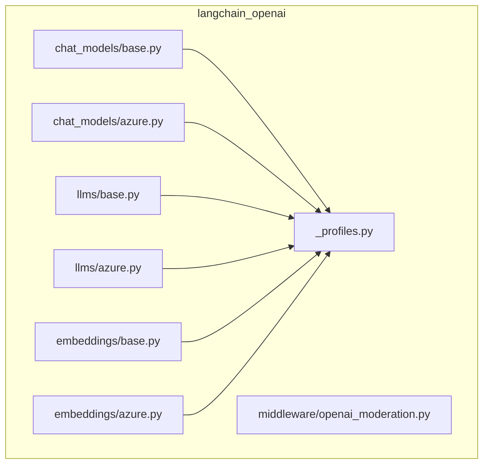
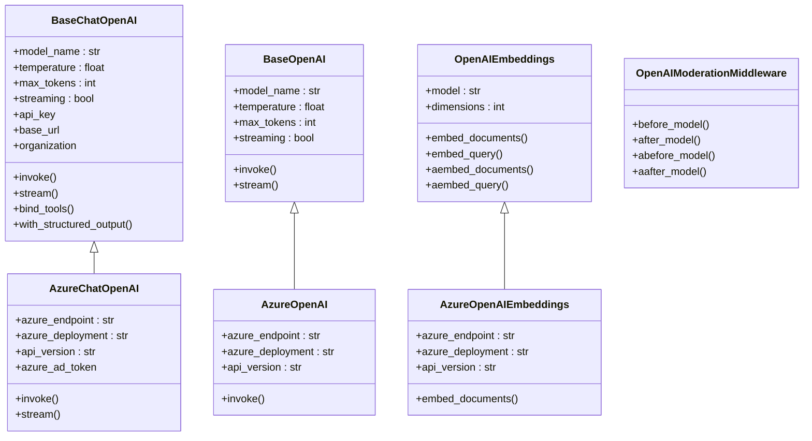
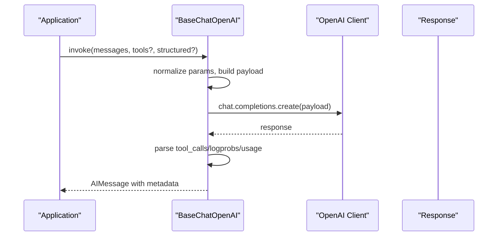
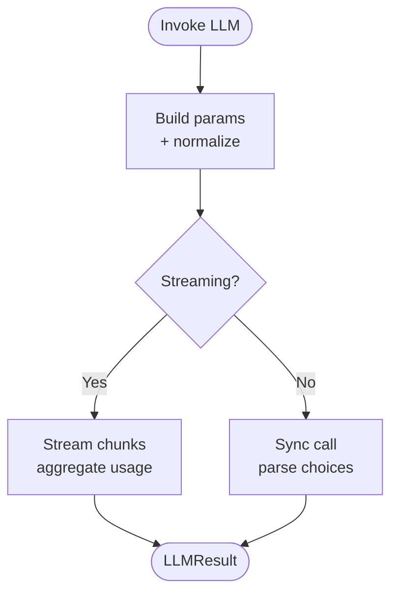
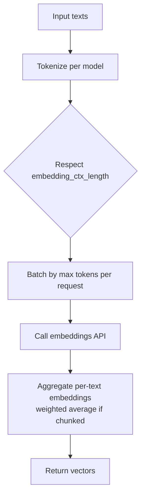
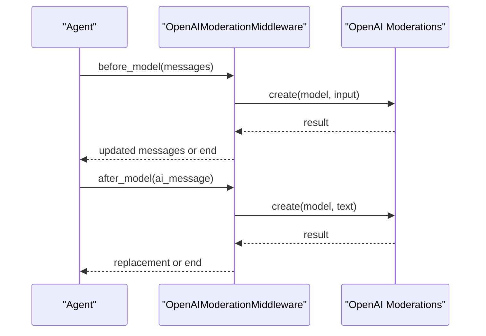
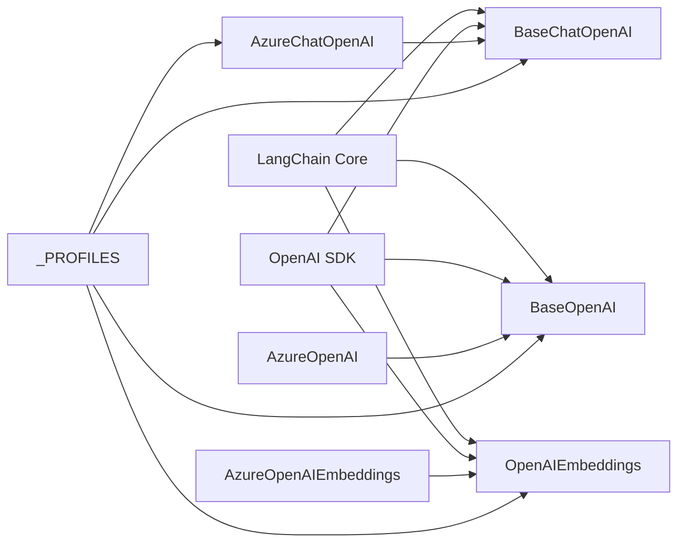

# OpenAI Integration

<cite>
**Referenced Files in This Document**
- [langchain_openai/__init__.py](file://libs/partners/openai/langchain_openai/__init__.py)
- [langchain_openai/chat_models/base.py](file://libs/partners/openai/langchain_openai/chat_models/base.py)
- [langchain_openai/chat_models/azure.py](file://libs/partners/openai/langchain_openai/chat_models/azure.py)
- [langchain_openai/llms/base.py](file://libs/partners/openai/langchain_openai/llms/base.py)
- [langchain_openai/llms/azure.py](file://libs/partners/openai/langchain_openai/llms/azure.py)
- [langchain_openai/embeddings/base.py](file://libs/partners/openai/langchain_openai/embeddings/base.py)
- [langchain_openai/embeddings/azure.py](file://libs/partners/openai/langchain_openai/embeddings/azure.py)
- [langchain_openai/middleware/openai_moderation.py](file://libs/partners/openai/langchain_openai/middleware/openai_moderation.py)
- [langchain_openai/data/_profiles.py](file://libs/partners/openai/langchain_openai/data/_profiles.py)
- [README.md](file://libs/partners/openai/README.md)
</cite>

## Table of Contents
1. [Introduction](#introduction)
2. [Project Structure](#project-structure)
3. [Core Components](#core-components)
4. [Architecture Overview](#architecture-overview)
5. [Detailed Component Analysis](#detailed-component-analysis)
6. [Dependency Analysis](#dependency-analysis)
7. [Performance Considerations](#performance-considerations)
8. [Troubleshooting Guide](#troubleshooting-guide)
9. [Conclusion](#conclusion)

## Introduction
This document explains how LangChain integrates with OpenAI across ChatModels, LLMs, and Embeddings. It covers authentication via API keys, configuration parameters, model selection, pricing considerations, OpenAI-specific features (function/tool calling, structured outputs, streaming), and production best practices including middleware and request/response transformations.

## Project Structure
The OpenAI integration lives in the langchain-openai package under libs/partners/openai. It provides:
- Chat models for conversational AI with tool/function calling and streaming
- LLMs for text completion tasks
- Embeddings for vector generation
- Azure variants for enterprise deployments
- Middleware for content moderation
- Model profiles for capabilities and constraints

**Diagram sources**
- [langchain_openai/chat_models/base.py](file://libs/partners/openai/langchain_openai/chat_models/base.py#L1-L120)
- [langchain_openai/chat_models/azure.py](file://libs/partners/openai/langchain_openai/chat_models/azure.py#L1-L120)
- [langchain_openai/llms/base.py](file://libs/partners/openai/langchain_openai/llms/base.py#L1-L120)
- [langchain_openai/llms/azure.py](file://libs/partners/openai/langchain_openai/llms/azure.py#L1-L120)
- [langchain_openai/embeddings/base.py](file://libs/partners/openai/langchain_openai/embeddings/base.py#L1-L120)
- [langchain_openai/embeddings/azure.py](file://libs/partners/openai/langchain_openai/embeddings/azure.py#L1-L120)
- [langchain_openai/middleware/openai_moderation.py](file://libs/partners/openai/langchain_openai/middleware/openai_moderation.py#L1-L120)
- [langchain_openai/data/_profiles.py](file://libs/partners/openai/langchain_openai/data/_profiles.py#L1-L120)

**Section sources**
- [README.md](file://libs/partners/openai/README.md#L1-L33)
- [langchain_openai/__init__.py](file://libs/partners/openai/langchain_openai/__init__.py#L1-L17)

## Core Components
- ChatModels: Conversational interface supporting tool/function calling, structured outputs, streaming, and multimodal inputs (images, audio).
- LLMs: Legacy text completion interface for non-chat models.
- Embeddings: Vector generation for semantic search and retrieval.
- Azure variants: Enterprise-grade clients for Azure OpenAI with deployment-specific configuration.
- Middleware: Content moderation using OpenAI’s moderation endpoint.
- Profiles: Capability profiles for models (token limits, tool calling, structured output, etc.).

**Section sources**
- [langchain_openai/chat_models/base.py](file://libs/partners/openai/langchain_openai/chat_models/base.py#L488-L800)
- [langchain_openai/llms/base.py](file://libs/partners/openai/langchain_openai/llms/base.py#L53-L200)
- [langchain_openai/embeddings/base.py](file://libs/partners/openai/langchain_openai/embeddings/base.py#L86-L180)
- [langchain_openai/middleware/openai_moderation.py](file://libs/partners/openai/langchain_openai/middleware/openai_moderation.py#L49-L120)
- [langchain_openai/data/_profiles.py](file://libs/partners/openai/langchain_openai/data/_profiles.py#L18-L712)

## Architecture Overview
The integration composes LangChain’s generic language model interfaces with the OpenAI SDK. Each component encapsulates:
- Authentication and client initialization
- Parameter normalization and defaults
- Request/response translation and metadata extraction
- Streaming and token usage aggregation
- Azure-specific overrides and headers

**Diagram sources**
- [langchain_openai/chat_models/base.py](file://libs/partners/openai/langchain_openai/chat_models/base.py#L488-L800)
- [langchain_openai/chat_models/azure.py](file://libs/partners/openai/langchain_openai/chat_models/azure.py#L34-L200)
- [langchain_openai/llms/base.py](file://libs/partners/openai/langchain_openai/llms/base.py#L53-L200)
- [langchain_openai/llms/azure.py](file://libs/partners/openai/langchain_openai/llms/azure.py#L20-L120)
- [langchain_openai/embeddings/base.py](file://libs/partners/openai/langchain_openai/embeddings/base.py#L86-L180)
- [langchain_openai/embeddings/azure.py](file://libs/partners/openai/langchain_openai/embeddings/azure.py#L16-L120)
- [langchain_openai/middleware/openai_moderation.py](file://libs/partners/openai/langchain_openai/middleware/openai_moderation.py#L49-L120)

## Detailed Component Analysis

### ChatModels: Base and Azure
- Authentication and configuration:
  - API key resolution from environment or callable
  - Organization and base URL customization
  - Proxy and custom httpx clients
- Invocation and streaming:
  - Standard invoke/stream methods
  - Usage metadata and token counters
- Tool/function calling:
  - bind_tools to attach Pydantic models/functions
  - Tool call parsing and invalid tool handling
- Structured outputs:
  - with_structured_output with automatic fallbacks for unsupported models
- Azure-specific:
  - azure_endpoint, azure_deployment, api_version
  - Azure AD token providers for sync/async
  - Backwards compatibility for legacy base_url vs azure_endpoint

**Diagram sources**
- [langchain_openai/chat_models/base.py](file://libs/partners/openai/langchain_openai/chat_models/base.py#L488-L800)
- [langchain_openai/chat_models/azure.py](file://libs/partners/openai/langchain_openai/chat_models/azure.py#L34-L200)

**Section sources**
- [langchain_openai/chat_models/base.py](file://libs/partners/openai/langchain_openai/chat_models/base.py#L488-L800)
- [langchain_openai/chat_models/azure.py](file://libs/partners/openai/langchain_openai/chat_models/azure.py#L34-L200)

### LLMs: Base and Azure
- Legacy text completion interface
- Streaming and non-streaming generation
- Token usage aggregation and model context sizing
- Azure-specific client construction and header injection

**Diagram sources**
- [langchain_openai/llms/base.py](file://libs/partners/openai/langchain_openai/llms/base.py#L429-L570)
- [langchain_openai/llms/azure.py](file://libs/partners/openai/langchain_openai/llms/azure.py#L120-L196)

**Section sources**
- [langchain_openai/llms/base.py](file://libs/partners/openai/langchain_openai/llms/base.py#L53-L200)
- [langchain_openai/llms/azure.py](file://libs/partners/openai/langchain_openai/llms/azure.py#L20-L120)

### Embeddings: Base and Azure
- Tokenization and batching with tiktoken or transformers
- Chunking by embedding_ctx_length and token limits
- Weighted averaging for long texts
- Async/sync dual clients and optional Azure AD tokens

**Diagram sources**
- [langchain_openai/embeddings/base.py](file://libs/partners/openai/langchain_openai/embeddings/base.py#L429-L598)
- [langchain_openai/embeddings/azure.py](file://libs/partners/openai/langchain_openai/embeddings/azure.py#L16-L120)

**Section sources**
- [langchain_openai/embeddings/base.py](file://libs/partners/openai/langchain_openai/embeddings/base.py#L86-L180)
- [langchain_openai/embeddings/azure.py](file://libs/partners/openai/langchain_openai/embeddings/azure.py#L16-L120)

### Middleware: OpenAI Moderation
- Integrates OpenAI’s moderation endpoint to filter inputs, outputs, and tool results
- Supports error, end, or replacement exit behaviors
- Async and sync variants

**Diagram sources**
- [langchain_openai/middleware/openai_moderation.py](file://libs/partners/openai/langchain_openai/middleware/openai_moderation.py#L49-L176)

**Section sources**
- [langchain_openai/middleware/openai_moderation.py](file://libs/partners/openai/langchain_openai/middleware/openai_moderation.py#L49-L176)

### Model Profiles and Capabilities
- Profiles define max input/output tokens, multimodal support, tool calling, structured output, and tool choice availability
- Used to inform defaults and validations for chat models

**Section sources**
- [langchain_openai/data/_profiles.py](file://libs/partners/openai/langchain_openai/data/_profiles.py#L18-L712)

## Dependency Analysis
- All OpenAI components depend on the OpenAI SDK for HTTP clients and response parsing
- LangChain core messaging types and utilities are used for message conversion, tool parsing, and metadata
- Azure variants extend base classes with Azure-specific client initialization and headers
- Profiles are shared across chat and embeddings to maintain consistent capability assumptions

**Diagram sources**
- [langchain_openai/chat_models/base.py](file://libs/partners/openai/langchain_openai/chat_models/base.py#L1-L140)
- [langchain_openai/llms/base.py](file://libs/partners/openai/langchain_openai/llms/base.py#L1-L40)
- [langchain_openai/embeddings/base.py](file://libs/partners/openai/langchain_openai/embeddings/base.py#L1-L20)
- [langchain_openai/chat_models/azure.py](file://libs/partners/openai/langchain_openai/chat_models/azure.py#L1-L60)
- [langchain_openai/llms/azure.py](file://libs/partners/openai/langchain_openai/llms/azure.py#L1-L60)
- [langchain_openai/embeddings/azure.py](file://libs/partners/openai/langchain_openai/embeddings/azure.py#L1-L60)
- [langchain_openai/data/_profiles.py](file://libs/partners/openai/langchain_openai/data/_profiles.py#L1-L40)

**Section sources**
- [langchain_openai/chat_models/base.py](file://libs/partners/openai/langchain_openai/chat_models/base.py#L1-L140)
- [langchain_openai/llms/base.py](file://libs/partners/openai/langchain_openai/llms/base.py#L1-L40)
- [langchain_openai/embeddings/base.py](file://libs/partners/openai/langchain_openai/embeddings/base.py#L1-L20)
- [langchain_openai/chat_models/azure.py](file://libs/partners/openai/langchain_openai/chat_models/azure.py#L1-L60)
- [langchain_openai/llms/azure.py](file://libs/partners/openai/langchain_openai/llms/azure.py#L1-L60)
- [langchain_openai/embeddings/azure.py](file://libs/partners/openai/langchain_openai/embeddings/azure.py#L1-L60)
- [langchain_openai/data/_profiles.py](file://libs/partners/openai/langchain_openai/data/_profiles.py#L1-L40)

## Performance Considerations
- Streaming usage: Enable stream_usage for accurate token usage during streaming; it is auto-enabled for default clients
- Token limits: Respect model context windows and embedding token limits; use chunking and weighted averaging for long texts
- Concurrency: Prefer async clients for concurrent requests; use custom httpx clients for connection pooling and timeouts
- Retries: Tune max_retries and timeouts to balance reliability and latency
- Cost optimization:
  - Choose smaller models for cheaper inference when quality allows
  - Use structured outputs judiciously; fallback to function calling when models lack native structured output support
  - Monitor token usage via response_metadata and usage_metadata
- Embeddings:
  - Batch within token limits (MAX_TOKENS_PER_REQUEST)
  - Use appropriate dimensions for embedding models that support it
  - Consider chunk_size tuning for throughput

[No sources needed since this section provides general guidance]

## Troubleshooting Guide
- Authentication failures:
  - Ensure OPENAI_API_KEY or AZURE_OPENAI_API_KEY is set; for Azure, verify AZURE_OPENAI_ENDPOINT and api_version
  - For Azure AD, provide azure_ad_token or token providers
- Azure endpoint mismatches:
  - Use azure_endpoint and azure_deployment consistently; avoid mixing legacy base_url with deployment
- Structured output errors:
  - Some models do not support structured outputs; switch to function_calling method or choose a compatible model
- Rate limits and timeouts:
  - Increase max_retries and tune request_timeout; consider backoff strategies
- Content filtering (Azure):
  - Responses may be filtered; handle content_filter results and adjust prompts or models
- Token counting and context:
  - Use model profiles and context size helpers; ensure prompts fit within max_input_tokens

**Section sources**
- [langchain_openai/chat_models/base.py](file://libs/partners/openai/langchain_openai/chat_models/base.py#L452-L474)
- [langchain_openai/chat_models/azure.py](file://libs/partners/openai/langchain_openai/chat_models/azure.py#L596-L702)
- [langchain_openai/llms/base.py](file://libs/partners/openai/langchain_openai/llms/base.py#L302-L342)
- [langchain_openai/embeddings/base.py](file://libs/partners/openai/langchain_openai/embeddings/base.py#L331-L410)

## Conclusion
LangChain’s OpenAI integration provides robust, production-ready wrappers for ChatModels, LLMs, and Embeddings with strong support for Azure deployments, tool/function calling, structured outputs, and streaming. Use model profiles to align expectations, configure authentication and clients carefully, and apply the middleware and best practices outlined above to ensure reliable, secure, and cost-efficient deployments.