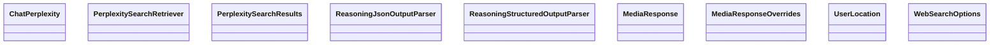

# Other Providers

<cite>
**Referenced Files in This Document**
- [libs/partners/fireworks/langchain_fireworks/__init__.py](file://libs/partners/fireworks/langchain_fireworks/__init__.py)
- [libs/partners/fireworks/langchain_fireworks/chat_models.py](file://libs/partners/fireworks/langchain_fireworks/chat_models.py)
- [libs/partners/mistralai/langchain_mistralai/__init__.py](file://libs/partners/mistralai/langchain_mistralai/__init__.py)
- [libs/partners/mistralai/langchain_mistralai/chat_models.py](file://libs/partners/mistralai/langchain_mistralai/chat_models.py)
- [libs/partners/nomic/langchain_nomic/__init__.py](file://libs/partners/nomic/langchain_nomic/__init__.py)
- [libs/partners/nomic/langchain_nomic/embeddings.py](file://libs/partners/nomic/langchain_nomic/embeddings.py)
- [libs/partners/ollama/langchain_ollama/__init__.py](file://libs/partners/ollama/langchain_ollama/__init__.py)
- [libs/partners/ollama/langchain_ollama/chat_models.py](file://libs/partners/ollama/langchain_ollama/chat_models.py)
- [libs/partners/perplexity/langchain_perplexity/__init__.py](file://libs/partners/perplexity/langchain_perplexity/__init__.py)
- [libs/partners/qdrant/langchain_qdrant/__init__.py](file://libs/partners/qdrant/langchain_qdrant/__init__.py)
- [libs/partners/xai/langchain_xai/__init__.py](file://libs/partners/xai/langchain_xai/__init__.py)
</cite>

## Table of Contents
1. [Introduction](#introduction)
2. [Project Structure](#project-structure)
3. [Core Components](#core-components)
4. [Architecture Overview](#architecture-overview)
5. [Detailed Component Analysis](#detailed-component-analysis)
6. [Dependency Analysis](#dependency-analysis)
7. [Performance Considerations](#performance-considerations)
8. [Troubleshooting Guide](#troubleshooting-guide)
9. [Conclusion](#conclusion)

## Introduction
This document provides comprehensive guidance for integrating additional provider packages in LangChain, focusing on Fireworks, MistralAI, Nomic, Ollama, Perplexity, Qdrant, and XAI. It explains authentication setup, configuration parameters, provider-specific capabilities, use cases, limitations, optimization strategies, migration approaches, and best practices for multi-provider applications. The goal is to help developers choose the right provider for their needs, configure it effectively, and operate reliably across environments.

## Project Structure
The relevant provider integrations live under the partners directory, with each provider offering a dedicated package that exposes LangChain-compatible components such as chat models, LLMs, embeddings, retrievers, tools, and vector stores. The structure follows a consistent pattern:
- A package-level __init__.py exports the primary classes and constants.
- Implementation files define chat models, LLMs, embeddings, and related utilities.
- Tests and scripts support development and validation.

**Diagram sources**
- [libs/partners/fireworks/langchain_fireworks/__init__.py](file://libs/partners/fireworks/langchain_fireworks/__init__.py#L1-L14)
- [libs/partners/mistralai/langchain_mistralai/__init__.py](file://libs/partners/mistralai/langchain_mistralai/__init__.py#L1-L7)
- [libs/partners/nomic/langchain_nomic/__init__.py](file://libs/partners/nomic/langchain_nomic/__init__.py#L1-L6)
- [libs/partners/ollama/langchain_ollama/__init__.py](file://libs/partners/ollama/langchain_ollama/__init__.py#L1-L43)
- [libs/partners/perplexity/langchain_perplexity/__init__.py](file://libs/partners/perplexity/langchain_perplexity/__init__.py#L1-L30)
- [libs/partners/qdrant/langchain_qdrant/__init__.py](file://libs/partners/qdrant/langchain_qdrant/__init__.py#L1-L16)
- [libs/partners/xai/langchain_xai/__init__.py](file://libs/partners/xai/langchain_xai/__init__.py#L1-L6)

**Section sources**
- [libs/partners/fireworks/langchain_fireworks/__init__.py](file://libs/partners/fireworks/langchain_fireworks/__init__.py#L1-L14)
- [libs/partners/mistralai/langchain_mistralai/__init__.py](file://libs/partners/mistralai/langchain_mistralai/__init__.py#L1-L7)
- [libs/partners/nomic/langchain_nomic/__init__.py](file://libs/partners/nomic/langchain_nomic/__init__.py#L1-L6)
- [libs/partners/ollama/langchain_ollama/__init__.py](file://libs/partners/ollama/langchain_ollama/__init__.py#L1-L43)
- [libs/partners/perplexity/langchain_perplexity/__init__.py](file://libs/partners/perplexity/langchain_perplexity/__init__.py#L1-L30)
- [libs/partners/qdrant/langchain_qdrant/__init__.py](file://libs/partners/qdrant/langchain_qdrant/__init__.py#L1-L16)
- [libs/partners/xai/langchain_xai/__init__.py](file://libs/partners/xai/langchain_xai/__init__.py#L1-L6)

## Core Components
This section summarizes the primary components exposed by each provider and their roles in LangChain workflows.

- Fireworks
  - ChatFireworks: Chat model compatible with LangChain’s BaseChatModel.
  - Fireworks: LLM wrapper.
  - FireworksEmbeddings: Embedding model.
  - Authentication: FIREWORKS_API_KEY environment variable.
  - Key parameters: model_name, temperature, stop_sequences, timeout, streaming, max_tokens, max_retries, base_url.

- MistralAI
  - ChatMistralAI: Chat model compatible with LangChain’s BaseChatModel.
  - MistralAIEmbeddings: Embedding model.
  - Authentication: MISTRAL_API_KEY environment variable.
  - Key parameters: model_name, temperature, top_p, max_tokens, random_seed, safe_prompt, timeout, max_concurrent_requests, max_retries, base_url.

- Nomic
  - NomicEmbeddings: Embedding model supporting remote, local, and dynamic inference modes.
  - Authentication: NOMIC_API_KEY environment variable.
  - Key parameters: model, dimensionality, inference_mode, device, vision_model.

- Ollama
  - ChatOllama: Chat model compatible with LangChain’s BaseChatModel.
  - OllamaEmbeddings: Embedding model.
  - OllamaLLM: LLM wrapper.
  - Authentication: via base_url userinfo or client kwargs; supports custom headers.
  - Key parameters: model, reasoning, validate_model_on_init, temperature, num_predict, stop, format, keep_alive, base_url, client_kwargs, sync/async client kwargs.

- Perplexity
  - ChatPerplexity: Chat model compatible with LangChain’s BaseChatModel.
  - PerplexitySearchRetriever: Retrieval component.
  - PerplexitySearchResults: Tool for web search results.
  - Output parsers: ReasoningJsonOutputParser, ReasoningStructuredOutputParser, strip_think_tags.
  - Types: MediaResponse, MediaResponseOverrides, UserLocation, WebSearchOptions.

- Qdrant
  - Qdrant: Vector store.
  - QdrantVectorStore: Low-level vector store interface.
  - RetrievalMode: Retrieval mode enumeration.
  - SparseEmbeddings and FastEmbedSparse: Sparse embedding utilities.
  - SparseVector: Sparse vector type.

- xAI
  - ChatXAI: Chat model compatible with LangChain’s BaseChatModel.

**Section sources**
- [libs/partners/fireworks/langchain_fireworks/__init__.py](file://libs/partners/fireworks/langchain_fireworks/__init__.py#L1-L14)
- [libs/partners/mistralai/langchain_mistralai/__init__.py](file://libs/partners/mistralai/langchain_mistralai/__init__.py#L1-L7)
- [libs/partners/nomic/langchain_nomic/__init__.py](file://libs/partners/nomic/langchain_nomic/__init__.py#L1-L6)
- [libs/partners/ollama/langchain_ollama/__init__.py](file://libs/partners/ollama/langchain_ollama/__init__.py#L1-L43)
- [libs/partners/perplexity/langchain_perplexity/__init__.py](file://libs/partners/perplexity/langchain_perplexity/__init__.py#L1-L30)
- [libs/partners/qdrant/langchain_qdrant/__init__.py](file://libs/partners/qdrant/langchain_qdrant/__init__.py#L1-L16)
- [libs/partners/xai/langchain_xai/__init__.py](file://libs/partners/xai/langchain_xai/__init__.py#L1-L6)

## Architecture Overview
The providers integrate with LangChain through standardized interfaces:
- Chat models inherit from BaseChatModel and expose invoke/stream/astream/abatch methods.
- Embeddings implement Embeddings interface for document/query embeddings.
- Vector stores implement vectorstore interfaces for similarity search and retrieval.
- Tools and retrievers plug into chains and agents.

[No sources needed since this diagram shows conceptual architecture, not a direct code mapping]

## Detailed Component Analysis

### Fireworks
- Authentication
  - FIREWORKS_API_KEY environment variable is used for API key resolution.
  - Optional FIREWORKS_API_BASE for custom base URL.
- Configuration parameters
  - model_name, temperature, stop_sequences, timeout, streaming, max_tokens, max_retries, base_url.
- Capabilities
  - Structured output via function calling, JSON mode, and JSON schema.
  - Tool binding and tool-call parsing.
  - Streaming and non-streaming responses.
- Limitations
  - n must be at least 1; when streaming, n must be 1.
- Optimization strategies
  - Tune temperature, stop_sequences, and max_tokens for cost and latency.
  - Use structured output methods to reduce post-processing.
  - Set timeouts and max_retries appropriately for reliability.
- Practical examples
  - Initialize ChatFireworks with a model and temperature.
  - Use with_structured_output with method selection (function_calling/json_mode/json_schema).
  - Bind tools for function calling.

**Diagram sources**
- [libs/partners/fireworks/langchain_fireworks/chat_models.py](file://libs/partners/fireworks/langchain_fireworks/chat_models.py#L281-L1056)

**Section sources**
- [libs/partners/fireworks/langchain_fireworks/chat_models.py](file://libs/partners/fireworks/langchain_fireworks/chat_models.py#L281-L1056)
- [libs/partners/fireworks/langchain_fireworks/__init__.py](file://libs/partners/fireworks/langchain_fireworks/__init__.py#L1-L14)

### MistralAI
- Authentication
  - MISTRAL_API_KEY environment variable.
  - Optional MISTRAL_BASE_URL or base_url parameter.
- Configuration parameters
  - model_name, temperature, top_p, max_tokens, random_seed, safe_prompt, timeout, max_concurrent_requests, max_retries.
- Capabilities
  - Structured output via function calling, JSON mode, and JSON schema.
  - Tool binding and tool-call parsing.
  - Streaming via HTTPX SSE.
- Limitations
  - Parameter “stop” is not supported in current implementation.
  - Temperature and top_p must be within [0.0, 1.0].
- Optimization strategies
  - Use structured output methods for predictable JSON.
  - Control concurrency and retries for stability.
  - Respect provider limits and adjust timeouts.
- Practical examples
  - Initialize ChatMistralAI with model and temperature.
  - Use with_structured_output with method selection.
  - Bind tools for function calling.

**Diagram sources**
- [libs/partners/mistralai/langchain_mistralai/chat_models.py](file://libs/partners/mistralai/langchain_mistralai/chat_models.py#L460-L1167)

**Section sources**
- [libs/partners/mistralai/langchain_mistralai/chat_models.py](file://libs/partners/mistralai/langchain_mistralai/chat_models.py#L460-L1167)
- [libs/partners/mistralai/langchain_mistralai/__init__.py](file://libs/partners/mistralai/langchain_mistralai/__init__.py#L1-L7)

### Nomic
- Authentication
  - NOMIC_API_KEY environment variable or explicit nomic_api_key parameter.
- Configuration parameters
  - model, dimensionality, inference_mode (“remote”, “local”, “dynamic”), device, vision_model.
- Capabilities
  - Text embeddings for search queries/documents.
  - Image embeddings via vision_model.
  - Matryoshka-style dimensionality reduction via dimensionality.
- Limitations
  - Device usage guidance includes macOS caveat.
- Optimization strategies
  - Choose inference_mode based on latency vs. bandwidth trade-offs.
  - Use dimensionality to reduce vector size for downstream costs.
- Practical examples
  - Initialize NomicEmbeddings with model and optional API key.
  - Call embed_documents and embed_query for retrieval pipelines.
  - Use embed_image for multimodal retrieval.

**Diagram sources**
- [libs/partners/nomic/langchain_nomic/embeddings.py](file://libs/partners/nomic/langchain_nomic/embeddings.py#L13-L150)

**Section sources**
- [libs/partners/nomic/langchain_nomic/embeddings.py](file://libs/partners/nomic/langchain_nomic/embeddings.py#L13-L150)
- [libs/partners/nomic/langchain_nomic/__init__.py](file://libs/partners/nomic/langchain_nomic/__init__.py#L1-L6)

### Ollama
- Authentication
  - base_url userinfo (username:password@host:port) or client kwargs for headers.
  - validate_model_on_init validates model presence at startup.
- Configuration parameters
  - model, reasoning (True/False/None/str), temperature, num_predict, stop, format, keep_alive, base_url, client_kwargs, sync/async client kwargs.
- Capabilities
  - Structured output via JSON schema, function calling, and JSON mode.
  - Tool calling with robust argument parsing.
  - Reasoning/thinking capture via reasoning flag.
  - Streaming and non-streaming responses.
- Limitations
  - tool_choice is not supported by Ollama; it is ignored.
  - Image content requires inline base64; data URLs with commas are supported.
- Optimization strategies
  - Use validate_model_on_init to fail fast if model is missing.
  - Adjust temperature, top_k, top_p, repeat_penalty for quality and speed.
  - Use keep_alive to manage model residency.
- Practical examples
  - Initialize ChatOllama with model and optional reasoning.
  - Use with_structured_output with method selection.
  - Enable JSON mode or JSON schema for deterministic outputs.

**Diagram sources**
- [libs/partners/ollama/langchain_ollama/chat_models.py](file://libs/partners/ollama/langchain_ollama/chat_models.py#L260-L1599)

**Section sources**
- [libs/partners/ollama/langchain_ollama/chat_models.py](file://libs/partners/ollama/langchain_ollama/chat_models.py#L260-L1599)
- [libs/partners/ollama/langchain_ollama/__init__.py](file://libs/partners/ollama/langchain_ollama/__init__.py#L1-L43)

### Perplexity
- Exports
  - ChatPerplexity, PerplexitySearchRetriever, PerplexitySearchResults, output parsers, and types.
- Capabilities
  - Chat model for conversational retrieval augmented generation (RAG).
  - Search retriever and tool for web search.
  - Output parsers for reasoning outputs.
  - Types for media responses, user location, and web search options.
- Use cases
  - Real-time web-augmented chat.
  - Retrieval pipelines with external search.
- Practical examples
  - Initialize ChatPerplexity for chat.
  - Use PerplexitySearchRetriever in retrieval chains.
  - Apply ReasoningJsonOutputParser for structured reasoning outputs.

**Diagram sources**
- [libs/partners/perplexity/langchain_perplexity/__init__.py](file://libs/partners/perplexity/langchain_perplexity/__init__.py#L1-L30)

**Section sources**
- [libs/partners/perplexity/langchain_perplexity/__init__.py](file://libs/partners/perplexity/langchain_perplexity/__init__.py#L1-L30)

### Qdrant
- Exports
  - Qdrant, QdrantVectorStore, RetrievalMode, SparseEmbeddings, SparseVector, FastEmbedSparse.
- Capabilities
  - Vector store integration with sparse embeddings and retrieval modes.
  - FastEmbedSparse for efficient sparse embeddings.
- Use cases
  - High-performance similarity search with sparse vectors.
  - Hybrid dense/sparse retrieval strategies.
- Practical examples
  - Initialize Qdrant/QdrantVectorStore with collection and configuration.
  - Use SparseEmbeddings for sparse vector generation.
  - Configure RetrievalMode for hybrid or pure sparse/dense retrieval.

**Diagram sources**
- [libs/partners/qdrant/langchain_qdrant/__init__.py](file://libs/partners/qdrant/langchain_qdrant/__init__.py#L1-L16)

**Section sources**
- [libs/partners/qdrant/langchain_qdrant/__init__.py](file://libs/partners/qdrant/langchain_qdrant/__init__.py#L1-L16)

### xAI
- Exports
  - ChatXAI chat model.
- Use cases
  - Conversational AI with provider-specific features.
- Practical examples
  - Initialize ChatXAI and use in chat chains.

**Diagram sources**
- [libs/partners/xai/langchain_xai/__init__.py](file://libs/partners/xai/langchain_xai/__init__.py#L1-L6)

**Section sources**
- [libs/partners/xai/langchain_xai/__init__.py](file://libs/partners/xai/langchain_xai/__init__.py#L1-L6)

## Dependency Analysis
Provider integrations depend on:
- LangChain core abstractions (BaseChatModel, Embeddings, vector store interfaces).
- Provider SDKs or HTTP clients (e.g., httpx for MistralAI, ollama client for Ollama).
- Optional tracing and telemetry via LangSmith parameters.

[No sources needed since this diagram shows conceptual dependencies, not a direct code mapping]

## Performance Considerations
- Latency and throughput
  - Adjust temperature, top_k/top_p, and num_predict to balance quality and speed.
  - Use streaming for real-time responses; disable for batch processing.
- Cost control
  - Limit max_tokens and tune stop conditions.
  - Prefer structured output methods to reduce post-processing overhead.
- Reliability
  - Set timeouts and max_retries appropriately.
  - Use validate_model_on_init for Ollama to avoid runtime failures.
- Memory and resource usage
  - Manage keep_alive for Ollama models.
  - Choose inference_mode and device for Nomic embeddings based on hardware availability.

[No sources needed since this section provides general guidance]

## Troubleshooting Guide
- Authentication errors
  - Verify environment variables (FIREWORKS_API_KEY, MISTRAL_API_KEY, NOMIC_API_KEY) or pass keys explicitly.
  - For Ollama, ensure base_url userinfo is correct and headers are set via client_kwargs.
- Rate limits and timeouts
  - Increase timeout and implement retries for MistralAI and Fireworks.
  - Reduce concurrency for MistralAI if encountering throttling.
- Structured output parsing
  - For Ollama, ensure format matches schema; use JSON schema or JSON mode consistently.
  - For Fireworks/MistralAI, verify tool schemas and method selection align with provider capabilities.
- Model availability
  - Use validate_model_on_init for Ollama to catch missing models early.
- Streaming issues
  - Confirm SSE support for MistralAI and proper handling of load responses.

**Section sources**
- [libs/partners/fireworks/langchain_fireworks/chat_models.py](file://libs/partners/fireworks/langchain_fireworks/chat_models.py#L394-L420)
- [libs/partners/mistralai/langchain_mistralai/chat_models.py](file://libs/partners/mistralai/langchain_mistralai/chat_models.py#L600-L647)
- [libs/partners/ollama/langchain_ollama/chat_models.py](file://libs/partners/ollama/langchain_ollama/chat_models.py#L808-L810)

## Conclusion
Each provider offers distinct strengths:
- Fireworks: broad structured output support and tool calling.
- MistralAI: strong structured output and streaming via SSE.
- Nomic: flexible inference modes and dimensionality control.
- Ollama: local-first, structured output, and reasoning capture.
- Perplexity: retrieval-augmented chat and web search.
- Qdrant: high-performance sparse and hybrid retrieval.
- xAI: conversational chat with provider-specific features.

Choose a provider based on your deployment model (cloud/local), latency and cost targets, and required features (reasoning, tool calling, structured output). For multi-provider applications, standardize on LangChain interfaces and use configuration-driven routing to switch providers dynamically.