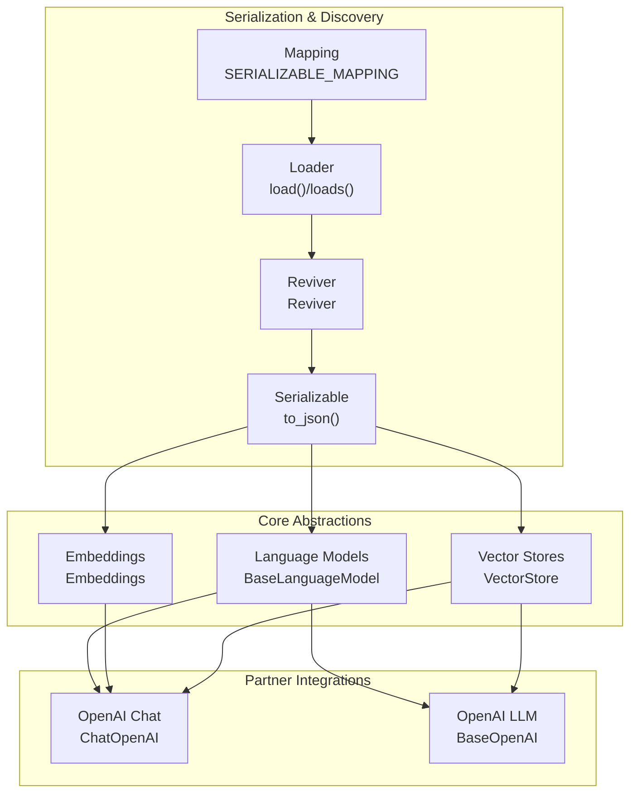
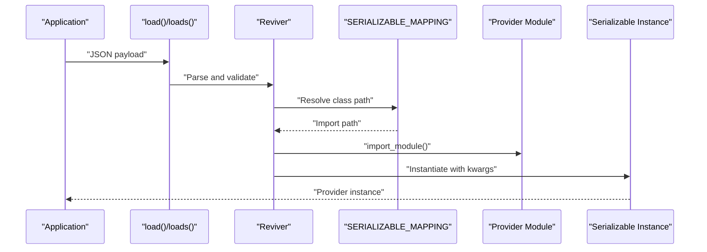
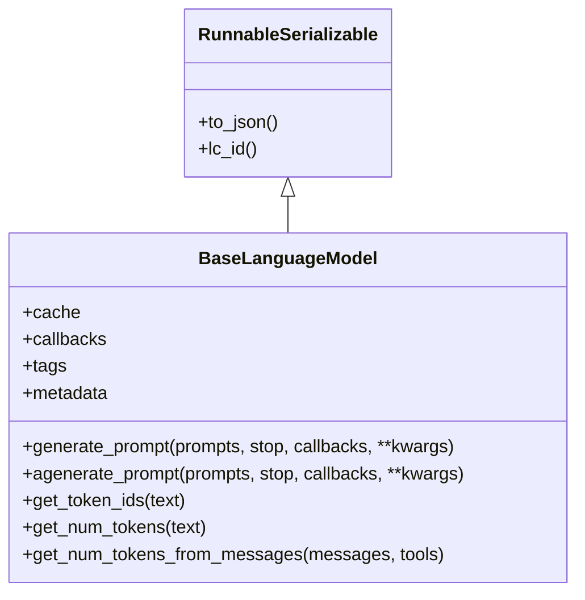
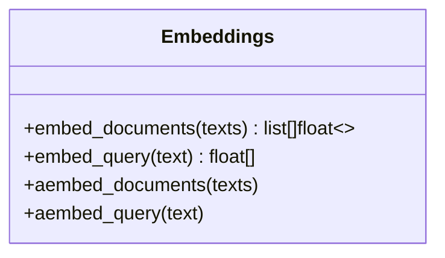
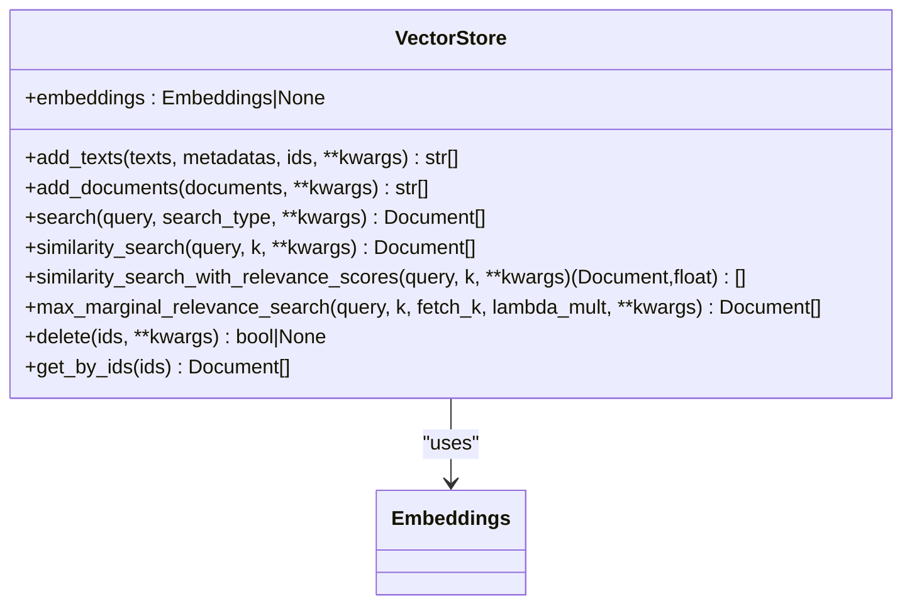
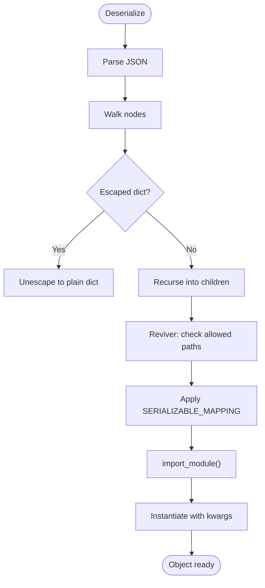
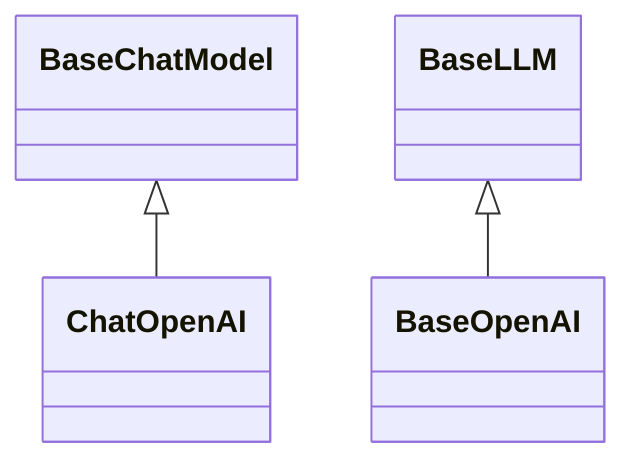
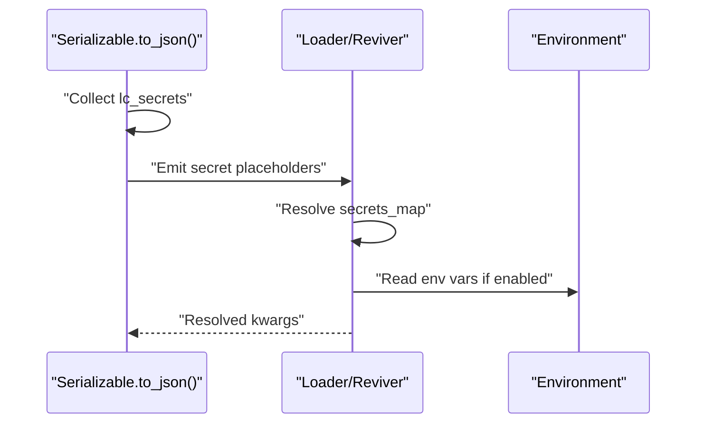
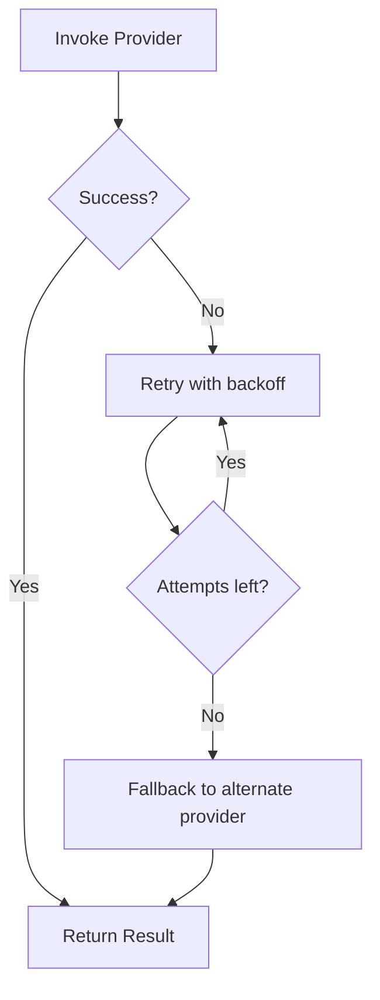
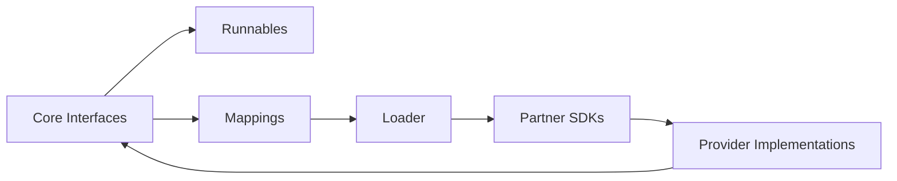

# Provider Architecture

<cite>
**Referenced Files in This Document**
- [__init__.py](file://libs/core/langchain_core/__init__.py)
- [base.py](file://libs/core/langchain_core/language_models/base.py)
- [embeddings.py](file://libs/core/langchain_core/embeddings/embeddings.py)
- [base.py](file://libs/core/langchain_core/vectorstores/base.py)
- [mapping.py](file://libs/core/langchain_core/load/mapping.py)
- [load.py](file://libs/core/langchain_core/load/load.py)
- [serializable.py](file://libs/core/langchain_core/load/serializable.py)
- [base.py](file://libs/core/langchain_core/runnables/base.py)
- [base.py](file://libs/partners/openai/langchain_openai/chat_models/base.py)
- [base.py](file://libs/partners/openai/langchain_openai/llms/base.py)
</cite>

## Table of Contents
1. [Introduction](#introduction)
2. [Project Structure](#project-structure)
3. [Core Components](#core-components)
4. [Architecture Overview](#architecture-overview)
5. [Detailed Component Analysis](#detailed-component-analysis)
6. [Dependency Analysis](#dependency-analysis)
7. [Performance Considerations](#performance-considerations)
8. [Troubleshooting Guide](#troubleshooting-guide)
9. [Conclusion](#conclusion)
10. [Appendices](#appendices)

## Introduction
This document explains LangChain’s provider architecture: how the ecosystem abstracts language models, embeddings, and vector stores behind unified interfaces, enabling seamless switching between providers. It covers the abstraction contracts, provider registration and discovery via serialization mappings, configuration and lifecycle patterns, authentication and secrets handling, rate limiting and error handling, and best practices for production-grade reliability and fallback strategies.

## Project Structure
LangChain’s provider architecture spans three layers:
- Core abstractions: interfaces and base classes for LLMs, embeddings, and vector stores.
- Serialization and discovery: mapping and loader utilities that enable dynamic provider instantiation.
- Partner integrations: provider-specific implementations (e.g., OpenAI chat and LLMs) that implement the core interfaces.

**Diagram sources**
- [base.py](file://libs/core/langchain_core/language_models/base.py#L131-L366)
- [embeddings.py](file://libs/core/langchain_core/embeddings/embeddings.py#L8-L79)
- [base.py](file://libs/core/langchain_core/vectorstores/base.py#L43-L800)
- [mapping.py](file://libs/core/langchain_core/load/mapping.py#L22-L541)
- [load.py](file://libs/core/langchain_core/load/load.py#L112-L471)
- [serializable.py](file://libs/core/langchain_core/load/serializable.py#L88-L376)
- [base.py](file://libs/partners/openai/langchain_openai/chat_models/base.py#L1-L200)
- [base.py](file://libs/partners/openai/langchain_openai/llms/base.py#L1-L200)

**Section sources**
- [__init__.py](file://libs/core/langchain_core/__init__.py#L1-L21)
- [base.py](file://libs/core/langchain_core/language_models/base.py#L131-L366)
- [embeddings.py](file://libs/core/langchain_core/embeddings/embeddings.py#L8-L79)
- [base.py](file://libs/core/langchain_core/vectorstores/base.py#L43-L800)
- [mapping.py](file://libs/core/langchain_core/load/mapping.py#L22-L541)
- [load.py](file://libs/core/langchain_core/load/load.py#L112-L471)
- [serializable.py](file://libs/core/langchain_core/load/serializable.py#L88-L376)
- [base.py](file://libs/partners/openai/langchain_openai/chat_models/base.py#L1-L200)
- [base.py](file://libs/partners/openai/langchain_openai/llms/base.py#L1-L200)

## Core Components
- Language Models: BaseLanguageModel defines the contract for generating text or chat completions, token counting, and caching/callbacks. It exposes synchronous and asynchronous generation APIs and integrates with Runnable semantics for composition.
- Embeddings: Embeddings interface defines synchronous and asynchronous methods for embedding documents and queries, enabling provider-agnostic embedding workflows.
- Vector Stores: VectorStore interface defines add/search/delete/get operations, relevance scoring helpers, and async variants, enabling pluggable vector databases.

These components are designed to be provider-agnostic, allowing downstream chains and applications to swap providers without changing application logic.

**Section sources**
- [base.py](file://libs/core/langchain_core/language_models/base.py#L131-L366)
- [embeddings.py](file://libs/core/langchain_core/embeddings/embeddings.py#L8-L79)
- [base.py](file://libs/core/langchain_core/vectorstores/base.py#L43-L800)

## Architecture Overview
The provider architecture is built on:
- Universal invocation protocol: Runnables enable composition, batching, streaming, and async execution across providers.
- Serialization and discovery: Serializable classes produce constructor-based JSON representations; Reviver resolves class paths via mappings and imports provider modules safely.
- Provider implementations: Partner packages (e.g., langchain_openai) implement core interfaces and integrate with provider SDKs.

**Diagram sources**
- [load.py](file://libs/core/langchain_core/load/load.py#L473-L672)
- [serializable.py](file://libs/core/langchain_core/load/serializable.py#L196-L281)
- [mapping.py](file://libs/core/langchain_core/load/mapping.py#L22-L541)

## Detailed Component Analysis

### Language Models Abstraction
- Contract: BaseLanguageModel defines generate_prompt/agenerate_prompt and token counting utilities. It supports caching, callbacks, tags, and metadata.
- Tokenization: Provides fallback tokenization and overrides for provider-specific tokenizers.
- Runnable integration: Inherits from RunnableSerializable, enabling composition and configuration.

**Diagram sources**
- [base.py](file://libs/core/langchain_core/language_models/base.py#L131-L366)
- [serializable.py](file://libs/core/langchain_core/load/serializable.py#L88-L186)

**Section sources**
- [base.py](file://libs/core/langchain_core/language_models/base.py#L131-L366)

### Embeddings Abstraction
- Contract: Embeddings interface defines embed_documents/embed_query and async counterparts. Implementations can override async methods for native performance.
- Usage: Enables interchangeable embedding providers for RAG pipelines.

**Diagram sources**
- [embeddings.py](file://libs/core/langchain_core/embeddings/embeddings.py#L8-L79)

**Section sources**
- [embeddings.py](file://libs/core/langchain_core/embeddings/embeddings.py#L8-L79)

### Vector Stores Abstraction
- Contract: VectorStore defines add_documents/add_texts, search families (similarity, MMR, threshold), and async variants. It delegates to Embeddings for vectorization and supports relevance scoring normalization helpers.
- Extensibility: Subclasses implement provider-specific backends while preserving the same interface.

**Diagram sources**
- [base.py](file://libs/core/langchain_core/vectorstores/base.py#L43-L800)

**Section sources**
- [base.py](file://libs/core/langchain_core/vectorstores/base.py#L43-L800)

### Provider Registration and Discovery
- Serializable: Classes opt-in to serialization via is_lc_serializable and provide lc_id/lc_secrets/lc_attributes. to_json produces constructor payloads.
- Mapping: SERIALIZABLE_MAPPING maps legacy and current class paths to import locations, enabling cross-version compatibility.
- Loader: load()/loads() validate namespaces, enforce allowed objects, resolve mappings, and import modules safely. Reviver constructs instances with validated kwargs.

**Diagram sources**
- [load.py](file://libs/core/langchain_core/load/load.py#L556-L672)
- [serializable.py](file://libs/core/langchain_core/load/serializable.py#L196-L281)
- [mapping.py](file://libs/core/langchain_core/load/mapping.py#L22-L541)

**Section sources**
- [serializable.py](file://libs/core/langchain_core/load/serializable.py#L88-L376)
- [mapping.py](file://libs/core/langchain_core/load/mapping.py#L22-L541)
- [load.py](file://libs/core/langchain_core/load/load.py#L112-L471)

### Provider Implementations (OpenAI)
- Chat Models: OpenAI chat models implement chat-specific message handling, tool/function calling, streaming chunks, and usage metadata. They integrate with provider SDK clients and leverage Runnable utilities for composition.
- LLMs: OpenAI LLMs implement text completion generation, streaming, token usage aggregation, and parameter handling.

**Diagram sources**
- [base.py](file://libs/partners/openai/langchain_openai/chat_models/base.py#L1-L200)
- [base.py](file://libs/partners/openai/langchain_openai/llms/base.py#L1-L200)

**Section sources**
- [base.py](file://libs/partners/openai/langchain_openai/chat_models/base.py#L1-L200)
- [base.py](file://libs/partners/openai/langchain_openai/llms/base.py#L1-L200)

### Authentication and Secrets
- Serializable secrets: lc_secrets maps constructor argument names to secret identifiers. to_json replaces secret values with special secret placeholders resolved at runtime.
- Loader secrets: Reviver supports secrets_map and secrets_from_env to resolve secrets during deserialization.
- Environment resolution: Provider implementations commonly use environment variables for API keys and other credentials.

**Diagram sources**
- [serializable.py](file://libs/core/langchain_core/load/serializable.py#L147-L162)
- [serializable.py](file://libs/core/langchain_core/load/serializable.py#L209-L272)
- [load.py](file://libs/core/langchain_core/load/load.py#L377-L400)
- [load.py](file://libs/core/langchain_core/load/load.py#L382-L387)

**Section sources**
- [serializable.py](file://libs/core/langchain_core/load/serializable.py#L147-L162)
- [serializable.py](file://libs/core/langchain_core/load/serializable.py#L209-L272)
- [load.py](file://libs/core/langchain_core/load/load.py#L377-L400)
- [load.py](file://libs/core/langchain_core/load/load.py#L382-L387)

### Rate Limiting and Error Handling
- Rate limiting: LangChain includes in-memory rate limiter utilities suitable for local development and testing. Production deployments should integrate provider-specific rate limiting and circuit breaker patterns.
- Error handling: Provider implementations catch provider-specific exceptions and surface them as LangChain-compatible errors. Retry and fallback strategies can be layered using Runnable utilities.

[No sources needed since this diagram shows conceptual workflow, not actual code structure]

**Section sources**
- [base.py](file://libs/core/langchain_core/runnables/base.py#L124-L200)

### Provider-Specific Features, Limitations, and Optimizations
- Chat models: Support tool/function calling, streaming chunks, and usage metadata. Optimizations include batching, streaming, and async execution via Runnables.
- Embeddings: Asynchronous embedding can be optimized by overriding async methods for native provider support.
- Vector stores: Relevance scoring normalization depends on provider metrics; implementers should override selection logic accordingly.

**Section sources**
- [base.py](file://libs/partners/openai/langchain_openai/chat_models/base.py#L1-L200)
- [embeddings.py](file://libs/core/langchain_core/embeddings/embeddings.py#L58-L79)
- [base.py](file://libs/core/langchain_core/vectorstores/base.py#L403-L415)

### Implementing Custom Providers
- Implement the appropriate core interface:
  - Language models: subclass BaseLanguageModel and implement generate_prompt/agenerate_prompt and token counting.
  - Embeddings: subclass Embeddings and implement embed_documents/embed_query with optional async overrides.
  - Vector stores: subclass VectorStore and implement add_documents/search families.
- Opt-in to serialization:
  - Set is_lc_serializable to True.
  - Define lc_id, lc_secrets, and lc_attributes as needed.
- Register in mappings:
  - Add entries to SERIALIZABLE_MAPPING to enable discovery and deserialization.
- Configure lifecycle:
  - Use Runnable configuration for callbacks, tags, and metadata.
  - Integrate with provider SDK clients and handle authentication via environment variables or secrets.

**Section sources**
- [base.py](file://libs/core/langchain_core/language_models/base.py#L131-L366)
- [embeddings.py](file://libs/core/langchain_core/embeddings/embeddings.py#L8-L79)
- [base.py](file://libs/core/langchain_core/vectorstores/base.py#L43-L800)
- [serializable.py](file://libs/core/langchain_core/load/serializable.py#L120-L162)
- [mapping.py](file://libs/core/langchain_core/load/mapping.py#L22-L541)

## Dependency Analysis
- Core abstractions depend on Runnables for composition and configuration.
- Provider implementations depend on partner SDKs (e.g., OpenAI) and core interfaces.
- Loader and mapping decouple provider discovery from provider code, enabling safe instantiation and cross-version compatibility.

**Diagram sources**
- [base.py](file://libs/core/langchain_core/runnables/base.py#L124-L200)
- [mapping.py](file://libs/core/langchain_core/load/mapping.py#L22-L541)
- [load.py](file://libs/core/langchain_core/load/load.py#L112-L471)
- [base.py](file://libs/partners/openai/langchain_openai/chat_models/base.py#L1-L200)

**Section sources**
- [base.py](file://libs/core/langchain_core/runnables/base.py#L124-L200)
- [mapping.py](file://libs/core/langchain_core/load/mapping.py#L22-L541)
- [load.py](file://libs/core/langchain_core/load/load.py#L112-L471)

## Performance Considerations
- Prefer async-native implementations for embeddings and vector stores to reduce latency.
- Use batching and streaming where supported to improve throughput.
- Cache provider responses judiciously, respecting provider limits and avoiding stale data.
- Normalize relevance scores consistently per provider backend.

[No sources needed since this section provides general guidance]

## Troubleshooting Guide
- Serialization failures: Ensure class paths are in the allowed objects list and namespaces are valid. Use additional_import_mappings for custom classes.
- Secrets not resolving: Verify lc_secrets and that secrets_map/env resolution is configured.
- Provider errors: Catch provider-specific exceptions and wrap them in LangChain-compatible errors; consider retry/fallback strategies.

**Section sources**
- [load.py](file://libs/core/langchain_core/load/load.py#L414-L422)
- [serializable.py](file://libs/core/langchain_core/load/serializable.py#L209-L272)
- [base.py](file://libs/core/langchain_core/runnables/base.py#L124-L200)

## Conclusion
LangChain’s provider architecture provides a robust, extensible foundation for integrating diverse language model, embedding, and vector store providers. Through standardized interfaces, secure serialization, and flexible composition, applications can remain portable and resilient across providers and environments.

[No sources needed since this section summarizes without analyzing specific files]

## Appendices
- Best practices:
  - Use Runnable configuration for observability and control.
  - Implement provider-specific optimizations (async, streaming, batching).
  - Manage secrets securely via lc_secrets and environment variables.
  - Plan for reliability with retries, fallbacks, and rate limiting.
  - Keep mappings updated for cross-version compatibility.

[No sources needed since this section provides general guidance]