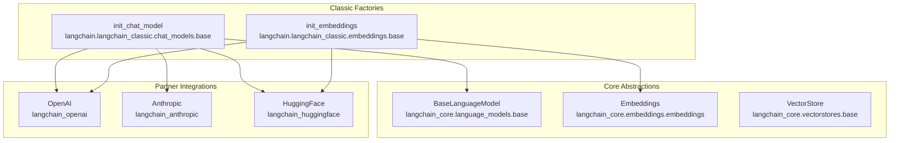
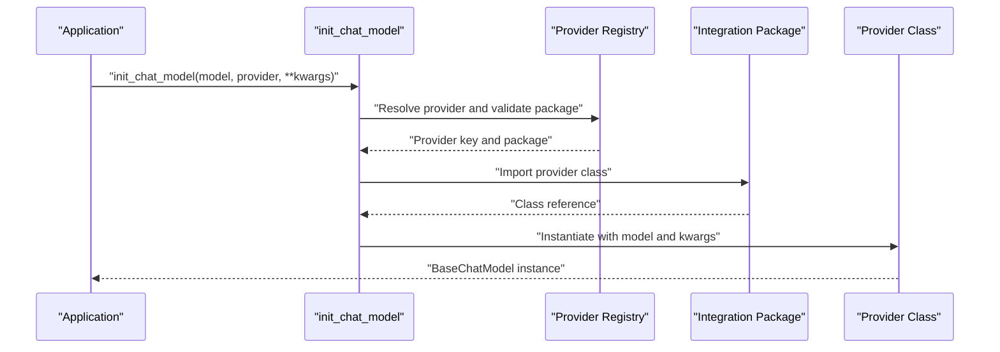
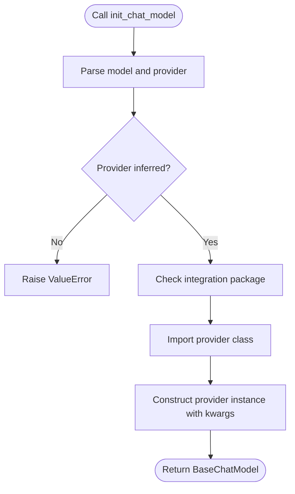
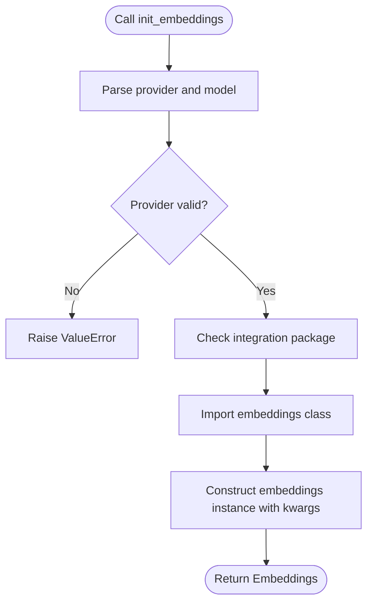
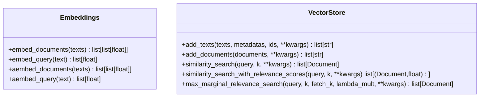
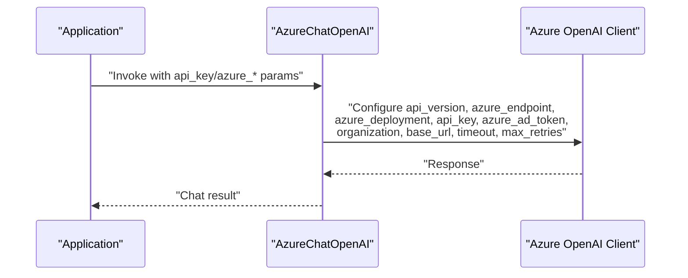
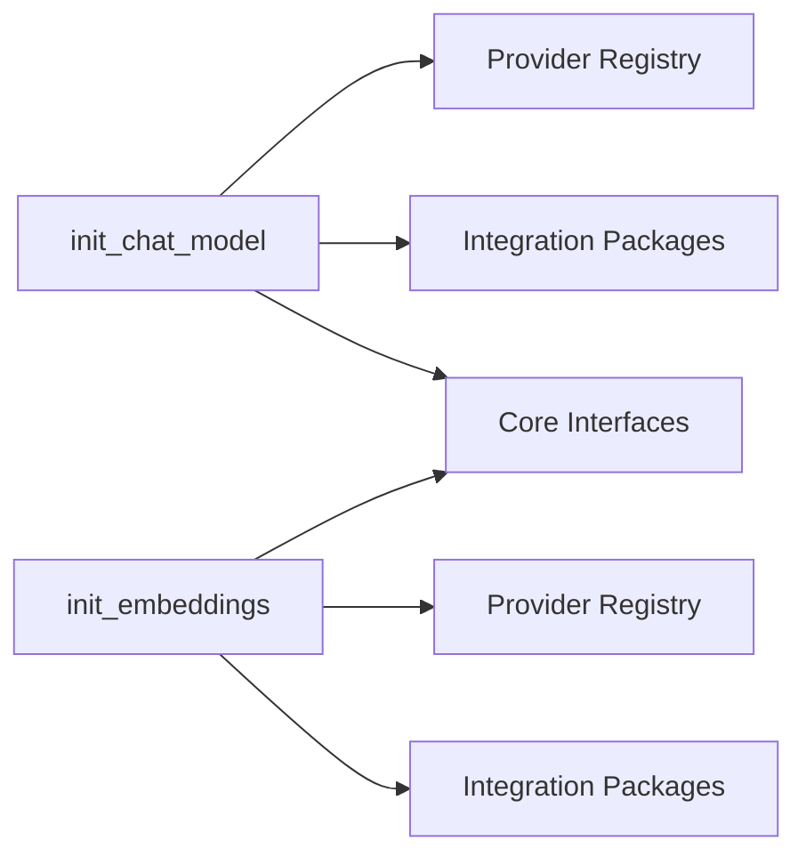

# Provider Integrations

<cite>
**Referenced Files in This Document**
- [base.py](file://libs/langchain/langchain_classic/chat_models/base.py)
- [base.py](file://libs/langchain/langchain_classic/embeddings/base.py)
- [embeddings.py](file://libs/core/langchain_core/embeddings/embeddings.py)
- [base.py](file://libs/core/langchain_core/vectorstores/base.py)
- [base.py](file://libs/core/langchain_core/language_models/base.py)
- [__init__.py](file://libs/partners/openai/langchain_openai/__init__.py)
- [__init__.py](file://libs/partners/anthropic/langchain_anthropic/__init__.py)
- [__init__.py](file://libs/partners/huggingface/langchain_huggingface/__init__.py)
- [azure.py](file://libs/partners/openai/langchain_openai/chat_models/azure.py)
- [azure.py](file://libs/partners/openai/langchain_openai/llms/azure.py)
- [test_chat_models.py](file://libs/langchain_v1/tests/unit_tests/chat_models/test_chat_models.py)
- [test_imports.py](file://libs/langchain_v1/tests/unit_tests/embeddings/test_imports.py)
</cite>

## Table of Contents
1. [Introduction](#introduction)
2. [Project Structure](#project-structure)
3. [Core Components](#core-components)
4. [Architecture Overview](#architecture-overview)
5. [Detailed Component Analysis](#detailed-component-analysis)
6. [Dependency Analysis](#dependency-analysis)
7. [Performance Considerations](#performance-considerations)
8. [Troubleshooting Guide](#troubleshooting-guide)
9. [Conclusion](#conclusion)
10. [Appendices](#appendices)

## Introduction
This document explains LangChain’s provider integration system that enables seamless switching between language model providers, embeddings providers, and vector store providers. It covers the provider abstraction, registration and discovery mechanisms, configuration patterns, and practical guidance for integrating and operating providers safely and efficiently. It also documents major integrations (OpenAI, Anthropic, HuggingFace, Azure OpenAI, and others), provider-specific features and limitations, authentication and rate-limiting approaches, and strategies for reliability and migration.

## Project Structure
LangChain separates core abstractions from provider-specific implementations:
- Core abstractions live in langchain-core (interfaces for language models, embeddings, and vector stores).
- Provider integrations live in partner packages (e.g., langchain-openai, langchain-anthropic, langchain-huggingface).
- Classic convenience factories in langchain provide unified initialization functions for chat models and embeddings, with a registry of supported providers and dynamic imports.

**Diagram sources**
- [base.py](file://libs/langchain/langchain_classic/chat_models/base.py#L71-L370)
- [base.py](file://libs/langchain/langchain_classic/embeddings/base.py#L128-L245)
- [embeddings.py](file://libs/core/langchain_core/embeddings/embeddings.py#L8-L79)
- [base.py](file://libs/core/langchain_core/vectorstores/base.py#L43-L120)
- [base.py](file://libs/core/langchain_core/language_models/base.py#L131-L210)
- [__init__.py](file://libs/partners/openai/langchain_openai/__init__.py#L1-L17)
- [__init__.py](file://libs/partners/anthropic/langchain_anthropic/__init__.py#L1-L14)
- [__init__.py](file://libs/partners/huggingface/langchain_huggingface/__init__.py#L1-L22)

**Section sources**
- [base.py](file://libs/langchain/langchain_classic/chat_models/base.py#L1-L120)
- [base.py](file://libs/langchain/langchain_classic/embeddings/base.py#L1-L40)

## Core Components
- Unified initialization functions:
  - Chat models: init_chat_model parses model and provider, validates packages, and constructs the appropriate provider class.
  - Embeddings: init_embeddings parses provider/model, validates packages, and constructs the appropriate embeddings class.
- Provider registries:
  - Chat models: a set of supported provider keys and inference rules for model prefixes.
  - Embeddings: a mapping from provider keys to integration package names.
- Core interfaces:
  - Embeddings interface defines synchronous/asynchronous embedding methods.
  - VectorStore interface defines add/search operations and relevance scoring helpers.
  - BaseLanguageModel defines generation interfaces and token utilities.

Key behaviors:
- Dynamic imports: provider classes are imported lazily when constructing models.
- Package checks: missing integration packages raise informative ImportErrors.
- Configurable models: init_chat_model supports runtime selection of model/provider and parameter binding.

**Section sources**
- [base.py](file://libs/langchain/langchain_classic/chat_models/base.py#L71-L370)
- [base.py](file://libs/langchain/langchain_classic/embeddings/base.py#L128-L245)
- [embeddings.py](file://libs/core/langchain_core/embeddings/embeddings.py#L8-L79)
- [base.py](file://libs/core/langchain_core/vectorstores/base.py#L43-L120)
- [base.py](file://libs/core/langchain_core/language_models/base.py#L131-L210)

## Architecture Overview
The provider integration architecture centers on a thin, extensible layer that:
- Normalizes provider selection and model identification.
- Delegates construction to partner libraries.
- Enforces core interfaces so downstream chains and applications remain provider-agnostic.

**Diagram sources**
- [base.py](file://libs/langchain/langchain_classic/chat_models/base.py#L372-L506)
- [base.py](file://libs/langchain/langchain_classic/chat_models/base.py#L633-L641)

## Detailed Component Analysis

### Chat Model Provider Registration and Initialization
- Supported providers and inference:
  - Providers include OpenAI, Anthropic, Azure OpenAI/AI, Google Vertex AI/GenAI, Bedrock/Converse, Cohere, Fireworks, Together, MistralAI, HuggingFace, Groq, Ollama, Google Anthropic Vertex, DeepSeek, IBM, NVIDIA, xAI, Perplexity, Upstage.
  - Model prefixes are inferred to map to providers (e.g., gpt-/o1-/o3-, claude-, amazon./anthropic./meta., gemini-, accounts/fireworks-, mistral-/mixtral-, deepseek-, grok-, sonar-).
- Initialization flow:
  - Parse model and provider (supporting "provider:model" format).
  - Validate provider against supported set.
  - Check integration package availability.
  - Import and construct the provider class with kwargs.
- Configurable models:
  - Supports binding runtime parameters and tools; parameters can be constrained for security.

**Diagram sources**
- [base.py](file://libs/langchain/langchain_classic/chat_models/base.py#L603-L631)
- [base.py](file://libs/langchain/langchain_classic/chat_models/base.py#L633-L641)
- [base.py](file://libs/langchain/langchain_classic/chat_models/base.py#L372-L506)

**Section sources**
- [base.py](file://libs/langchain/langchain_classic/chat_models/base.py#L106-L144)
- [base.py](file://libs/langchain/langchain_classic/chat_models/base.py#L509-L600)
- [base.py](file://libs/langchain/langchain_classic/chat_models/base.py#L372-L506)
- [test_chat_models.py](file://libs/langchain_v1/tests/unit_tests/chat_models/test_chat_models.py#L55-L67)

### Embeddings Provider Registration and Initialization
- Supported providers and mapping:
  - Providers include OpenAI/Azure OpenAI, Bedrock, Cohere, Google GenAI/VertexAI, HuggingFace, MistralAI, Ollama.
- Initialization flow:
  - Parse "provider:model" or infer provider from model string.
  - Validate provider and check integration package.
  - Import and construct the provider embeddings class with kwargs.

**Diagram sources**
- [base.py](file://libs/langchain/langchain_classic/embeddings/base.py#L28-L114)
- [base.py](file://libs/langchain/langchain_classic/embeddings/base.py#L117-L126)
- [base.py](file://libs/langchain/langchain_classic/embeddings/base.py#L204-L245)

**Section sources**
- [base.py](file://libs/langchain/langchain_classic/embeddings/base.py#L8-L18)
- [base.py](file://libs/langchain/langchain_classic/embeddings/base.py#L153-L163)
- [base.py](file://libs/langchain/langchain_classic/embeddings/base.py#L204-L245)
- [test_imports.py](file://libs/langchain_v1/tests/unit_tests/embeddings/test_imports.py#L1-L10)

### Core Interfaces: Embeddings and Vector Stores
- Embeddings interface:
  - Defines synchronous and asynchronous methods for document and query embeddings.
- VectorStore interface:
  - Defines add/search operations, async variants, and relevance scoring helpers.
  - Provides convenience constructors and async wrappers.

**Diagram sources**
- [embeddings.py](file://libs/core/langchain_core/embeddings/embeddings.py#L8-L79)
- [base.py](file://libs/core/langchain_core/vectorstores/base.py#L43-L120)

**Section sources**
- [embeddings.py](file://libs/core/langchain_core/embeddings/embeddings.py#L8-L79)
- [base.py](file://libs/core/langchain_core/vectorstores/base.py#L43-L120)

### Major Provider Integrations

#### OpenAI and Azure OpenAI
- OpenAI:
  - Chat models: ChatOpenAI.
  - LLMs: OpenAI.
  - Embeddings: OpenAIEmbeddings.
- Azure OpenAI:
  - Chat models: AzureChatOpenAI.
  - LLMs: AzureOpenAI.
  - Embeddings: AzureOpenAIEmbeddings.
- Authentication and configuration:
  - API key and optional organization/base URL.
  - Azure-specific parameters include deployment endpoint/version and optional AD token provider.
- Rate limiting and retries:
  - Provider classes accept max_retries and timeout parameters; clients are configured accordingly.

**Diagram sources**
- [azure.py](file://libs/partners/openai/langchain_openai/chat_models/azure.py#L660-L683)
- [azure.py](file://libs/partners/openai/langchain_openai/llms/azure.py#L146-L176)

**Section sources**
- [__init__.py](file://libs/partners/openai/langchain_openai/__init__.py#L1-L17)
- [azure.py](file://libs/partners/openai/langchain_openai/chat_models/azure.py#L660-L683)
- [azure.py](file://libs/partners/openai/langchain_openai/llms/azure.py#L146-L176)

#### Anthropic (Claude)
- Chat models: ChatAnthropic.
- LLMs: AnthropicLLM.
- Authentication: API key via provider-specific parameters.

**Section sources**
- [__init__.py](file://libs/partners/anthropic/langchain_anthropic/__init__.py#L1-L14)

#### HuggingFace
- Chat models: ChatHuggingFace.
- Embeddings: HuggingFaceEmbeddings, HuggingFaceEndpointEmbeddings.
- LLMs: HuggingFaceEndpoint, HuggingFacePipeline.
- Authentication: API key via provider-specific parameters.

**Section sources**
- [__init__.py](file://libs/partners/huggingface/langchain_huggingface/__init__.py#L1-L22)

#### Others (selected)
- Google Vertex AI/GenAI, Bedrock/Converse, Cohere, Fireworks, Together, MistralAI, Groq, Ollama, DeepSeek, IBM, NVIDIA, xAI, Perplexity, Upstage.
- Each integrates via its respective partner package and is selectable through init_chat_model.

**Section sources**
- [base.py](file://libs/langchain/langchain_classic/chat_models/base.py#L121-L144)
- [base.py](file://libs/langchain/langchain_classic/chat_models/base.py#L509-L531)

### Provider-Specific Features, Limitations, and Optimization Techniques
- Token counting:
  - BaseLanguageModel provides a default GPT-2 tokenizer fallback; model-specific implementations may override for accuracy.
- Relevance scoring:
  - VectorStore provides helpers to normalize distances to [0,1]; implementations select appropriate functions per metric.
- Streaming and async:
  - Embeddings and VectorStore offer async variants backed by executor wrappers.
- Model inference:
  - init_chat_model supports runtime parameter binding and tool binding on configurable models.

**Section sources**
- [base.py](file://libs/core/langchain_core/language_models/base.py#L93-L112)
- [base.py](file://libs/core/langchain_core/vectorstores/base.py#L375-L415)
- [base.py](file://libs/langchain/langchain_classic/chat_models/base.py#L643-L750)

### Authentication Mechanisms
- OpenAI/Azure OpenAI:
  - API key via provider parameters; Azure supports Azure AD token or token provider.
- Anthropic/HuggingFace:
  - API key via provider parameters.
- General pattern:
  - Integration packages accept credentials and base URLs; classic factories forward provider-specific kwargs.

**Section sources**
- [azure.py](file://libs/partners/openai/langchain_openai/chat_models/azure.py#L660-L683)
- [azure.py](file://libs/partners/openai/langchain_openai/llms/azure.py#L146-L176)
- [__init__.py](file://libs/partners/openai/langchain_openai/__init__.py#L1-L17)
- [__init__.py](file://libs/partners/anthropic/langchain_anthropic/__init__.py#L1-L14)
- [__init__.py](file://libs/partners/huggingface/langchain_huggingface/__init__.py#L1-L22)

### Rate Limiting and Cost Management
- Built-in rate limiting:
  - Core rate limiter utilities exist in the repository; providers can accept rate_limiter instances via kwargs.
- Retries:
  - Provider classes accept max_retries and timeout parameters; clients are configured accordingly.
- Cost management:
  - Use token counting utilities and monitor usage via callbacks/tracers; implement budget-aware chains and caching.

**Section sources**
- [base.py](file://libs/core/langchain_core/language_models/base.py#L131-L210)
- [azure.py](file://libs/partners/openai/langchain_openai/llms/azure.py#L146-L176)

### Practical Configuration Examples
- Initialize a fixed chat model:
  - Use init_chat_model with "provider:model" or separate provider/model arguments; pass provider-specific kwargs (e.g., temperature, max_tokens).
- Configure a configurable chat model:
  - Use configurable_fields and config_prefix to allow runtime selection of model/provider and parameters.
- Initialize embeddings:
  - Use init_embeddings with "provider:model" or explicit provider; pass provider-specific kwargs.

Note: Refer to provider-specific integration references for exact parameter names and supported options.

**Section sources**
- [base.py](file://libs/langchain/langchain_classic/chat_models/base.py#L175-L320)
- [base.py](file://libs/langchain/langchain_classic/embeddings/base.py#L175-L190)

### Migration Between Providers
- Switching providers:
  - Replace provider/model identifiers in init_chat_model or init_embeddings; keep the rest of your chain unchanged due to shared interfaces.
- Parameter alignment:
  - Align provider-specific parameters (e.g., temperature, max_tokens) to equivalent semantics across providers.
- Validation:
  - Ensure the target integration package is installed; classic factories will raise ImportError otherwise.

**Section sources**
- [base.py](file://libs/langchain/langchain_classic/chat_models/base.py#L175-L320)
- [base.py](file://libs/langchain/langchain_classic/embeddings/base.py#L175-L190)

### Reliability, Fallback Strategies, and Production Best Practices
- Fallback strategies:
  - Use middleware or wrapper patterns to fall back to alternate models when failures occur.
- Retry and backoff:
  - Configure max_retries and timeouts; implement jitter and caps to avoid thundering herd.
- Security:
  - Avoid allowing arbitrary runtime parameter overrides; constrain configurable_fields explicitly.
- Observability:
  - Attach callbacks/tracers to capture usage metrics and errors.

**Section sources**
- [base.py](file://libs/langchain/langchain_classic/chat_models/base.py#L158-L165)
- [test_model_fallback.py](file://libs/langchain_v1/tests/unit_tests/agents/middleware/implementations/test_model_fallback.py#L116-L323)

### Extending the Provider System with Custom Integrations
- Add a new provider:
  - Register the provider key and mapping in the classic factories’ provider registry.
  - Ensure the integration package exports the required classes and is importable.
  - Forward provider-specific kwargs from the factory to the provider class.
- Maintain compatibility:
  - Keep consistent parameter names and behavior across providers to preserve chain portability.

**Section sources**
- [base.py](file://libs/langchain/langchain_classic/chat_models/base.py#L509-L531)
- [base.py](file://libs/langchain/langchain_classic/embeddings/base.py#L8-L18)

## Dependency Analysis
The classic factories depend on:
- Core abstractions for interfaces.
- Partner packages for provider implementations.
- Dynamic imports guarded by package checks.

**Diagram sources**
- [base.py](file://libs/langchain/langchain_classic/chat_models/base.py#L509-L531)
- [base.py](file://libs/langchain/langchain_classic/embeddings/base.py#L8-L18)
- [embeddings.py](file://libs/core/langchain_core/embeddings/embeddings.py#L8-L79)

**Section sources**
- [base.py](file://libs/langchain/langchain_classic/chat_models/base.py#L509-L531)
- [base.py](file://libs/langchain/langchain_classic/embeddings/base.py#L8-L18)

## Performance Considerations
- Prefer async methods where available for embeddings and vector store operations.
- Use caching judiciously; avoid caching streaming responses.
- Tune max_retries and timeouts per provider SLAs.
- Monitor token usage and relevance scoring thresholds to reduce unnecessary compute.

[No sources needed since this section provides general guidance]

## Troubleshooting Guide
- ImportError for integration package:
  - Install the required package (e.g., langchain-openai) indicated by the factory’s error message.
- ValueError for unsupported provider or model:
  - Confirm provider is registered and model string format is correct.
- Missing model name:
  - Ensure a valid model identifier is provided or provider can be inferred.

**Section sources**
- [base.py](file://libs/langchain/langchain_classic/chat_models/base.py#L633-L641)
- [base.py](file://libs/langchain/langchain_classic/embeddings/base.py#L117-L126)
- [test_chat_models.py](file://libs/langchain_v1/tests/unit_tests/chat_models/test_chat_models.py#L55-L67)
- [test_imports.py](file://libs/langchain_v1/tests/unit_tests/embeddings/test_imports.py#L1-L10)

## Conclusion
LangChain’s provider integration system offers a robust, extensible abstraction enabling seamless switching across language models, embeddings, and vector stores. Through unified initialization, dynamic imports, and core interfaces, applications can remain provider-agnostic while leveraging provider-specific capabilities. By following the configuration patterns, reliability strategies, and extension guidelines outlined here, teams can build flexible, maintainable, and production-ready systems.

[No sources needed since this section summarizes without analyzing specific files]

## Appendices
- Provider lists and installation hints are documented directly in the classic factory functions and their tests.

**Section sources**
- [base.py](file://libs/langchain/langchain_classic/chat_models/base.py#L121-L144)
- [base.py](file://libs/langchain/langchain_classic/embeddings/base.py#L153-L163)
- [test_chat_models.py](file://libs/langchain_v1/tests/unit_tests/chat_models/test_chat_models.py#L65-L67)