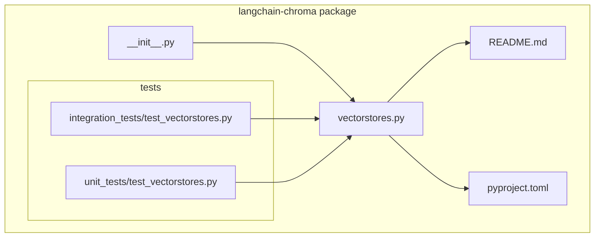
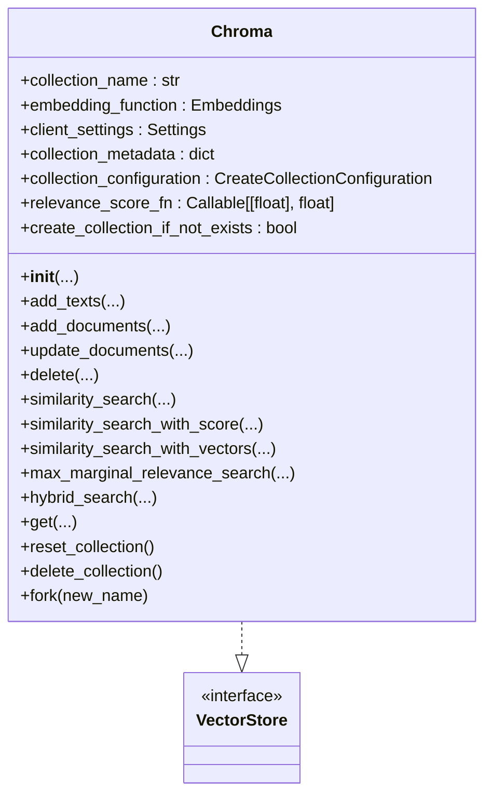
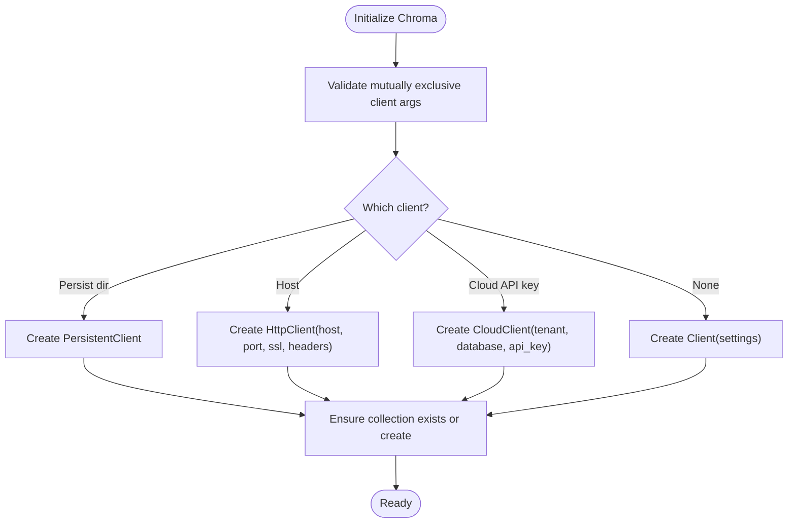
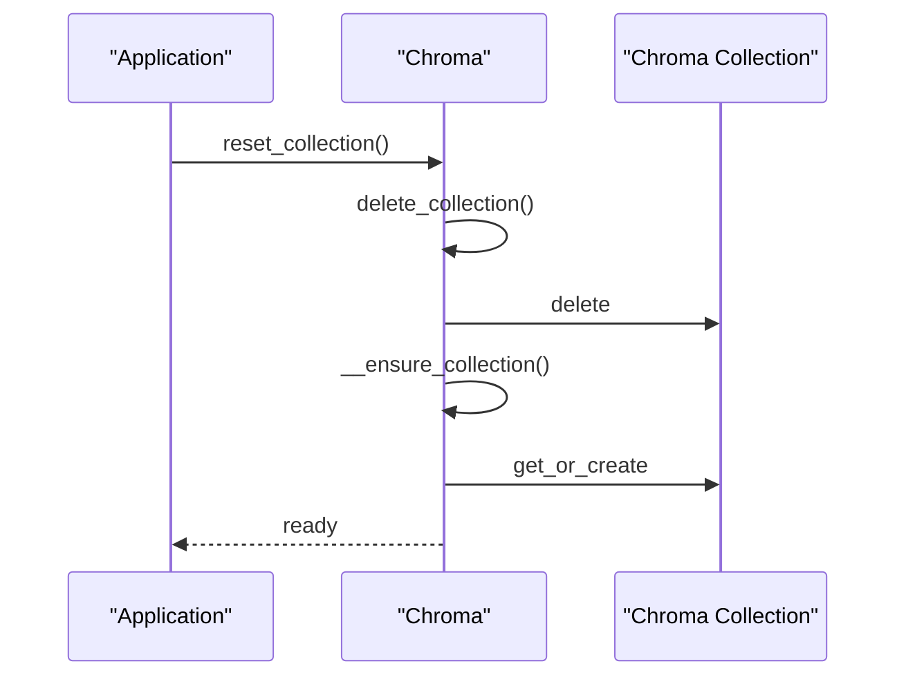
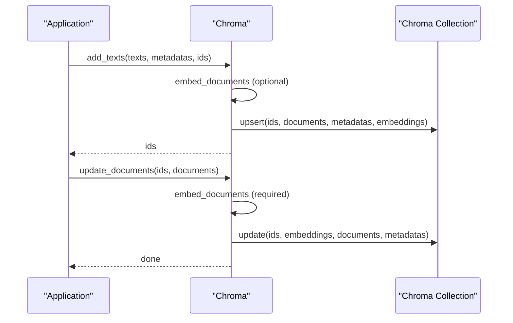
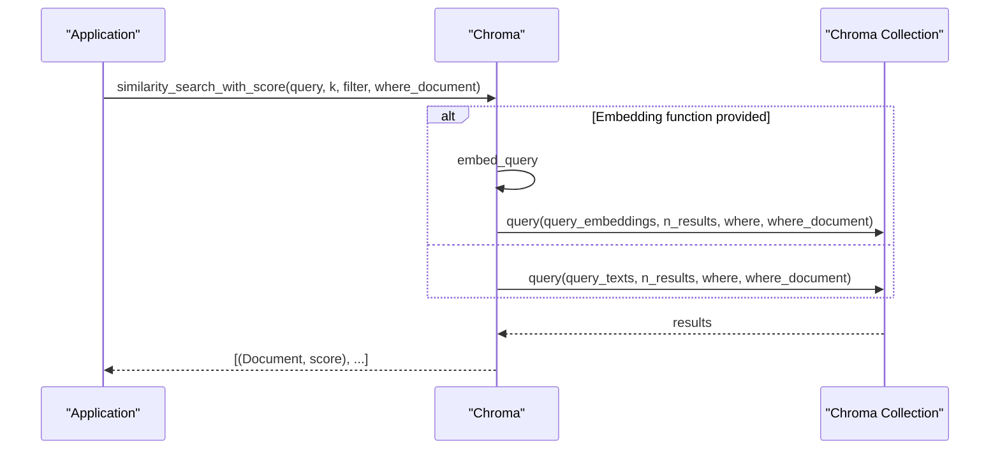
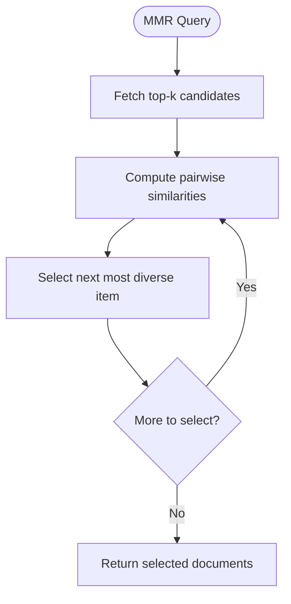
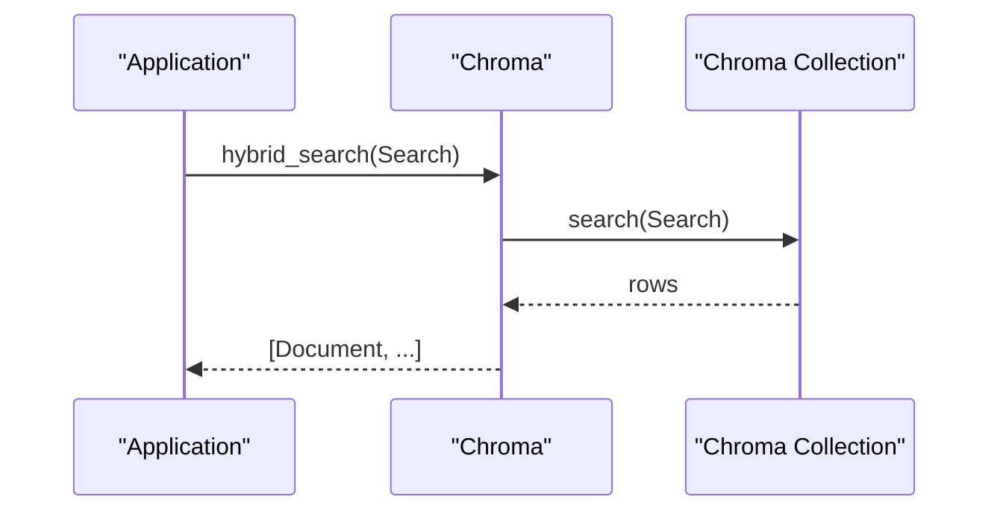
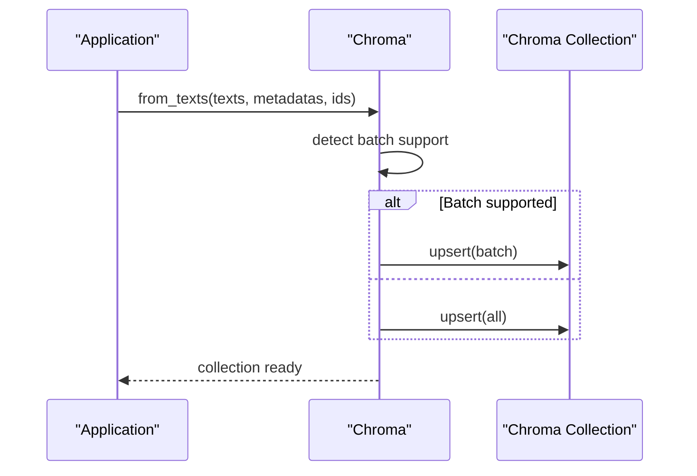
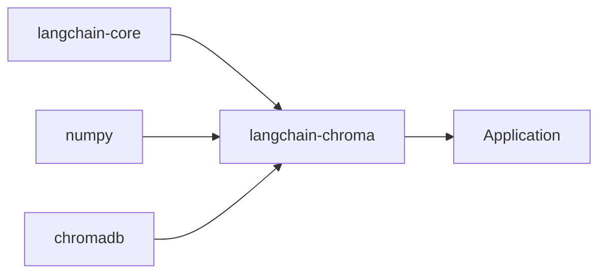

# Chroma Vector Store

<cite>
**Referenced Files in This Document**
- [vectorstores.py](file://libs/partners/chroma/langchain_chroma/vectorstores.py)
- [__init__.py](file://libs/partners/chroma/langchain_chroma/__init__.py)
- [README.md](file://libs/partners/chroma/README.md)
- [pyproject.toml](file://libs/partners/chroma/pyproject.toml)
- [test_vectorstores.py](file://libs/partners/chroma/tests/integration_tests/test_vectorstores.py)
- [test_vectorstores.py](file://libs/partners/chroma/tests/unit_tests/test_vectorstores.py)
</cite>

## Table of Contents
1. [Introduction](#introduction)
2. [Project Structure](#project-structure)
3. [Core Components](#core-components)
4. [Architecture Overview](#architecture-overview)
5. [Detailed Component Analysis](#detailed-component-analysis)
6. [Dependency Analysis](#dependency-analysis)
7. [Performance Considerations](#performance-considerations)
8. [Troubleshooting Guide](#troubleshooting-guide)
9. [Conclusion](#conclusion)
10. [Appendices](#appendices)

## Introduction
This document explains the Chroma vector store integration in LangChain. It covers Chroma’s architecture as an embedded, local-first vector database, how to initialize and manage collections, and how to perform vector operations such as similarity search, metadata filtering, and batch operations. Practical examples demonstrate local setup, adding documents, searching, and managing collections. We also address performance characteristics, memory usage, scaling limitations, comparisons with other vector stores, and migration guidance for production deployments.

## Project Structure
The Chroma integration is implemented as a LangChain partner package. The primary implementation resides in the vectorstores module, with public exports via the package’s init file, tests validating behavior, and packaging metadata.

**Diagram sources**
- [__init__.py](file://libs/partners/chroma/langchain_chroma/__init__.py#L1-L8)
- [vectorstores.py](file://libs/partners/chroma/langchain_chroma/vectorstores.py#L1-L1460)
- [README.md](file://libs/partners/chroma/README.md#L1-L23)
- [pyproject.toml](file://libs/partners/chroma/pyproject.toml#L1-L126)
- [test_vectorstores.py](file://libs/partners/chroma/tests/integration_tests/test_vectorstores.py#L1-L872)
- [test_vectorstores.py](file://libs/partners/chroma/tests/unit_tests/test_vectorstores.py#L1-L31)

**Section sources**
- [__init__.py](file://libs/partners/chroma/langchain_chroma/__init__.py#L1-L8)
- [vectorstores.py](file://libs/partners/chroma/langchain_chroma/vectorstores.py#L1-L1460)
- [README.md](file://libs/partners/chroma/README.md#L1-L23)
- [pyproject.toml](file://libs/partners/chroma/pyproject.toml#L1-L126)

## Core Components
- Chroma class: A LangChain VectorStore adapter backed by ChromaDB. It supports local persistent storage, remote HTTP clients, and cloud clients, and exposes methods for adding/updating/deleting documents, similarity search, MMR, hybrid search, and collection management.
- Initialization parameters: Choose between local persistent client, HTTP client, or cloud client; configure collection name, embedding function, metadata/configuration, and optional relevance score normalization.
- Collection management: Create/get-or-create collections, reset/delete collections, and fork collections for isolated workloads.
- Vector operations: Text and image similarity search, vector-based retrieval, MMR, hybrid search, and batch add/update with automatic batching.

Key capabilities and entry points:
- Local ephemeral or persistent collections
- Remote Chroma server connectivity
- Metadata filtering and document-content filtering
- Batch ingestion and updates with Chroma’s batch utilities
- Relevance scoring customization and normalization

**Section sources**
- [vectorstores.py](file://libs/partners/chroma/langchain_chroma/vectorstores.py#L155-L421)
- [vectorstores.py](file://libs/partners/chroma/langchain_chroma/vectorstores.py#L422-L442)
- [vectorstores.py](file://libs/partners/chroma/langchain_chroma/vectorstores.py#L449-L484)
- [vectorstores.py](file://libs/partners/chroma/langchain_chroma/vectorstores.py#L597-L682)
- [vectorstores.py](file://libs/partners/chroma/langchain_chroma/vectorstores.py#L1272-L1372)
- [vectorstores.py](file://libs/partners/chroma/langchain_chroma/vectorstores.py#L1452-L1460)

## Architecture Overview
The Chroma integration wraps a ChromaDB client and collection. It translates LangChain operations into Chroma queries and mutations, handling embedding generation, batching, and result conversion.

**Diagram sources**
- [vectorstores.py](file://libs/partners/chroma/langchain_chroma/vectorstores.py#L155-L156)
- [vectorstores.py](file://libs/partners/chroma/langchain_chroma/vectorstores.py#L26-L26)

**Section sources**
- [vectorstores.py](file://libs/partners/chroma/langchain_chroma/vectorstores.py#L155-L421)

## Detailed Component Analysis

### Initialization and Client Selection
Chroma supports three client modes:
- Persistent client: writes to a local directory
- HTTP client: connects to a remote Chroma server
- Cloud client: connects to Chroma Cloud using tenant and database identifiers

Initialization enforces mutual exclusivity among client selection parameters and optionally creates the collection if it does not exist.

**Diagram sources**
- [vectorstores.py](file://libs/partners/chroma/langchain_chroma/vectorstores.py#L359-L410)
- [vectorstores.py](file://libs/partners/chroma/langchain_chroma/vectorstores.py#L422-L429)

**Section sources**
- [vectorstores.py](file://libs/partners/chroma/langchain_chroma/vectorstores.py#L302-L421)

### Collection Management
- Create/get-or-create collection on demand
- Reset collection by deleting and recreating
- Delete collection and clear internal reference
- Fork collection to isolate workloads

**Diagram sources**
- [vectorstores.py](file://libs/partners/chroma/langchain_chroma/vectorstores.py#L1129-L1136)
- [vectorstores.py](file://libs/partners/chroma/langchain_chroma/vectorstores.py#L422-L429)

**Section sources**
- [vectorstores.py](file://libs/partners/chroma/langchain_chroma/vectorstores.py#L1124-L1136)
- [vectorstores.py](file://libs/partners/chroma/langchain_chroma/vectorstores.py#L422-L429)

### Adding and Updating Documents
- add_texts/add_documents: embed texts (if an embedding function is provided) and upsert into the collection; supports mixed metadata presence
- update_documents: compute new embeddings and update existing records; uses Chroma’s batching utilities when available

**Diagram sources**
- [vectorstores.py](file://libs/partners/chroma/langchain_chroma/vectorstores.py#L597-L682)
- [vectorstores.py](file://libs/partners/chroma/langchain_chroma/vectorstores.py#L1223-L1271)

**Section sources**
- [vectorstores.py](file://libs/partners/chroma/langchain_chroma/vectorstores.py#L597-L682)
- [vectorstores.py](file://libs/partners/chroma/langchain_chroma/vectorstores.py#L1223-L1271)

### Similarity Search and Filtering
- similarity_search/similarity_search_with_score/similarity_search_with_vectors: query by text or precomputed embedding; supports metadata filters and document-content filters
- where_document allows substring/content-based filtering
- Results include documents, scores, and optionally embeddings

**Diagram sources**
- [vectorstores.py](file://libs/partners/chroma/langchain_chroma/vectorstores.py#L817-L857)
- [vectorstores.py](file://libs/partners/chroma/langchain_chroma/vectorstores.py#L449-L484)

**Section sources**
- [vectorstores.py](file://libs/partners/chroma/langchain_chroma/vectorstores.py#L730-L857)
- [vectorstores.py](file://libs/partners/chroma/langchain_chroma/vectorstores.py#L449-L484)

### Maximal Marginal Relevance (MMR)
MMR selects diverse results by trading off similarity to the query against redundancy among selected items. It requires an embedding function and supports both text and vector-based queries.

**Diagram sources**
- [vectorstores.py](file://libs/partners/chroma/langchain_chroma/vectorstores.py#L1026-L1122)
- [vectorstores.py](file://libs/partners/chroma/langchain_chroma/vectorstores.py#L109-L152)

**Section sources**
- [vectorstores.py](file://libs/partners/chroma/langchain_chroma/vectorstores.py#L1026-L1122)
- [vectorstores.py](file://libs/partners/chroma/langchain_chroma/vectorstores.py#L109-L152)

### Hybrid Search
Hybrid search leverages Chroma’s Search DSL to combine dense and sparse embeddings and rank results accordingly.

**Diagram sources**
- [vectorstores.py](file://libs/partners/chroma/langchain_chroma/vectorstores.py#L684-L728)

**Section sources**
- [vectorstores.py](file://libs/partners/chroma/langchain_chroma/vectorstores.py#L684-L728)

### Batch Operations and Large Datasets
- Automatic batching: when the underlying Chroma client exposes batch utilities, add_texts/from_texts and update_documents iterate over batches
- Legacy mode: older Chroma versions perform single-shot upsert/update
- Tests validate large batch ingestion and updates

**Diagram sources**
- [vectorstores.py](file://libs/partners/chroma/langchain_chroma/vectorstores.py#L1350-L1371)
- [vectorstores.py](file://libs/partners/chroma/langchain_chroma/vectorstores.py#L1249-L1270)

**Section sources**
- [vectorstores.py](file://libs/partners/chroma/langchain_chroma/vectorstores.py#L1350-L1371)
- [vectorstores.py](file://libs/partners/chroma/langchain_chroma/vectorstores.py#L1249-L1270)
- [test_vectorstores.py](file://libs/partners/chroma/tests/integration_tests/test_vectorstores.py#L618-L672)

### Practical Examples
- Local setup and persistence: instantiate Chroma with a persist_directory; data persists across runs
- Adding documents: use add_texts or from_texts; optionally supply ids and metadatas
- Searching: similarity_search, similarity_search_with_score, or MMR variants
- Managing collections: reset_collection to clear and recreate, delete_collection to remove

These examples are validated by integration tests covering persistence, filtering, relevance scoring, and batch operations.

**Section sources**
- [test_vectorstores.py](file://libs/partners/chroma/tests/integration_tests/test_vectorstores.py#L282-L326)
- [test_vectorstores.py](file://libs/partners/chroma/tests/integration_tests/test_vectorstores.py#L228-L280)
- [test_vectorstores.py](file://libs/partners/chroma/tests/integration_tests/test_vectorstores.py#L537-L557)
- [test_vectorstores.py](file://libs/partners/chroma/tests/integration_tests/test_vectorstores.py#L703-L772)

## Dependency Analysis
- LangChain core: depends on langchain-core for base vector store interface and document abstractions
- ChromaDB: integrates with chromadb client APIs and collection operations
- NumPy: used for numerical operations (cosine similarity, MMR)
- Packaging: langchain-chroma pins compatible versions of chromadb and langchain-core

**Diagram sources**
- [pyproject.toml](file://libs/partners/chroma/pyproject.toml#L9-L14)

**Section sources**
- [pyproject.toml](file://libs/partners/chroma/pyproject.toml#L9-L14)

## Performance Considerations
- Embedding cost: Each add/update triggers embedding computation when an embedding function is configured
- Batch sizing: Use Chroma’s batch utilities to avoid oversized requests; tests validate large batch ingestion and updates
- Indexing parameters: Configure collection index settings (e.g., distance metric) to influence similarity and relevance scoring
- Memory usage: Local persistent mode persists to disk; remote HTTP/cloud modes shift IO to network/storage
- Scalability: For large-scale production, prefer managed cloud offerings or dedicated vector databases optimized for throughput and latency

[No sources needed since this section provides general guidance]

## Troubleshooting Guide
Common issues and resolutions:
- Metadata validation errors: Complex metadata may require filtering before upsert; the integration surfaces helpful guidance when metadata types are unsupported
- Missing embedding function: Certain operations (MMR, update_documents) require an embedding function; ensure it is provided during initialization
- Collection not initialized: After delete_collection, the internal collection reference is cleared; reset_collection or re-instantiate to restore
- None content handling: Results with None page_content are filtered out during conversion

**Section sources**
- [vectorstores.py](file://libs/partners/chroma/langchain_chroma/vectorstores.py#L570-L577)
- [vectorstores.py](file://libs/partners/chroma/langchain_chroma/vectorstores.py#L657-L663)
- [vectorstores.py](file://libs/partners/chroma/langchain_chroma/vectorstores.py#L1124-L1136)
- [test_vectorstores.py](file://libs/partners/chroma/tests/integration_tests/test_vectorstores.py#L833-L872)

## Conclusion
The Chroma integration provides a robust, local-first vector store for LangChain with strong support for metadata filtering, similarity search, MMR, hybrid search, and batch operations. It offers flexible client modes—local, HTTP, and cloud—making it suitable for development, testing, and small-scale production scenarios. For larger-scale or high-throughput needs, consider migrating to managed vector databases or horizontally scaled solutions, while retaining familiar LangChain retrieval patterns.

[No sources needed since this section summarizes without analyzing specific files]

## Appendices

### Initialization Parameters Reference
- collection_name: Collection identifier
- embedding_function: Embeddings provider for query and document embeddings
- persist_directory: Local path for persistent storage
- host/port/ssl/headers: Remote Chroma server connection
- chroma_cloud_api_key/tenant/database: Cloud client credentials and identifiers
- client_settings/collection_metadata/collection_configuration: Client and collection configuration
- create_collection_if_not_exists: Control whether to auto-create the collection
- relevance_score_fn: Custom relevance score normalization

**Section sources**
- [vectorstores.py](file://libs/partners/chroma/langchain_chroma/vectorstores.py#L302-L421)

### Supported Operations Summary
- Add: add_texts, add_documents, from_texts, from_documents
- Update: update_documents, update_document
- Delete: delete, delete_collection, reset_collection
- Retrieve: similarity_search, similarity_search_with_score, similarity_search_with_vectors, similarity_search_by_vector
- Diversity: max_marginal_relevance_search, max_marginal_relevance_search_by_vector
- Hybrid: hybrid_search
- Utilities: get, get_by_ids, fork

**Section sources**
- [vectorstores.py](file://libs/partners/chroma/langchain_chroma/vectorstores.py#L597-L682)
- [vectorstores.py](file://libs/partners/chroma/langchain_chroma/vectorstores.py#L1214-L1271)
- [vectorstores.py](file://libs/partners/chroma/langchain_chroma/vectorstores.py#L730-L857)
- [vectorstores.py](file://libs/partners/chroma/langchain_chroma/vectorstores.py#L1026-L1122)
- [vectorstores.py](file://libs/partners/chroma/langchain_chroma/vectorstores.py#L684-L728)
- [vectorstores.py](file://libs/partners/chroma/langchain_chroma/vectorstores.py#L1137-L1213)
- [vectorstores.py](file://libs/partners/chroma/langchain_chroma/vectorstores.py#L492-L507)