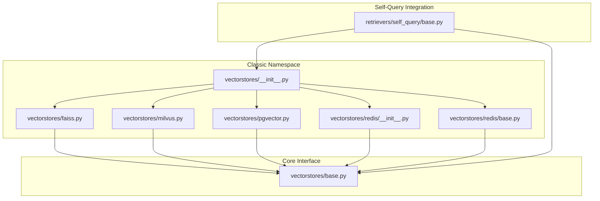
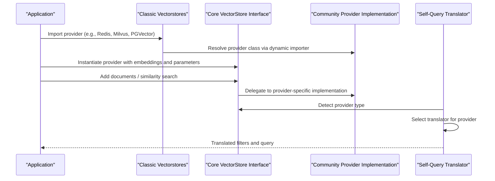
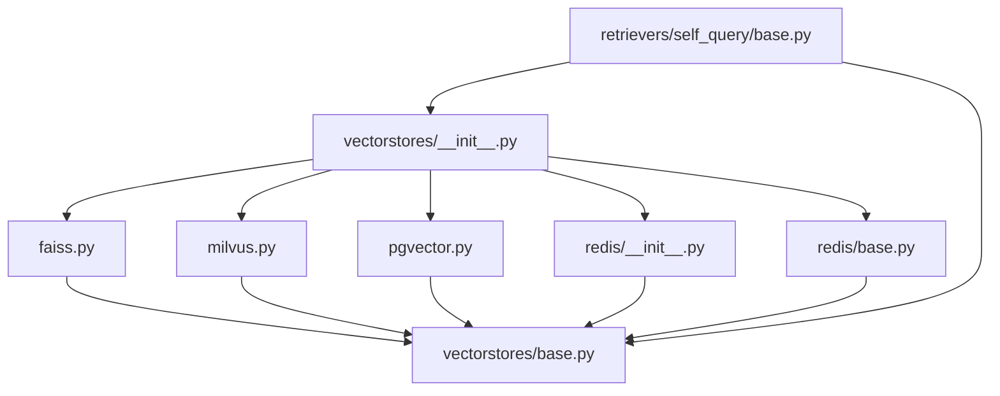

# Other Vector Store Providers

<cite>
**Referenced Files in This Document**
- [vectorstores/__init__.py](file://libs/langchain/langchain_classic/vectorstores/__init__.py)
- [vectorstores/faiss.py](file://libs/langchain/langchain_classic/vectorstores/faiss.py)
- [vectorstores/milvus.py](file://libs/langchain/langchain_classic/vectorstores/milvus.py)
- [vectorstores/pgvector.py](file://libs/langchain/langchain_classic/vectorstores/pgvector.py)
- [vectorstores/redis/__init__.py](file://libs/langchain/langchain_classic/vectorstores/redis/__init__.py)
- [vectorstores/redis/base.py](file://libs/langchain/langchain_classic/vectorstores/redis/base.py)
- [retrievers/self_query/base.py](file://libs/langchain/langchain_classic/retrievers/self_query/base.py)
- [vectorstores/base.py](file://libs/core/langchain_core/vectorstores/base.py)
</cite>

## Table of Contents
1. [Introduction](#introduction)
2. [Project Structure](#project-structure)
3. [Core Components](#core-components)
4. [Architecture Overview](#architecture-overview)
5. [Detailed Component Analysis](#detailed-component-analysis)
6. [Dependency Analysis](#dependency-analysis)
7. [Performance Considerations](#performance-considerations)
8. [Troubleshooting Guide](#troubleshooting-guide)
9. [Conclusion](#conclusion)
10. [Appendices](#appendices)

## Introduction
This document provides comprehensive guidance for integrating and operating additional vector store providers in LangChain beyond the built-in in-memory store. It focuses on four widely used vector database integrations: FAISS, Redis, Milvus, and PGVector. For each provider, it covers:
- Purpose and typical use cases
- Setup and configuration considerations
- Connection parameters and environment prerequisites
- Performance characteristics and scalability
- Deployment scenarios and optimization strategies
- Comparative analysis to help you select the right vector store for your needs

LangChain’s vector store ecosystem is modular. The core defines a unified interface that all vector stores implement. Provider-specific packages expose classes and utilities under the classic LangChain namespace, while the community packages provide the actual implementations.

## Project Structure
LangChain organizes vector store providers under a classic namespace that delegates to community packages. The core interface resides in the core library. The following diagram shows how the classic namespace maps to community implementations and how self-query logic integrates with providers.

**Diagram sources**
- [vectorstores/__init__.py](file://libs/langchain/langchain_classic/vectorstores/__init__.py#L112-L245)
- [vectorstores/faiss.py](file://libs/langchain/langchain_classic/vectorstores/faiss.py#L1-L24)
- [vectorstores/milvus.py](file://libs/langchain/langchain_classic/vectorstores/milvus.py#L1-L24)
- [vectorstores/pgvector.py](file://libs/langchain/langchain_classic/vectorstores/pgvector.py#L1-L29)
- [vectorstores/redis/__init__.py](file://libs/langchain/langchain_classic/vectorstores/redis/__init__.py#L1-L43)
- [vectorstores/redis/base.py](file://libs/langchain/langchain_classic/vectorstores/redis/base.py#L1-L34)
- [vectorstores/base.py](file://libs/core/langchain_core/vectorstores/base.py#L43-L800)
- [retrievers/self_query/base.py](file://libs/langchain/langchain_classic/retrievers/self_query/base.py#L61-L191)

**Section sources**
- [vectorstores/__init__.py](file://libs/langchain/langchain_classic/vectorstores/__init__.py#L112-L245)
- [vectorstores/base.py](file://libs/core/langchain_core/vectorstores/base.py#L43-L800)

## Core Components
LangChain’s vector store interface defines a consistent contract for storing and retrieving vectorized data. Implementations of this interface vary by provider in terms of supported operations, performance characteristics, and configuration options.

Key capabilities exposed by the interface include:
- Adding texts or documents with optional IDs and metadata
- Deleting by ID or other criteria
- Retrieving by ID
- Similarity search, similarity search with scores, and MMR (Maximal Marginal Relevance) search
- Asynchronous variants of the above operations
- Converting raw distances to normalized relevance scores

These methods enable consistent retrieval workflows regardless of the underlying vector store.

**Section sources**
- [vectorstores/base.py](file://libs/core/langchain_core/vectorstores/base.py#L43-L800)

## Architecture Overview
The classic LangChain vector store modules act as thin delegators to community packages. They expose provider classes and related utilities under the classic namespace, enabling backward compatibility and centralized imports. Self-query logic recognizes multiple providers and routes query translation accordingly.

**Diagram sources**
- [vectorstores/redis/__init__.py](file://libs/langchain/langchain_classic/vectorstores/redis/__init__.py#L1-L43)
- [vectorstores/redis/base.py](file://libs/langchain/langchain_classic/vectorstores/redis/base.py#L1-L34)
- [vectorstores/milvus.py](file://libs/langchain/langchain_classic/vectorstores/milvus.py#L1-L24)
- [vectorstores/pgvector.py](file://libs/langchain/langchain_classic/vectorstores/pgvector.py#L1-L29)
- [vectorstores/faiss.py](file://libs/langchain/langchain_classic/vectorstores/faiss.py#L1-L24)
- [vectorstores/base.py](file://libs/core/langchain_core/vectorstores/base.py#L43-L800)
- [retrievers/self_query/base.py](file://libs/langchain/langchain_classic/retrievers/self_query/base.py#L61-L191)

## Detailed Component Analysis

### FAISS
FAISS is a library optimized for efficient similarity search over dense vectors. It is commonly used for rapid retrieval during development and prototyping.

- Typical use cases
  - Rapid prototyping and experimentation
  - Local or in-memory retrieval without external dependencies
  - Batch indexing and offline retrieval workflows

- Setup and configuration
  - FAISS is exposed via the classic namespace and resolved to the community package.
  - Ensure the community FAISS package is installed in your environment.
  - Configure embedding dimensions and index parameters according to your dataset characteristics.

- Connection parameters and environment prerequisites
  - No external server required; operates in-process.
  - Index type and metric selection influence performance and memory usage.

- Performance characteristics and scalability
  - Excellent for small to medium datasets and fast nearest neighbor search.
  - Not designed for distributed or persistent deployments; consider alternatives for production-scale vector databases.

- Deployment scenarios and optimization strategies
  - Suitable for local development, CI pipelines, and offline batch jobs.
  - Optimize index type and preloading strategies for repeated queries.

**Section sources**
- [vectorstores/faiss.py](file://libs/langchain/langchain_classic/vectorstores/faiss.py#L1-L24)
- [vectorstores/__init__.py](file://libs/langchain/langchain_classic/vectorstores/__init__.py#L112-L199)

### Redis
Redis-based vector storage leverages Redis modules (such as RediSearch and RedisJSON) to provide in-memory vector search and filtering capabilities.

- Typical use cases
  - Low-latency retrieval with metadata filtering
  - Real-time applications requiring fast updates and reads
  - Hybrid retrieval combining vector and keyword filters

- Setup and configuration
  - Exposed via the classic namespace; resolves to the community Redis vector store.
  - Install the community Redis vector store package.
  - Ensure Redis server is running with required modules enabled.

- Connection parameters and environment prerequisites
  - Host, port, password, and database selection are typical connection parameters.
  - Index creation and schema definition are handled by the provider wrapper.

- Performance characteristics and scalability
  - High throughput for read-heavy workloads.
  - Limited by available RAM; suitable for moderate-scale datasets.
  - Filtering performance depends on index configuration and query complexity.

- Deployment scenarios and optimization strategies
  - Ideal for microservices and real-time retrieval.
  - Tune index parameters, use appropriate filter types, and monitor memory usage.

- Self-query integration
  - The self-query translator includes a dedicated translator for Redis, enabling translation of structured filters into provider-specific query constructs.

**Section sources**
- [vectorstores/redis/__init__.py](file://libs/langchain/langchain_classic/vectorstores/redis/__init__.py#L1-L43)
- [vectorstores/redis/base.py](file://libs/langchain/langchain_classic/vectorstores/redis/base.py#L1-L34)
- [retrievers/self_query/base.py](file://libs/langchain/langchain_classic/retrievers/self_query/base.py#L61-L89)
- [retrievers/self_query/base.py](file://libs/langchain/langchain_classic/retrievers/self_query/base.py#L127-L128)

### Milvus
Milvus is a scalable, cloud-native vector database designed for large-scale similarity search and analytics.

- Typical use cases
  - Production-grade vector search at scale
  - Distributed deployments with high availability
  - Advanced analytics and observability features

- Setup and configuration
  - Exposed via the classic namespace and resolved to the community Milvus provider.
  - Install the community Milvus package and configure connection settings.

- Connection parameters and environment prerequisites
  - Endpoint, collection name, primary key, and vector field names are typical parameters.
  - Authentication and TLS settings depend on your Milvus deployment mode.

- Performance characteristics and scalability
  - Designed for massive datasets and concurrent workloads.
  - Supports sharding, replicas, and advanced indexing strategies.

- Deployment scenarios and optimization strategies
  - Recommended for enterprise and high-scale applications.
  - Optimize collection schema, index types, and resource allocation.

- Self-query integration
  - The self-query translator includes a dedicated translator for Milvus, enabling structured filtering and query translation.

**Section sources**
- [vectorstores/milvus.py](file://libs/langchain/langchain_classic/vectorstores/milvus.py#L1-L24)
- [retrievers/self_query/base.py](file://libs/langchain/langchain_classic/retrievers/self_query/base.py#L116-L116)

### PGVector
PGVector extends PostgreSQL with vector similarity search capabilities, enabling SQL-like operations and leveraging existing relational tooling.

- Typical use cases
  - Applications requiring SQL-based filtering alongside vector search
  - Environments already invested in PostgreSQL infrastructure
  - Mixed workloads combining vector and relational data

- Setup and configuration
  - Exposed via the classic namespace and resolved to the community PGVector provider.
  - Install the community PGVector package and enable the extension in your database.

- Connection parameters and environment prerequisites
  - Standard PostgreSQL connection parameters apply (host, port, database, user, password).
  - Configure the vector dimension and similarity function (e.g., inner product, cosine, L2).

- Performance characteristics and scalability
  - Benefits from PostgreSQL’s maturity, replication, and indexing.
  - Performance scales with database resources and index tuning.

- Deployment scenarios and optimization strategies
  - Ideal for teams preferring SQL-centric workflows and existing PostgreSQL ecosystems.
  - Use appropriate indexes and consider partitioning for large datasets.

- Self-query integration
  - The self-query translator includes a dedicated translator for PGVector, enabling translation of structured filters into SQL-compatible expressions.

**Section sources**
- [vectorstores/pgvector.py](file://libs/langchain/langchain_classic/vectorstores/pgvector.py#L1-L29)
- [retrievers/self_query/base.py](file://libs/langchain/langchain_classic/retrievers/self_query/base.py#L105-L105)

## Dependency Analysis
The classic vector store modules depend on the core interface and delegate provider-specific logic to community packages. Self-query logic maintains a registry of translators mapped to provider classes, ensuring correct translation for each backend.

**Diagram sources**
- [vectorstores/__init__.py](file://libs/langchain/langchain_classic/vectorstores/__init__.py#L112-L245)
- [vectorstores/faiss.py](file://libs/langchain/langchain_classic/vectorstores/faiss.py#L1-L24)
- [vectorstores/milvus.py](file://libs/langchain/langchain_classic/vectorstores/milvus.py#L1-L24)
- [vectorstores/pgvector.py](file://libs/langchain/langchain_classic/vectorstores/pgvector.py#L1-L29)
- [vectorstores/redis/__init__.py](file://libs/langchain/langchain_classic/vectorstores/redis/__init__.py#L1-L43)
- [vectorstores/redis/base.py](file://libs/langchain/langchain_classic/vectorstores/redis/base.py#L1-L34)
- [vectorstores/base.py](file://libs/core/langchain_core/vectorstores/base.py#L43-L800)
- [retrievers/self_query/base.py](file://libs/langchain/langchain_classic/retrievers/self_query/base.py#L61-L191)

**Section sources**
- [vectorstores/__init__.py](file://libs/langchain/langchain_classic/vectorstores/__init__.py#L112-L245)
- [retrievers/self_query/base.py](file://libs/langchain/langchain_classic/retrievers/self_query/base.py#L61-L191)

## Performance Considerations
- FAISS
  - Best for small to medium datasets and fast nearest neighbor search.
  - Not intended for distributed or persistent deployments; consider alternatives for production-scale vector databases.

- Redis
  - High throughput for read-heavy workloads.
  - Limited by available RAM; suitable for moderate-scale datasets.
  - Filtering performance depends on index configuration and query complexity.

- Milvus
  - Designed for massive datasets and concurrent workloads.
  - Supports sharding, replicas, and advanced indexing strategies.

- PGVector
  - Benefits from PostgreSQL’s maturity, replication, and indexing.
  - Performance scales with database resources and index tuning.

[No sources needed since this section provides general guidance]

## Troubleshooting Guide
- Missing provider package
  - Symptom: Import errors when importing a provider from the classic namespace.
  - Resolution: Install the corresponding community package for the provider (e.g., FAISS, Redis, Milvus, PGVector).

- Self-query translation failures
  - Symptom: Queries fail to translate for a given provider.
  - Resolution: Verify that the provider is recognized by the self-query translator and that the appropriate translator is available in the environment.

- Connection issues
  - Symptom: Failures connecting to external services (e.g., Redis, Milvus, PostgreSQL).
  - Resolution: Confirm endpoint, credentials, and network connectivity; ensure required modules/extensions are enabled.

**Section sources**
- [vectorstores/redis/__init__.py](file://libs/langchain/langchain_classic/vectorstores/redis/__init__.py#L1-L43)
- [vectorstores/redis/base.py](file://libs/langchain/langchain_classic/vectorstores/redis/base.py#L1-L34)
- [retrievers/self_query/base.py](file://libs/langchain/langchain_classic/retrievers/self_query/base.py#L61-L191)

## Conclusion
LangChain’s vector store providers offer a broad spectrum of capabilities, from lightweight in-memory solutions to enterprise-grade distributed systems. Choose a provider based on your dataset size, latency requirements, operational constraints, and existing infrastructure. FAISS is ideal for prototyping; Redis excels in low-latency, real-time retrieval; Milvus is suited for large-scale, production deployments; and PGVector blends vector search with SQL-based workflows for teams relying on PostgreSQL.

[No sources needed since this section summarizes without analyzing specific files]

## Appendices

### Comparative Analysis
- FAISS
  - Pros: Fast similarity search, simple setup, good for prototyping.
  - Cons: Not distributed or persistent; not recommended for production-scale vector databases.

- Redis
  - Pros: Low-latency retrieval, metadata filtering, real-time updates.
  - Cons: Memory-bound; moderate-scale deployments.

- Milvus
  - Pros: Scalable, distributed, enterprise-grade features.
  - Cons: Requires operational expertise and infrastructure.

- PGVector
  - Pros: SQL-centric workflows, existing PostgreSQL ecosystems, mixed workloads.
  - Cons: Performance depends on database tuning and resources.

[No sources needed since this section provides general guidance]