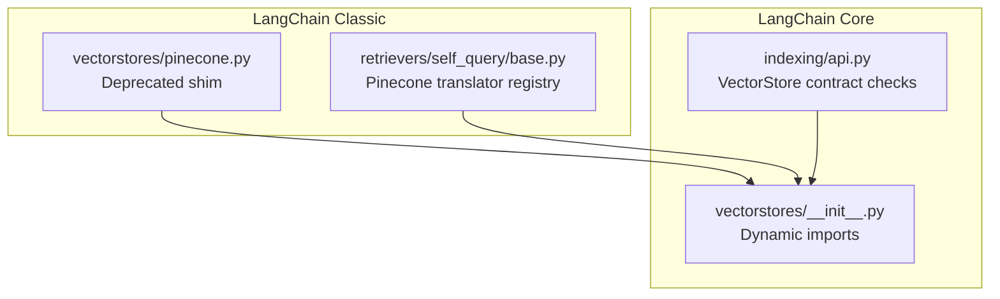
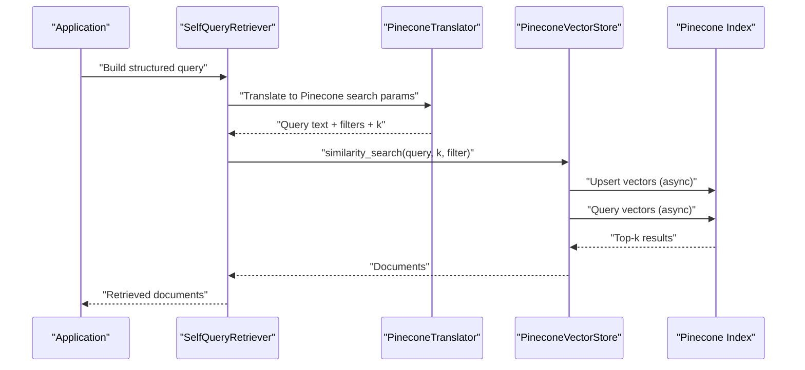
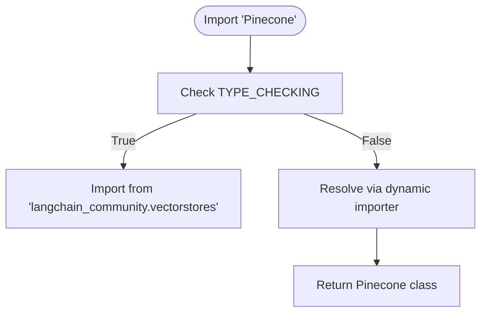
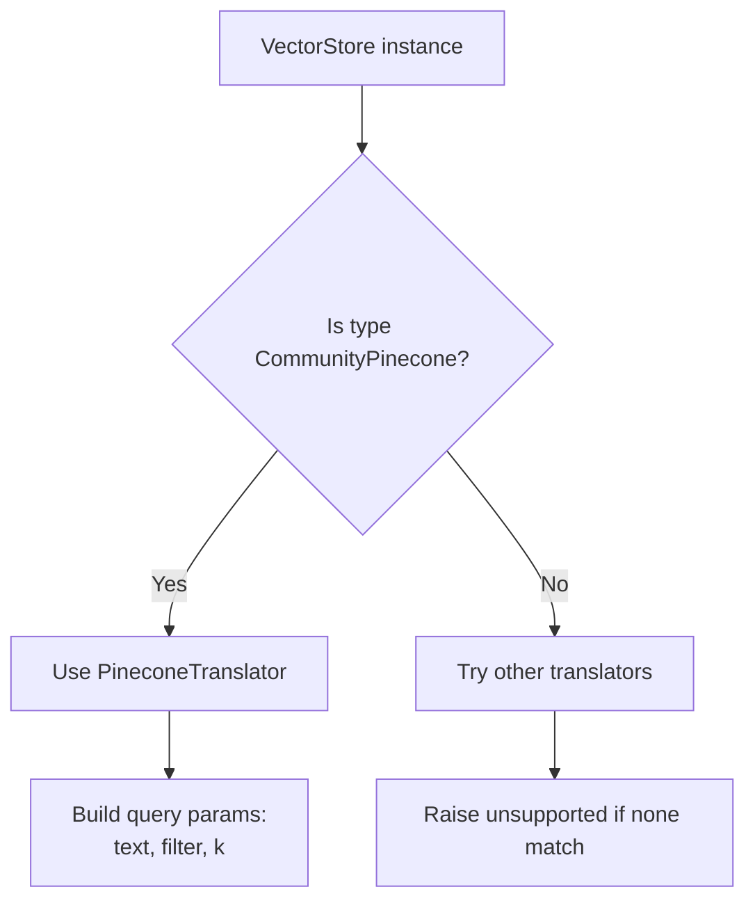
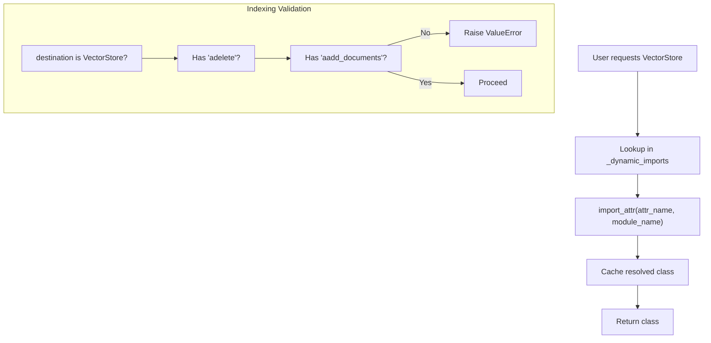
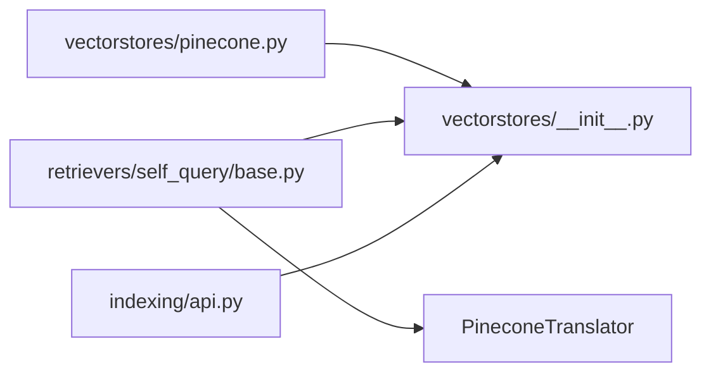

# Pinecone Vector Store

<cite>
**Referenced Files in This Document**
- [pinecone.py](file://libs/langchain/langchain_classic/vectorstores/pinecone.py)
- [base.py](file://libs/langchain/langchain_classic/retrievers/self_query/base.py)
- [api.py](file://libs/core/langchain_core/indexing/api.py)
- [__init__.py](file://libs/core/langchain_core/vectorstores/__init__.py)
</cite>

## Table of Contents
1. [Introduction](#introduction)
2. [Project Structure](#project-structure)
3. [Core Components](#core-components)
4. [Architecture Overview](#architecture-overview)
5. [Detailed Component Analysis](#detailed-component-analysis)
6. [Dependency Analysis](#dependency-analysis)
7. [Performance Considerations](#performance-considerations)
8. [Troubleshooting Guide](#troubleshooting-guide)
9. [Conclusion](#conclusion)

## Introduction
This document explains how Pinecone integrates with LangChain as a managed vector database service optimized for enterprise-grade scalability and performance. It covers configuration, index management, dimension handling, namespaces, metadata filtering, and end-to-end upsert and search workflows. It also provides practical guidance for deploying Pinecone indexes, handling large-scale datasets, optimizing performance and costs, integrating with cloud environments (AWS/Azure), and migrating from self-hosted solutions.

## Project Structure
LangChain’s Pinecone integration is primarily exposed via a compatibility shim and dynamic imports. The repository includes:
- A deprecation shim that redirects Pinecone imports to the community package
- A self-query translator registry that recognizes Pinecone vector stores
- Core vector store abstractions and dynamic import mechanisms

**Diagram sources**
- [pinecone.py](file://libs/langchain/langchain_classic/vectorstores/pinecone.py#L1-L24)
- [base.py](file://libs/langchain/langchain_classic/retrievers/self_query/base.py#L95-L101)
- [__init__.py](file://libs/core/langchain_core/vectorstores/__init__.py#L18-L23)
- [api.py](file://libs/core/langchain_core/indexing/api.py#L757-L770)

**Section sources**
- [pinecone.py](file://libs/langchain/langchain_classic/vectorstores/pinecone.py#L1-L24)
- [base.py](file://libs/langchain/langchain_classic/retrievers/self_query/base.py#L95-L101)
- [__init__.py](file://libs/core/langchain_core/vectorstores/__init__.py#L18-L23)
- [api.py](file://libs/core/langchain_core/indexing/api.py#L757-L770)

## Core Components
- Pinecone deprecation shim: Provides backward-compatible imports for Pinecone while redirecting to the community package.
- Self-query translator registry: Recognizes Pinecone vector stores and maps structured queries to Pinecone-specific search parameters.
- Dynamic vector store imports: Enables lazy loading of vector store implementations to reduce startup overhead.
- VectorStore contract checks: Validates that vector stores implement required asynchronous methods for ingestion and deletion.

Key responsibilities:
- Redirect legacy Pinecone usage to community-backed implementations
- Enable structured query translation for Pinecone-backed retrievers
- Support asynchronous ingestion and deletion via the VectorStore interface

**Section sources**
- [pinecone.py](file://libs/langchain/langchain_classic/vectorstores/pinecone.py#L1-L24)
- [base.py](file://libs/langchain/langchain_classic/retrievers/self_query/base.py#L103-L107)
- [__init__.py](file://libs/core/langchain_core/vectorstores/__init__.py#L26-L44)
- [api.py](file://libs/core/langchain_core/indexing/api.py#L757-L770)

## Architecture Overview
The integration centers on a compatibility shim and a translator registry. Legacy Pinecone usage is redirected to the community package, while the self-query retriever uses a translator to convert structured queries into Pinecone search parameters.

**Diagram sources**
- [base.py](file://libs/langchain/langchain_classic/retrievers/self_query/base.py#L103-L107)
- [api.py](file://libs/core/langchain_core/indexing/api.py#L757-L770)

## Detailed Component Analysis

### Pinecone Import Compatibility Shim
Purpose:
- Maintain backward compatibility for imports previously pointing to Pinecone
- Redirect to the community package for actual implementation

Behavior:
- Uses a dynamic importer to resolve Pinecone references
- Exposes Pinecone as an importable symbol while delegating to the community package

**Diagram sources**
- [pinecone.py](file://libs/langchain/langchain_classic/vectorstores/pinecone.py#L5-L18)

**Section sources**
- [pinecone.py](file://libs/langchain/langchain_classic/vectorstores/pinecone.py#L1-L24)

### Self-Query Translator Registry for Pinecone
Purpose:
- Map structured queries to Pinecone-specific search parameters
- Enable metadata filtering and limit handling during retrieval

Behavior:
- Registers Pinecone as a recognized vector store type
- Selects the Pinecone translator when building retrievers with Pinecone

**Diagram sources**
- [base.py](file://libs/langchain/langchain_classic/retrievers/self_query/base.py#L103-L107)

**Section sources**
- [base.py](file://libs/langchain/langchain_classic/retrievers/self_query/base.py#L95-L101)
- [base.py](file://libs/langchain/langchain_classic/retrievers/self_query/base.py#L134-L136)

### Dynamic Vector Store Imports and Contract Validation
Purpose:
- Lazy-load vector store implementations to reduce import overhead
- Enforce required asynchronous methods for ingestion and deletion

Behavior:
- Dynamic import mechanism resolves VectorStore subclasses on demand
- Indexing API validates presence of asynchronous methods before allowing ingestion

**Diagram sources**
- [__init__.py](file://libs/core/langchain_core/vectorstores/__init__.py#L26-L44)
- [api.py](file://libs/core/langchain_core/indexing/api.py#L757-L770)

**Section sources**
- [__init__.py](file://libs/core/langchain_core/vectorstores/__init__.py#L18-L23)
- [__init__.py](file://libs/core/langchain_core/vectorstores/__init__.py#L26-L44)
- [api.py](file://libs/core/langchain_core/indexing/api.py#L757-L770)

## Dependency Analysis
Relationships:
- The Pinecone shim depends on the dynamic import mechanism to resolve community-backed implementations
- The self-query registry depends on recognizing Pinecone vector stores to enable structured query translation
- The indexing API depends on the VectorStore interface to validate asynchronous ingestion and deletion capabilities

**Diagram sources**
- [pinecone.py](file://libs/langchain/langchain_classic/vectorstores/pinecone.py#L1-L24)
- [base.py](file://libs/langchain/langchain_classic/retrievers/self_query/base.py#L95-L101)
- [__init__.py](file://libs/core/langchain_core/vectorstores/__init__.py#L18-L23)
- [api.py](file://libs/core/langchain_core/indexing/api.py#L757-L770)

**Section sources**
- [pinecone.py](file://libs/langchain/langchain_classic/vectorstores/pinecone.py#L1-L24)
- [base.py](file://libs/langchain/langchain_classic/retrievers/self_query/base.py#L95-L101)
- [__init__.py](file://libs/core/langchain_core/vectorstores/__init__.py#L18-L23)
- [api.py](file://libs/core/langchain_core/indexing/api.py#L757-L770)

## Performance Considerations
- Asynchronous ingestion and deletion: Ensure vector stores implement asynchronous methods to support high-throughput batch operations.
- Metadata filtering: Use Pinecone’s metadata filters to reduce search space and improve latency.
- Dimension handling: Align embedding dimensions with index configuration to avoid costly re-indexing.
- Namespace partitioning: Use namespaces to isolate workloads and scale independently.
- Batch sizes: Tune batch sizes for upsert and search to balance throughput and latency.
- Cloud placement: Deploy Pinecone clusters close to compute resources to minimize network latency.

[No sources needed since this section provides general guidance]

## Troubleshooting Guide
Common issues and resolutions:
- Missing asynchronous methods: If ingestion fails, verify that the vector store implements required async methods for deletion and document addition.
- Unsupported vector store type: If using a self-query retriever, ensure the vector store is recognized by the translator registry.
- Import resolution errors: Confirm that the community package is installed and that legacy imports are redirected via the shim.

**Section sources**
- [api.py](file://libs/core/langchain_core/indexing/api.py#L757-L770)
- [base.py](file://libs/langchain/langchain_classic/retrievers/self_query/base.py#L103-L107)
- [pinecone.py](file://libs/langchain/langchain_classic/vectorstores/pinecone.py#L1-L24)

## Conclusion
LangChain’s Pinecone integration leverages a compatibility shim, dynamic imports, and a translator registry to provide a seamless developer experience. By aligning with the VectorStore interface and enabling structured query translation, it supports scalable, enterprise-grade vector search. For production deployments, focus on proper index configuration, metadata filtering, namespace partitioning, and asynchronous operations to achieve optimal performance and cost efficiency.