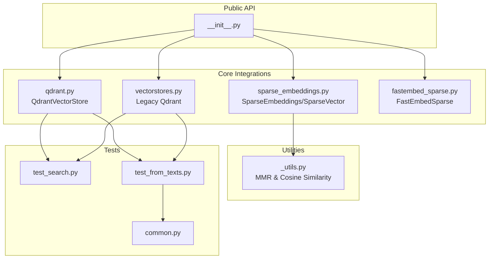
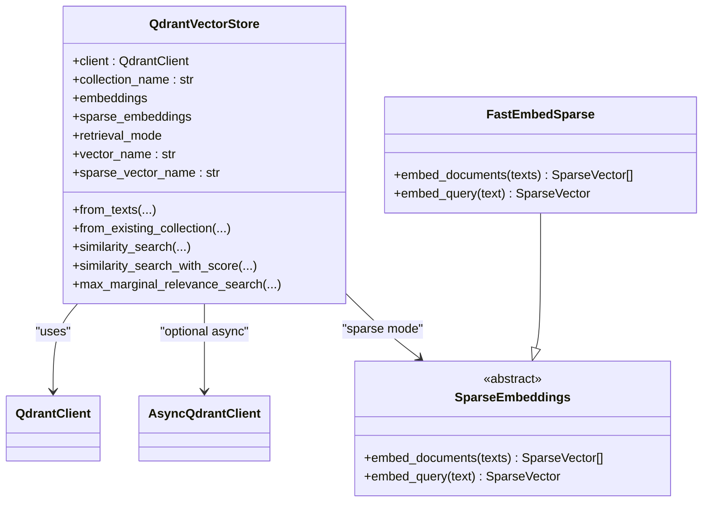
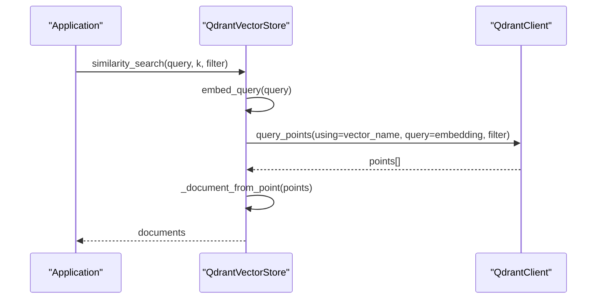
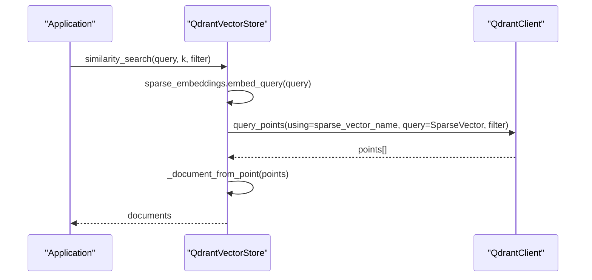
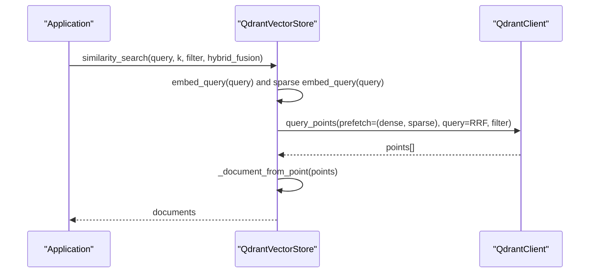
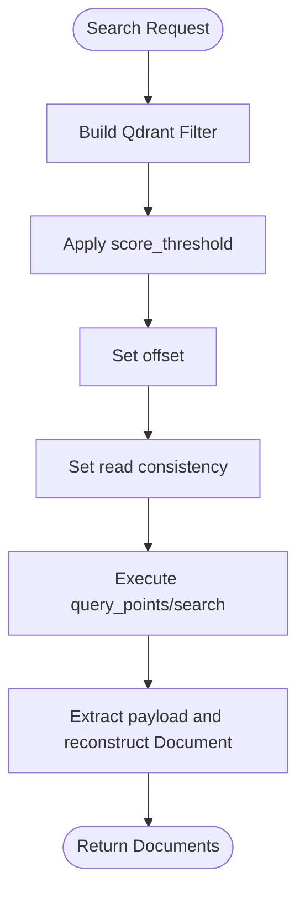
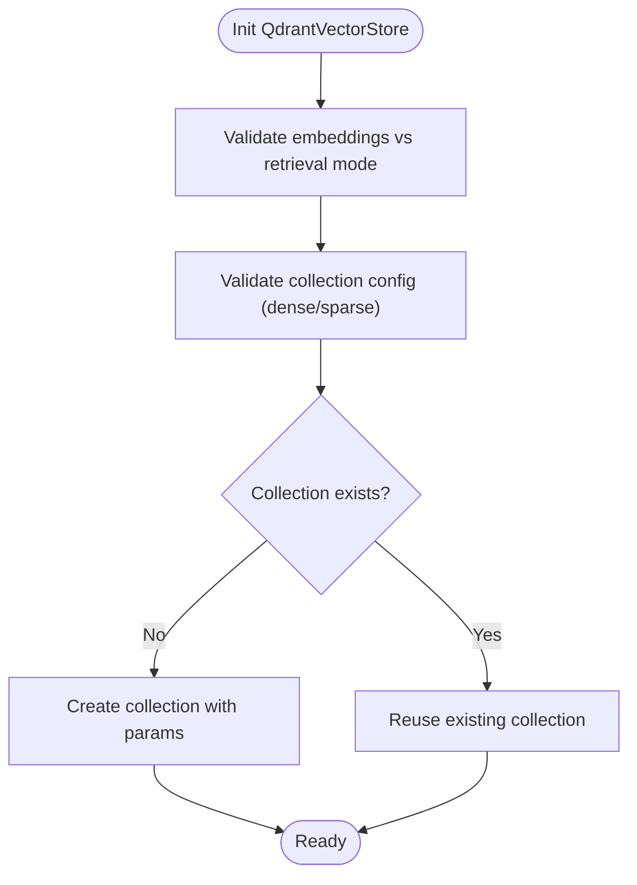
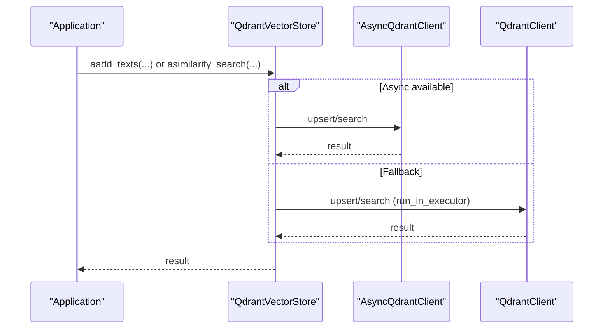
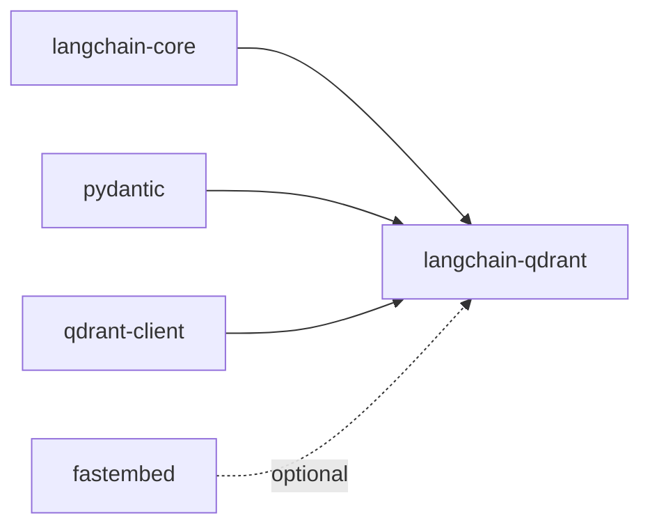

# Qdrant Vector Store

<cite>
**Referenced Files in This Document**
- [__init__.py](file://libs/partners/qdrant/langchain_qdrant/__init__.py)
- [qdrant.py](file://libs/partners/qdrant/langchain_qdrant/qdrant.py)
- [vectorstores.py](file://libs/partners/qdrant/langchain_qdrant/vectorstores.py)
- [sparse_embeddings.py](file://libs/partners/qdrant/langchain_qdrant/sparse_embeddings.py)
- [fastembed_sparse.py](file://libs/partners/qdrant/langchain_qdrant/fastembed_sparse.py)
- [_utils.py](file://libs/partners/qdrant/langchain_qdrant/_utils.py)
- [README.md](file://libs/partners/qdrant/README.md)
- [pyproject.toml](file://libs/partners/qdrant/pyproject.toml)
- [test_search.py](file://libs/partners/qdrant/tests/integration_tests/qdrant_vector_store/test_search.py)
- [test_from_texts.py](file://libs/partners/qdrant/tests/integration_tests/qdrant_vector_store/test_from_texts.py)
- [common.py](file://libs/partners/qdrant/tests/integration_tests/common.py)
</cite>

## Table of Contents
1. [Introduction](#introduction)
2. [Project Structure](#project-structure)
3. [Core Components](#core-components)
4. [Architecture Overview](#architecture-overview)
5. [Detailed Component Analysis](#detailed-component-analysis)
6. [Dependency Analysis](#dependency-analysis)
7. [Performance Considerations](#performance-considerations)
8. [Troubleshooting Guide](#troubleshooting-guide)
9. [Conclusion](#conclusion)
10. [Appendices](#appendices)

## Introduction
This document explains the Qdrant vector store integration in LangChain, focusing on Qdrant’s cloud-native vector database architecture and how LangChain connects to it. It covers collection configuration, vector sizing constraints, indexing strategies, advanced features such as payload filtering, HNSW index configuration, and quantization options. Practical guidance is provided for connecting to Qdrant clusters, managing collections, optimizing search performance, and understanding distributed deployment, backup, and monitoring considerations. Guidance is also included for choosing between local and cloud deployments.

## Project Structure
The Qdrant integration is implemented as a LangChain partner package with a clean separation of concerns:
- Public API exports and re-exports
- Dense vector store implementation
- Legacy vector store implementation
- Sparse embedding interfaces and FastEmbed-backed sparse encoder
- Utility functions for MMR and similarity
- Tests validating search, filters, and configuration behaviors

**Diagram sources**
- [__init__.py](file://libs/partners/qdrant/langchain_qdrant/__init__.py#L1-L16)
- [qdrant.py](file://libs/partners/qdrant/langchain_qdrant/qdrant.py#L1-L203)
- [vectorstores.py](file://libs/partners/qdrant/langchain_qdrant/vectorstores.py#L1-L120)
- [sparse_embeddings.py](file://libs/partners/qdrant/langchain_qdrant/sparse_embeddings.py#L1-L34)
- [fastembed_sparse.py](file://libs/partners/qdrant/langchain_qdrant/fastembed_sparse.py#L1-L85)
- [_utils.py](file://libs/partners/qdrant/langchain_qdrant/_utils.py#L1-L69)
- [test_search.py](file://libs/partners/qdrant/tests/integration_tests/qdrant_vector_store/test_search.py#L1-L414)
- [test_from_texts.py](file://libs/partners/qdrant/tests/integration_tests/qdrant_vector_store/test_from_texts.py#L1-L386)
- [common.py](file://libs/partners/qdrant/tests/integration_tests/common.py#L1-L87)

**Section sources**
- [__init__.py](file://libs/partners/qdrant/langchain_qdrant/__init__.py#L1-L16)
- [README.md](file://libs/partners/qdrant/README.md#L1-L23)
- [pyproject.toml](file://libs/partners/qdrant/pyproject.toml#L1-L121)

## Core Components
- QdrantVectorStore: Modern, robust integration supporting dense, sparse, and hybrid retrieval modes, with flexible client configuration, collection validation, and advanced search features.
- Legacy Qdrant: Backward-compatible vector store with synchronous and asynchronous APIs, payload keys, and batch operations.
- SparseEmbeddings and SparseVector: Abstractions for sparse embeddings and their structure.
- FastEmbedSparse: Sparse encoder backed by FastEmbed for BM25-style sparse vectors.
- Utility functions: MMR computation and cosine similarity with optional SIMD acceleration.

Key capabilities:
- Dense, sparse, and hybrid retrieval modes
- Payload filtering via Qdrant Filter models
- Named vectors support
- Batch upsert and search
- Async/sync interoperability with constraints
- Collection validation and recreation options

**Section sources**
- [qdrant.py](file://libs/partners/qdrant/langchain_qdrant/qdrant.py#L28-L34)
- [qdrant.py](file://libs/partners/qdrant/langchain_qdrant/qdrant.py#L36-L300)
- [vectorstores.py](file://libs/partners/qdrant/langchain_qdrant/vectorstores.py#L59-L141)
- [sparse_embeddings.py](file://libs/partners/qdrant/langchain_qdrant/sparse_embeddings.py#L7-L34)
- [fastembed_sparse.py](file://libs/partners/qdrant/langchain_qdrant/fastembed_sparse.py#L11-L85)
- [_utils.py](file://libs/partners/qdrant/langchain_qdrant/_utils.py#L8-L69)

## Architecture Overview
The integration bridges LangChain’s vector store abstractions with Qdrant’s client APIs. The modern QdrantVectorStore encapsulates:
- Client instantiation and lifecycle
- Collection creation/validation
- Dense/sparse/hybrid search orchestration
- Payload extraction and document reconstruction
- Batched upsert and search operations

**Diagram sources**
- [qdrant.py](file://libs/partners/qdrant/langchain_qdrant/qdrant.py#L210-L336)
- [sparse_embeddings.py](file://libs/partners/qdrant/langchain_qdrant/sparse_embeddings.py#L16-L34)
- [fastembed_sparse.py](file://libs/partners/qdrant/langchain_qdrant/fastembed_sparse.py#L11-L85)

## Detailed Component Analysis

### Dense Retrieval Mode
- Embeddings are required; vectors are generated via the provided Embeddings interface.
- Supports named vectors and payload filtering.
- Batched upsert and search operations.
- Hybrid fusion is not applicable here.

**Diagram sources**
- [qdrant.py](file://libs/partners/qdrant/langchain_qdrant/qdrant.py#L520-L643)

**Section sources**
- [qdrant.py](file://libs/partners/qdrant/langchain_qdrant/qdrant.py#L520-L643)

### Sparse Retrieval Mode
- Requires a SparseEmbeddings implementation; dense embeddings are not used.
- Sparse vectors are stored under a dedicated sparse vector name.
- Supports named sparse vectors and payload filtering.

**Diagram sources**
- [qdrant.py](file://libs/partners/qdrant/langchain_qdrant/qdrant.py#L590-L599)

**Section sources**
- [qdrant.py](file://libs/partners/qdrant/langchain_qdrant/qdrant.py#L590-L599)
- [sparse_embeddings.py](file://libs/partners/qdrant/langchain_qdrant/sparse_embeddings.py#L16-L34)
- [fastembed_sparse.py](file://libs/partners/qdrant/langchain_qdrant/fastembed_sparse.py#L11-L85)

### Hybrid Retrieval Mode
- Combines dense and sparse retrieval via prefetch and fusion.
- Defaults to reciprocal rank fusion (RRF) if no fusion query is provided.
- Supports named dense and sparse vectors.

**Diagram sources**
- [qdrant.py](file://libs/partners/qdrant/langchain_qdrant/qdrant.py#L601-L627)

**Section sources**
- [qdrant.py](file://libs/partners/qdrant/langchain_qdrant/qdrant.py#L601-L627)

### Payload Filtering and Search Parameters
- Filters are expressed using Qdrant’s Filter model; dictionary-based filters are deprecated.
- Supports score thresholds, offsets, and read consistency.
- Payload keys for content and metadata are configurable.

**Diagram sources**
- [qdrant.py](file://libs/partners/qdrant/langchain_qdrant/qdrant.py#L569-L580)
- [qdrant.py](file://libs/partners/qdrant/langchain_qdrant/qdrant.py#L662-L684)

**Section sources**
- [qdrant.py](file://libs/partners/qdrant/langchain_qdrant/qdrant.py#L569-L580)
- [qdrant.py](file://libs/partners/qdrant/langchain_qdrant/qdrant.py#L662-L684)
- [test_search.py](file://libs/partners/qdrant/tests/integration_tests/qdrant_vector_store/test_search.py#L107-L145)

### Collection Management and Validation
- Creation and validation of dense/sparse vectors and distances.
- Enforces dimensional consistency and vector name matching.
- Supports force recreation and collection reuse.
- Accepts advanced collection options (e.g., on_disk_payload, optimizers_config).

**Diagram sources**
- [qdrant.py](file://libs/partners/qdrant/langchain_qdrant/qdrant.py#L1150-L1176)
- [test_from_texts.py](file://libs/partners/qdrant/tests/integration_tests/qdrant_vector_store/test_from_texts.py#L155-L266)

**Section sources**
- [qdrant.py](file://libs/partners/qdrant/langchain_qdrant/qdrant.py#L1150-L1176)
- [test_from_texts.py](file://libs/partners/qdrant/tests/integration_tests/qdrant_vector_store/test_from_texts.py#L155-L266)

### Batch Operations and Async Interoperability
- Batched upsert and search reduce network overhead.
- Async client is used when not running in-memory; otherwise, sync fallback applies.
- Decorator ensures async methods fall back to sync equivalents when not implemented.

**Diagram sources**
- [vectorstores.py](file://libs/partners/qdrant/langchain_qdrant/vectorstores.py#L35-L56)
- [vectorstores.py](file://libs/partners/qdrant/langchain_qdrant/vectorstores.py#L2280-L2332)

**Section sources**
- [vectorstores.py](file://libs/partners/qdrant/langchain_qdrant/vectorstores.py#L35-L56)
- [vectorstores.py](file://libs/partners/qdrant/langchain_qdrant/vectorstores.py#L2280-L2332)

### Advanced Features: HNSW Index, Quantization, and Optimizers
- HNSW index configuration, quantization, WAL, and optimizer settings are exposed via Qdrant client models.
- On-disk payload and vectors can be enabled to optimize memory usage.
- These options are passed through during collection creation and configuration.

Practical guidance:
- Enable on_disk for vectors and on_disk_payload for payload to reduce RAM usage at the cost of latency.
- Tune HNSW parameters (e.g., m, ef_construct, full_scan_threshold) for recall/performance trade-offs.
- Consider scalar quantization for sparse vectors or product quantization for dense vectors to reduce storage and improve throughput.

**Section sources**
- [test_from_texts.py](file://libs/partners/qdrant/tests/integration_tests/qdrant_vector_store/test_from_texts.py#L353-L385)
- [vectorstores.py](file://libs/partners/qdrant/langchain_qdrant/vectorstores.py#L1541-L1558)

## Dependency Analysis
External dependencies and their roles:
- qdrant-client: Core client for REST and gRPC communication with Qdrant.
- pydantic: Data validation and serialization for sparse vector structures.
- langchain-core: Vector store abstractions and document models.

Optional dependencies:
- fastembed: Sparse embedding backend for BM25-style sparse vectors.

**Diagram sources**
- [pyproject.toml](file://libs/partners/qdrant/pyproject.toml#L9-L13)
- [pyproject.toml](file://libs/partners/qdrant/pyproject.toml#L28-L31)

**Section sources**
- [pyproject.toml](file://libs/partners/qdrant/pyproject.toml#L1-L121)

## Performance Considerations
- Batch size tuning: Increase batch_size to reduce round-trips; balance with memory usage.
- Payload and vector persistence: Enable on_disk and on_disk_payload to reduce memory pressure.
- HNSW parameters: Adjust m, ef_construct, and full_scan_threshold to optimize recall and latency.
- Quantization: Apply appropriate quantization strategies to reduce storage and bandwidth.
- Read consistency: Use consistency levels judiciously to balance correctness and latency.
- MMR: Use lambda_mult to control diversity vs relevance trade-offs.

[No sources needed since this section provides general guidance]

## Troubleshooting Guide
Common issues and resolutions:
- Dimension mismatch: Ensure embeddings dimension matches collection vector size; otherwise, creation/reuse will fail.
- Vector name mismatch: Named vectors must match across runs; otherwise, configuration validation fails.
- Distance mismatch: Collection distance must align with requested distance; otherwise, validation fails.
- Async/local client conflict: In-memory Qdrant cannot interoperate with async clients; use sync fallback.
- Payload filtering deprecation: Use Qdrant Filter model instead of dict-based filters.

Validation and error handling:
- Collection configuration validation for dense and sparse modes.
- Explicit error messages for dimensionality and distance mismatches.
- Graceful fallback for async methods to sync equivalents.

**Section sources**
- [test_from_texts.py](file://libs/partners/qdrant/tests/integration_tests/qdrant_vector_store/test_from_texts.py#L155-L266)
- [vectorstores.py](file://libs/partners/qdrant/langchain_qdrant/vectorstores.py#L35-L56)
- [qdrant.py](file://libs/partners/qdrant/langchain_qdrant/qdrant.py#L1150-L1176)

## Conclusion
The Qdrant integration in LangChain provides a robust, extensible vector store with support for dense, sparse, and hybrid retrieval modes. It offers fine-grained control over collection configuration, payload filtering, and advanced indexing and quantization options. By leveraging batch operations, async/sync interoperability, and careful configuration of HNSW and quantization, teams can achieve high-performance, scalable vector search tailored to production workloads.

[No sources needed since this section summarizes without analyzing specific files]

## Appendices

### Connecting to Qdrant Clusters and Managing Collections
- Connect via URL/port or in-memory mode; API key and HTTPS can be configured.
- Create or reuse collections; enforce validation and optionally force recreate.
- Configure named vectors and sparse vector names for multi-modal setups.

**Section sources**
- [qdrant.py](file://libs/partners/qdrant/langchain_qdrant/qdrant.py#L338-L493)
- [test_from_texts.py](file://libs/partners/qdrant/tests/integration_tests/qdrant_vector_store/test_from_texts.py#L113-L152)

### Distributed Deployment, Backup, and Monitoring
- Distributed deployment: Use remote Qdrant instances and configure client options accordingly.
- Backup strategies: Rely on Qdrant’s built-in collection snapshots and replication settings.
- Monitoring: Track query latency, throughput, and resource utilization; leverage Qdrant’s metrics and logs.

[No sources needed since this section provides general guidance]

### Choosing Between Local and Cloud Deployments
- Local (in-memory or local filesystem): Suitable for development, testing, and small-scale workloads.
- Cloud/Remote: Required for production scale, high availability, and multi-region access.

[No sources needed since this section provides general guidance]