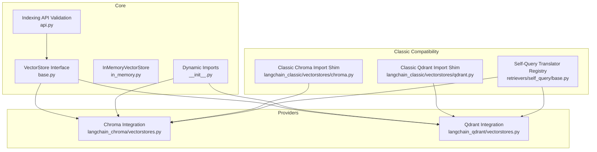
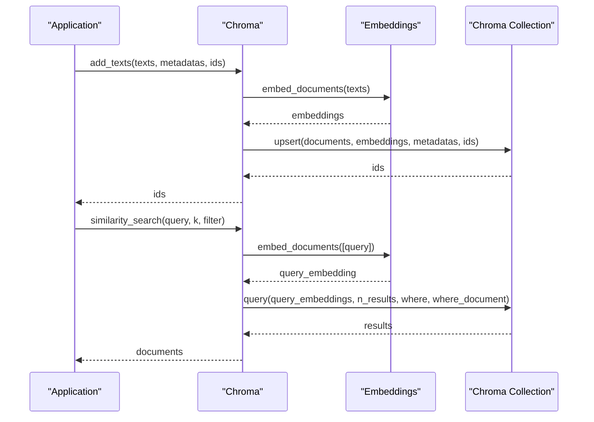
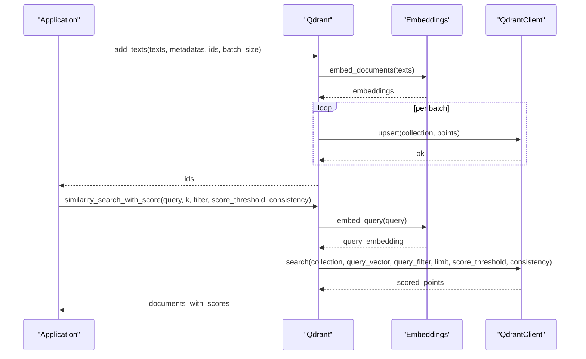
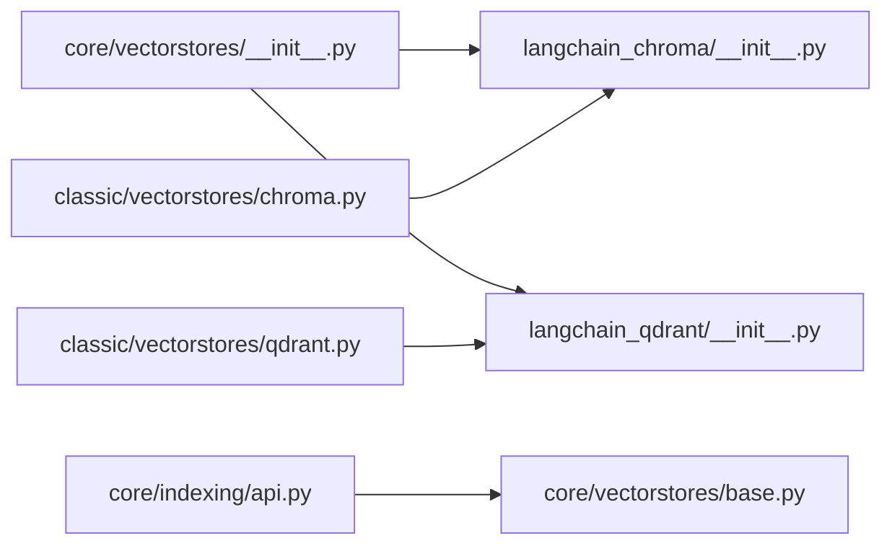

# Vector Store Providers

<cite>
**Referenced Files in This Document**
- [base.py](file://libs/core/langchain_core/vectorstores/base.py)
- [__init__.py](file://libs/core/langchain_core/vectorstores/__init__.py)
- [in_memory.py](file://libs/core/langchain_core/vectorstores/in_memory.py)
- [api.py](file://libs/core/langchain_core/indexing/api.py)
- [vectorstores.py](file://libs/partners/chroma/langchain_chroma/vectorstores.py)
- [vectorstores.py](file://libs/partners/qdrant/langchain_qdrant/vectorstores.py)
- [__init__.py](file://libs/partners/chroma/langchain_chroma/__init__.py)
- [__init__.py](file://libs/partners/qdrant/langchain_qdrant/__init__.py)
- [chroma.py](file://libs/langchain/langchain_classic/vectorstores/chroma.py)
- [qdrant.py](file://libs/langchain/langchain_classic/vectorstores/qdrant.py)
- [base.py](file://libs/langchain/langchain_classic/retrievers/self_query/base.py)
- [__init__.py](file://libs/langchain/langchain_classic/vectorstores/__init__.py)
</cite>

## Table of Contents
1. [Introduction](#introduction)
2. [Project Structure](#project-structure)
3. [Core Components](#core-components)
4. [Architecture Overview](#architecture-overview)
5. [Detailed Component Analysis](#detailed-component-analysis)
6. [Dependency Analysis](#dependency-analysis)
7. [Performance Considerations](#performance-considerations)
8. [Troubleshooting Guide](#troubleshooting-guide)
9. [Conclusion](#conclusion)
10. [Appendices](#appendices)

## Introduction
This document explains how LangChain’s vector store provider integrations enable retrieval-augmented generation (RAG) applications to store, index, and retrieve embeddings efficiently. It covers the common interface that all vector stores implement, highlights major providers (Chroma, Qdrant), and outlines provider-specific capabilities such as metadata filtering, hybrid search, and relevance scoring. It also provides practical guidance on configuration, vector operations, performance tuning, selection criteria, migration, and production best practices.

## Project Structure
LangChain organizes vector store functionality across:
- A core interface and utilities under langchain_core
- Provider-specific integrations under langchain_* packages and partners
- Classic compatibility shims for legacy imports

Key areas:
- Core interface and base classes for vector stores
- Dynamic imports and lazy-loading mechanisms
- Provider implementations (Chroma, Qdrant)
- Compatibility shims for classic imports
- Self-query translator registry for structured filtering

**Diagram sources**
- [base.py](file://libs/core/langchain_core/vectorstores/base.py#L43-L800)
- [in_memory.py](file://libs/core/langchain_core/vectorstores/in_memory.py)
- [__init__.py](file://libs/core/langchain_core/vectorstores/__init__.py#L26-L54)
- [api.py](file://libs/core/langchain_core/indexing/api.py#L757-L770)
- [vectorstores.py](file://libs/partners/chroma/langchain_chroma/vectorstores.py#L155-L800)
- [vectorstores.py](file://libs/partners/qdrant/langchain_qdrant/vectorstores.py#L59-L800)
- [chroma.py](file://libs/langchain/langchain_classic/vectorstores/chroma.py#L16-L23)
- [qdrant.py](file://libs/langchain/langchain_classic/vectorstores/qdrant.py#L16-L29)
- [base.py](file://libs/langchain/langchain_classic/retrievers/self_query/base.py#L103-L191)

**Section sources**
- [base.py](file://libs/core/langchain_core/vectorstores/base.py#L43-L800)
- [__init__.py](file://libs/core/langchain_core/vectorstores/__init__.py#L26-L54)
- [api.py](file://libs/core/langchain_core/indexing/api.py#L757-L770)
- [vectorstores.py](file://libs/partners/chroma/langchain_chroma/vectorstores.py#L155-L800)
- [vectorstores.py](file://libs/partners/qdrant/langchain_qdrant/vectorstores.py#L59-L800)
- [chroma.py](file://libs/langchain/langchain_classic/vectorstores/chroma.py#L16-L23)
- [qdrant.py](file://libs/langchain/langchain_classic/vectorstores/qdrant.py#L16-L29)
- [base.py](file://libs/langchain/langchain_classic/retrievers/self_query/base.py#L103-L191)

## Core Components
- VectorStore interface defines the contract for storing and retrieving embeddings, including:
  - Adding texts/documents and deleting by ID
  - Similarity search variants: similarity, similarity with relevance scores, and maximal marginal relevance (MMR)
  - Asynchronous variants for all operations
  - Relevance score normalization helpers
- Dynamic imports enable lazy loading of vector store implementations to reduce startup overhead and avoid circular dependencies.
- Indexing API validation ensures vector stores expose required async methods for certain workflows.

Key responsibilities:
- Unified abstraction for similarity search and MMR
- Consistent relevance score handling across providers
- Async/sync compatibility via executor fallbacks
- Provider-agnostic metadata filtering and vector operations

**Section sources**
- [base.py](file://libs/core/langchain_core/vectorstores/base.py#L43-L800)
- [__init__.py](file://libs/core/langchain_core/vectorstores/__init__.py#L26-L54)
- [api.py](file://libs/core/langchain_core/indexing/api.py#L757-L770)

## Architecture Overview
LangChain’s vector store architecture centers on a shared interface that provider-specific implementations fulfill. Provider integrations encapsulate:
- Client initialization and persistence modes
- Embedding computation delegation to configured Embeddings
- Query-time filtering and ranking
- Batch upsert and async execution patterns

**Diagram sources**
- [base.py](file://libs/core/langchain_core/vectorstores/base.py#L43-L800)
- [vectorstores.py](file://libs/partners/chroma/langchain_chroma/vectorstores.py#L155-L800)
- [vectorstores.py](file://libs/partners/qdrant/langchain_qdrant/vectorstores.py#L59-L800)

## Detailed Component Analysis

### Chroma Integration
Chroma provides a flexible vector store supporting:
- Local persistent mode, remote HTTP client, and cloud client
- Upsert of texts and images with optional embeddings
- Metadata filtering and document-content filtering
- Hybrid search using ranked fusion
- Forking collections for isolation
- Cosine similarity and MMR selection

Provider-specific features:
- Metadata filtering via where clauses
- Document-content filtering via where_document
- Hybrid search with configurable ranking strategies
- Image embedding support when embedding function supports images

Common operations:
- Initialize with collection name and embedding function
- Add texts/images with optional IDs and metadata
- Perform similarity search with k and filters
- Retrieve with relevance scores and apply thresholds

**Diagram sources**
- [vectorstores.py](file://libs/partners/chroma/langchain_chroma/vectorstores.py#L597-L784)

**Section sources**
- [vectorstores.py](file://libs/partners/chroma/langchain_chroma/vectorstores.py#L155-L800)
- [__init__.py](file://libs/partners/chroma/langchain_chroma/__init__.py#L1-L8)
- [chroma.py](file://libs/langchain/langchain_classic/vectorstores/chroma.py#L16-L23)

### Qdrant Integration
Qdrant offers:
- Synchronous and asynchronous client support
- Batch upsert with configurable batch size
- Rich metadata filtering using qdrant-client models
- Score thresholds and read consistency controls
- Vector naming for multi-vector collections
- MMR and relevance-scored retrieval

Provider-specific features:
- Distance strategy selection (e.g., cosine)
- Vector name scoping for multi-vector scenarios
- Offset pagination and search params
- Async fallback decorator for missing async methods

Common operations:
- Initialize with client, collection name, and embeddings
- Add texts in batches
- Search with filters, thresholds, and consistency
- Retrieve with relevance scores and apply thresholds

**Diagram sources**
- [vectorstores.py](file://libs/partners/qdrant/langchain_qdrant/vectorstores.py#L146-L722)

**Section sources**
- [vectorstores.py](file://libs/partners/qdrant/langchain_qdrant/vectorstores.py#L59-L800)
- [__init__.py](file://libs/partners/qdrant/langchain_qdrant/__init__.py#L1-L16)
- [qdrant.py](file://libs/langchain/langchain_classic/vectorstores/qdrant.py#L16-L29)

### Self-Query Translator Registry
LangChain’s self-query functionality maps structured queries to provider-native filters. The registry includes built-in translators for several vector stores, including Chroma and Qdrant, enabling:
- Automatic translation of natural-language filters into provider-specific query filters
- Support for metadata fields and text conditions

This enables consistent filtering semantics across providers without hardcoding provider specifics in user code.

**Section sources**
- [base.py](file://libs/langchain/langchain_classic/retrievers/self_query/base.py#L103-L191)
- [__init__.py](file://libs/langchain/langchain_classic/vectorstores/__init__.py#L173-L245)

## Dependency Analysis
- Core depends on provider integrations through dynamic imports, reducing cold-start costs and avoiding circular dependencies.
- Indexing API validation requires async methods to be present for certain workflows.
- Classic compatibility shims route deprecated imports to community packages, preserving backward compatibility.

**Diagram sources**
- [__init__.py](file://libs/core/langchain_core/vectorstores/__init__.py#L26-L54)
- [__init__.py](file://libs/partners/chroma/langchain_chroma/__init__.py#L1-L8)
- [__init__.py](file://libs/partners/qdrant/langchain_qdrant/__init__.py#L1-L16)
- [chroma.py](file://libs/langchain/langchain_classic/vectorstores/chroma.py#L16-L23)
- [qdrant.py](file://libs/langchain/langchain_classic/vectorstores/qdrant.py#L16-L29)
- [api.py](file://libs/core/langchain_core/indexing/api.py#L757-L770)
- [base.py](file://libs/core/langchain_core/vectorstores/base.py#L43-L800)

**Section sources**
- [__init__.py](file://libs/core/langchain_core/vectorstores/__init__.py#L26-L54)
- [api.py](file://libs/core/langchain_core/indexing/api.py#L757-L770)
- [chroma.py](file://libs/langchain/langchain_classic/vectorstores/chroma.py#L16-L23)
- [qdrant.py](file://libs/langchain/langchain_classic/vectorstores/qdrant.py#L16-L29)

## Performance Considerations
- Embedding dimensionality and normalization:
  - Relevance score normalization depends on embedding scale and dimensionality. Choose embeddings that align with the provider’s distance strategy.
- Indexing and search parameters:
  - Adjust k and fetch_k for MMR to balance quality and latency.
  - Use score_threshold to prune low-relevance results early.
- Batch operations:
  - Qdrant supports batch upsert to reduce network overhead.
- Filtering cost:
  - Complex metadata filters can increase query latency; keep filters selective.
- Asynchrony:
  - Prefer async APIs where supported to improve throughput in high-concurrency scenarios.
- Persistence and networking:
  - Local persistent Chroma avoids network latency; remote or cloud clients introduce latency and require robust connectivity.

[No sources needed since this section provides general guidance]

## Troubleshooting Guide
- Missing async methods:
  - Some workflows require async methods; ensure the vector store exposes them or rely on executor fallbacks.
- Metadata filtering errors:
  - Complex metadata values may be rejected; filter metadata appropriately before insertion.
- Hybrid search configuration:
  - Ensure hybrid ranking and filters are compatible with the provider’s capabilities.
- Client initialization:
  - Chroma supports only one of persistent, HTTP, or cloud client modes at a time; ensure mutually exclusive parameters are not combined.
- Distance strategy mismatch:
  - Verify that embedding normalization and distance strategy (e.g., cosine) align with expected similarity behavior.

**Section sources**
- [api.py](file://libs/core/langchain_core/indexing/api.py#L757-L770)
- [vectorstores.py](file://libs/partners/chroma/langchain_chroma/vectorstores.py#L597-L784)
- [vectorstores.py](file://libs/partners/qdrant/langchain_qdrant/vectorstores.py#L59-L800)

## Conclusion
LangChain’s vector store interface provides a consistent abstraction across providers, while provider-specific integrations expose advanced capabilities such as metadata filtering, hybrid search, and multi-vector strategies. By leveraging the core interface, dynamic imports, and provider-specific features, developers can build scalable RAG systems with predictable performance and maintainable code.

[No sources needed since this section summarizes without analyzing specific files]

## Appendices

### Practical Configuration Examples
- Chroma
  - Initialize with collection name and embedding function; choose persistent directory, HTTP host/port, or cloud credentials.
  - Add texts with optional IDs and metadata; perform similarity search with k and filters.
  - Use hybrid search for fused dense and sparse retrieval.
- Qdrant
  - Initialize with client and collection; configure distance strategy and vector name for multi-vector setups.
  - Add texts in batches; search with filters, score thresholds, and consistency.

[No sources needed since this section provides general guidance]

### Vector Dimensions, Indexing Strategies, Similarity Functions, and Query Performance
- Vector dimensions:
  - Provider capabilities vary; ensure embeddings and index configuration match expected dimensionality.
- Indexing strategies:
  - Chroma and Qdrant support configurable index parameters; tune for recall and latency.
- Similarity functions:
  - Cosine similarity is commonly used; ensure embeddings are normalized accordingly.
- Query performance:
  - Use k and fetch_k judiciously; apply score thresholds; leverage filters to reduce candidate sets.

[No sources needed since this section provides general guidance]

### Provider-Specific Features
- Chroma
  - Metadata filtering, document-content filtering, hybrid search, image embedding support, collection forking.
- Qdrant
  - Multi-vector support via vector names, rich filter models, score thresholds, read consistency, batch upsert.

**Section sources**
- [vectorstores.py](file://libs/partners/chroma/langchain_chroma/vectorstores.py#L155-L800)
- [vectorstores.py](file://libs/partners/qdrant/langchain_qdrant/vectorstores.py#L59-L800)

### Migration Between Providers
- Maintain a uniform interface by relying on VectorStore methods.
- Replace provider-specific initialization parameters with equivalent configuration (e.g., embedding function, collection name).
- Validate filters and search parameters against the target provider’s capabilities.
- Test relevance scoring and thresholds after migration.

[No sources needed since this section provides general guidance]

### Best Practices for Production Deployments
- Use async APIs where available to maximize throughput.
- Normalize embeddings to align with the chosen distance strategy.
- Keep metadata simple and indexed where possible.
- Monitor latency and adjust k/fetch_k and thresholds.
- Persist collections locally for low-latency development; use managed cloud offerings for scalability.

[No sources needed since this section provides general guidance]