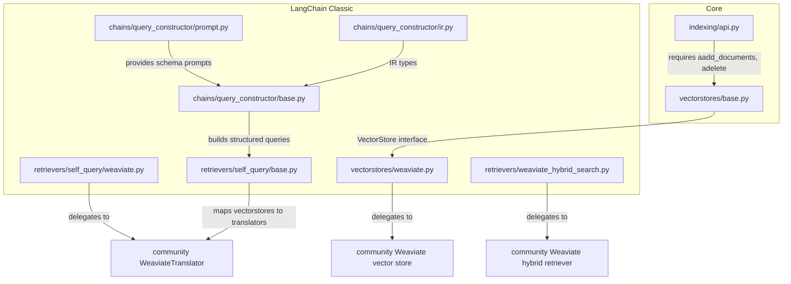
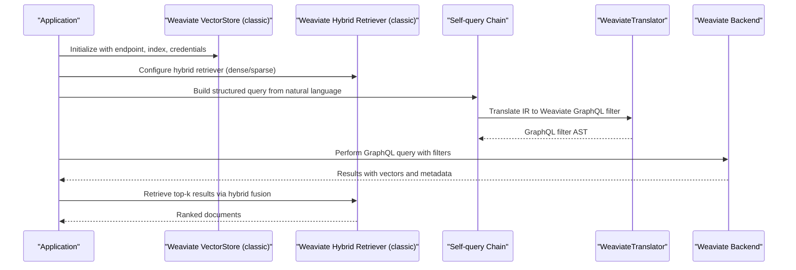
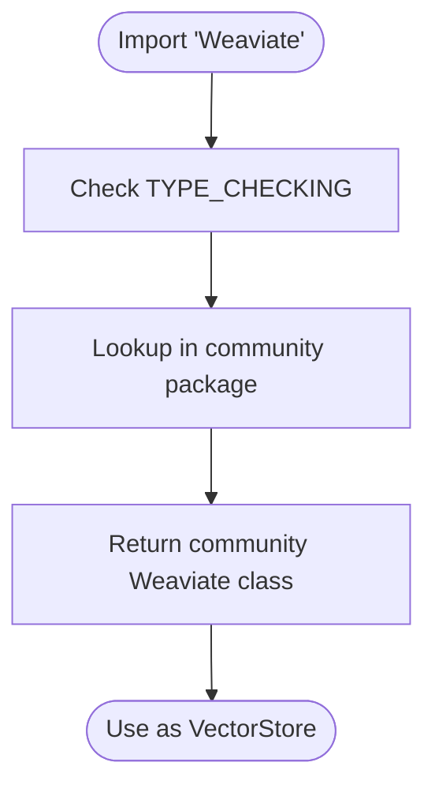
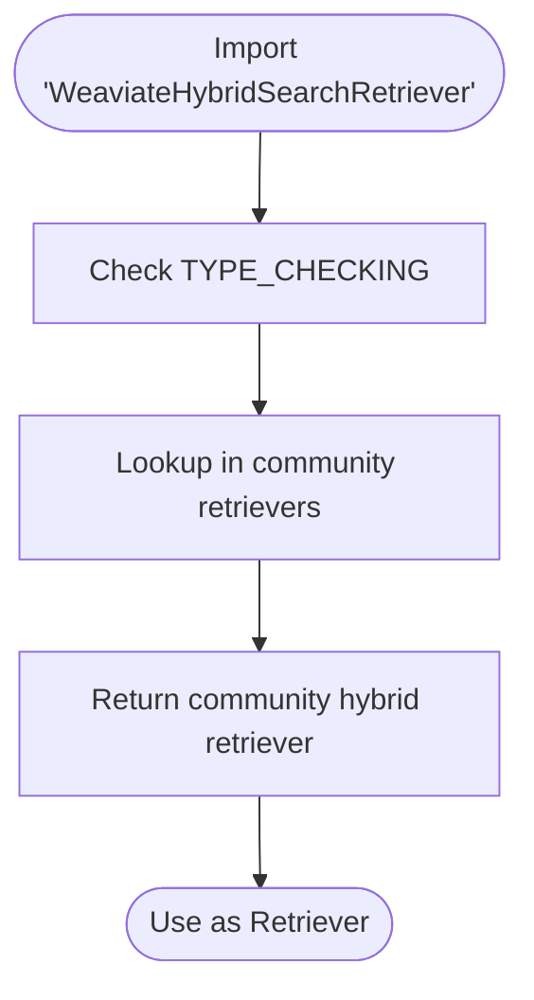
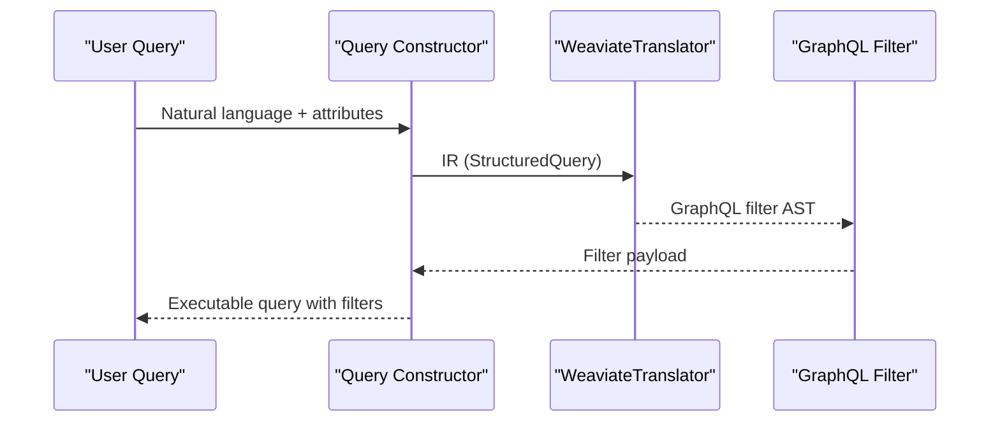
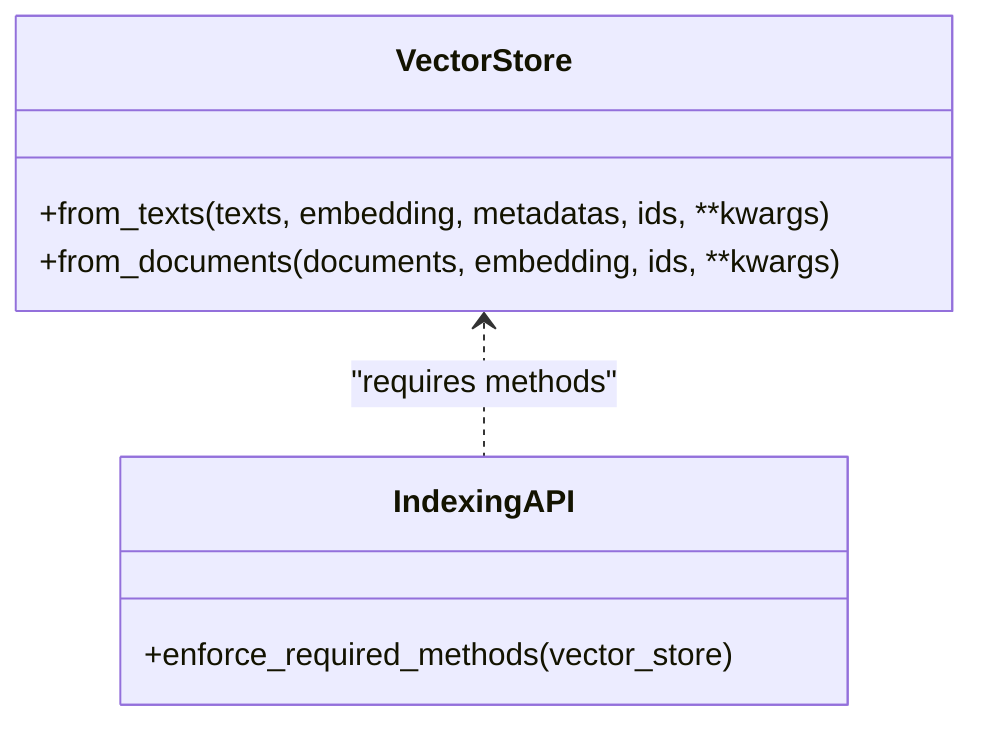
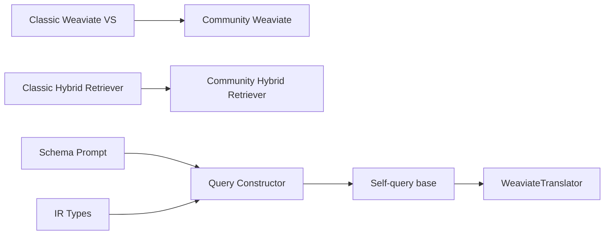

# Weaviate Vector Store

<cite>
**Referenced Files in This Document**
- [weaviate.py](file://libs/langchain/langchain_classic/vectorstores/weaviate.py)
- [weaviate_hybrid_search.py](file://libs/langchain/langchain_classic/retrievers/weaviate_hybrid_search.py)
- [weaviate.py](file://libs/langchain/langchain_classic/retrievers/self_query/weaviate.py)
- [base.py](file://libs/langchain/langchain_classic/retrievers/self_query/base.py)
- [base.py](file://libs/core/langchain_core/vectorstores/base.py)
- [api.py](file://libs/core/langchain_core/indexing/api.py)
- [base.py](file://libs/langchain/langchain_classic/chains/query_constructor/base.py)
- [prompt.py](file://libs/langchain/langchain_classic/chains/query_constructor/prompt.py)
- [ir.py](file://libs/langchain/langchain_classic/chains/query_constructor/ir.py)
</cite>

## Table of Contents
1. [Introduction](#introduction)
2. [Project Structure](#project-structure)
3. [Core Components](#core-components)
4. [Architecture Overview](#architecture-overview)
5. [Detailed Component Analysis](#detailed-component-analysis)
6. [Dependency Analysis](#dependency-analysis)
7. [Performance Considerations](#performance-considerations)
8. [Troubleshooting Guide](#troubleshooting-guide)
9. [Conclusion](#conclusion)
10. [Appendices](#appendices)

## Introduction
This document explains how LangChain integrates with Weaviate as a vector store and retrieval component. It focuses on the classic LangChain vector store and retriever abstractions, how they delegate to the community-provided Weaviate implementation, and how to configure and operate Weaviate for semantic search, hybrid search, and structured filtering. It also covers schema design, object management, GraphQL querying patterns, aggregation operations, real-time updates, performance tuning, and cluster deployment considerations.

## Project Structure
LangChain’s classic vector store and retriever modules expose thin wrappers that delegate to the community package. The relevant files in this repository include:
- Vector store wrapper for Weaviate
- Hybrid search retriever wrapper for Weaviate
- Self-query translator for Weaviate
- Core vector store base classes and indexing APIs
- Query construction and translation utilities

**Diagram sources**
- [weaviate.py](file://libs/langchain/langchain_classic/vectorstores/weaviate.py#L1-L24)
- [weaviate_hybrid_search.py](file://libs/langchain/langchain_classic/retrievers/weaviate_hybrid_search.py#L1-L24)
- [weaviate.py](file://libs/langchain/langchain_classic/retrievers/self_query/weaviate.py#L1-L24)
- [base.py](file://libs/langchain/langchain_classic/retrievers/self_query/base.py#L103-L133)
- [base.py](file://libs/core/langchain_core/vectorstores/base.py#L846-L868)
- [api.py](file://libs/core/langchain_core/indexing/api.py#L757-L770)
- [base.py](file://libs/langchain/langchain_classic/chains/query_constructor/base.py#L226-L381)
- [prompt.py](file://libs/langchain/langchain_classic/chains/query_constructor/prompt.py#L142-L165)
- [ir.py](file://libs/langchain/langchain_classic/chains/query_constructor/ir.py#L1-L23)

**Section sources**
- [weaviate.py](file://libs/langchain/langchain_classic/vectorstores/weaviate.py#L1-L24)
- [weaviate_hybrid_search.py](file://libs/langchain/langchain_classic/retrievers/weaviate_hybrid_search.py#L1-L24)
- [weaviate.py](file://libs/langchain/langchain_classic/retrievers/self_query/weaviate.py#L1-L24)
- [base.py](file://libs/langchain/langchain_classic/retrievers/self_query/base.py#L103-L133)
- [base.py](file://libs/core/langchain_core/vectorstores/base.py#L846-L868)
- [api.py](file://libs/core/langchain_core/indexing/api.py#L757-L770)
- [base.py](file://libs/langchain/langchain_classic/chains/query_constructor/base.py#L226-L381)
- [prompt.py](file://libs/langchain/langchain_classic/chains/query_constructor/prompt.py#L142-L165)
- [ir.py](file://libs/langchain/langchain_classic/chains/query_constructor/ir.py#L1-L23)

## Core Components
- Vector store wrapper: Exposes the community Weaviate vector store under the classic LangChain namespace and raises deprecation/import warnings when accessed.
- Hybrid search retriever wrapper: Exposes the community Weaviate hybrid retriever for dense/sparse fusion retrieval.
- Self-query translator: Provides a Weaviate-specific translator to convert structured queries into Weaviate GraphQL filters.
- Core vector store base: Defines the required interface for adding/deleting documents and constructing vector stores from texts/embeddings.
- Indexing API: Enforces required methods on vector stores during indexing operations.
- Query construction: Utilities to build structured queries and translate them to Weaviate filters.

Key responsibilities:
- Delegation: Classic wrappers forward functionality to the community package.
- Translation: Self-query translator maps structured filters to Weaviate GraphQL.
- Interface compliance: Ensures vector stores implement required methods for asynchronous indexing.

**Section sources**
- [weaviate.py](file://libs/langchain/langchain_classic/vectorstores/weaviate.py#L1-L24)
- [weaviate_hybrid_search.py](file://libs/langchain/langchain_classic/retrievers/weaviate_hybrid_search.py#L1-L24)
- [weaviate.py](file://libs/langchain/langchain_classic/retrievers/self_query/weaviate.py#L1-L24)
- [base.py](file://libs/core/langchain_core/vectorstores/base.py#L846-L868)
- [api.py](file://libs/core/langchain_core/indexing/api.py#L757-L770)
- [base.py](file://libs/langchain/langchain_classic/retrievers/self_query/base.py#L103-L133)

## Architecture Overview
The integration follows a delegation pattern:
- LangChain classic modules define import aliases and deprecation handling.
- The community package implements the actual Weaviate client, schema, and GraphQL operations.
- Self-query construction converts natural-language-like filters into Weaviate GraphQL filter blocks.
- Retrievers and vector stores implement the core interface and rely on the community backend.

**Diagram sources**
- [weaviate.py](file://libs/langchain/langchain_classic/vectorstores/weaviate.py#L1-L24)
- [weaviate_hybrid_search.py](file://libs/langchain/langchain_classic/retrievers/weaviate_hybrid_search.py#L1-L24)
- [base.py](file://libs/langchain/langchain_classic/retrievers/self_query/base.py#L103-L133)
- [base.py](file://libs/langchain/langchain_classic/chains/query_constructor/base.py#L226-L381)
- [prompt.py](file://libs/langchain/langchain_classic/chains/query_constructor/prompt.py#L142-L165)
- [ir.py](file://libs/langchain/langchain_classic/chains/query_constructor/ir.py#L1-L23)

## Detailed Component Analysis

### Vector Store Wrapper (Weaviate)
- Purpose: Provide a classic LangChain import path for the community Weaviate vector store with deprecation handling.
- Behavior: On attribute access, forwards to the community package and surfaces deprecation warnings.
- Usage: Import from the classic namespace; underlying implementation resides in the community package.

**Diagram sources**
- [weaviate.py](file://libs/langchain/langchain_classic/vectorstores/weaviate.py#L1-L24)

**Section sources**
- [weaviate.py](file://libs/langchain/langchain_classic/vectorstores/weaviate.py#L1-L24)

### Hybrid Search Retriever Wrapper (Weaviate)
- Purpose: Provide a classic LangChain import path for the community Weaviate hybrid retriever.
- Behavior: On attribute access, forwards to the community package for dense/sparse fusion retrieval.

**Diagram sources**
- [weaviate_hybrid_search.py](file://libs/langchain/langchain_classic/retrievers/weaviate_hybrid_search.py#L1-L24)

**Section sources**
- [weaviate_hybrid_search.py](file://libs/langchain/langchain_classic/retrievers/weaviate_hybrid_search.py#L1-L24)

### Self-Query Translator (Weaviate)
- Purpose: Convert structured queries into Weaviate GraphQL filters.
- Behavior: Uses the community WeaviateTranslator to map IR nodes to GraphQL filter expressions.

**Diagram sources**
- [weaviate.py](file://libs/langchain/langchain_classic/retrievers/self_query/weaviate.py#L1-L24)
- [base.py](file://libs/langchain/langchain_classic/retrievers/self_query/base.py#L103-L133)
- [base.py](file://libs/langchain/langchain_classic/chains/query_constructor/base.py#L226-L381)
- [prompt.py](file://libs/langchain/langchain_classic/chains/query_constructor/prompt.py#L142-L165)
- [ir.py](file://libs/langchain/langchain_classic/chains/query_constructor/ir.py#L1-L23)

**Section sources**
- [weaviate.py](file://libs/langchain/langchain_classic/retrievers/self_query/weaviate.py#L1-L24)
- [base.py](file://libs/langchain/langchain_classic/retrievers/self_query/base.py#L103-L133)
- [base.py](file://libs/langchain/langchain_classic/chains/query_constructor/base.py#L226-L381)
- [prompt.py](file://libs/langchain/langchain_classic/chains/query_constructor/prompt.py#L142-L165)
- [ir.py](file://libs/langchain/langchain_classic/chains/query_constructor/ir.py#L1-L23)

### Core Vector Store Interface and Indexing
- VectorStore base defines factory methods for constructing stores from texts and embeddings and requires asynchronous add/delete operations.
- Indexing API enforces presence of required methods on vector stores before indexing.

**Diagram sources**
- [base.py](file://libs/core/langchain_core/vectorstores/base.py#L846-L868)
- [api.py](file://libs/core/langchain_core/indexing/api.py#L757-L770)

**Section sources**
- [base.py](file://libs/core/langchain_core/vectorstores/base.py#L846-L868)
- [api.py](file://libs/core/langchain_core/indexing/api.py#L757-L770)

## Dependency Analysis
- Classic wrappers depend on the community package for actual functionality.
- Self-query chain depends on the translator registry to map vector stores to translators.
- Query construction utilities depend on IR types and prompt templates to produce structured filters.

**Diagram sources**
- [weaviate.py](file://libs/langchain/langchain_classic/vectorstores/weaviate.py#L1-L24)
- [weaviate_hybrid_search.py](file://libs/langchain/langchain_classic/retrievers/weaviate_hybrid_search.py#L1-L24)
- [base.py](file://libs/langchain/langchain_classic/retrievers/self_query/base.py#L103-L133)
- [base.py](file://libs/langchain/langchain_classic/chains/query_constructor/base.py#L226-L381)
- [prompt.py](file://libs/langchain/langchain_classic/chains/query_constructor/prompt.py#L142-L165)
- [ir.py](file://libs/langchain/langchain_classic/chains/query_constructor/ir.py#L1-L23)

**Section sources**
- [base.py](file://libs/langchain/langchain_classic/retrievers/self_query/base.py#L103-L133)
- [base.py](file://libs/langchain/langchain_classic/chains/query_constructor/base.py#L226-L381)
- [prompt.py](file://libs/langchain/langchain_classic/chains/query_constructor/prompt.py#L142-L165)
- [ir.py](file://libs/langchain/langchain_classic/chains/query_constructor/ir.py#L1-L23)

## Performance Considerations
- Embedding dimensionality and normalization: Ensure embeddings align with Weaviate’s configured vector index parameters.
- Vector index configuration: Choose appropriate distance metrics and index sizes to balance recall and latency.
- Batch writes: Use batched add operations to reduce overhead when ingesting large document sets.
- Filtering cost: Complex GraphQL filters can increase query latency; prefer selective filters and leverage indices.
- Hybrid search: Tune dense/sparse weights to optimize retrieval quality and latency trade-offs.
- Cluster deployment: Scale replicas and shards according to throughput and availability needs; monitor node health and disk usage.

[No sources needed since this section provides general guidance]

## Troubleshooting Guide
- Missing required methods: Ensure the vector store implements asynchronous add/delete operations; the indexing API enforces these.
- Import deprecations: Accessing the classic wrappers triggers deprecation warnings; update imports to the community package.
- Self-query translation errors: Verify attribute names and comparators match the schema; use the provided schema prompts to guide query construction.
- GraphQL filter mismatches: Confirm filter syntax matches Weaviate’s GraphQL schema; simplify filters to isolate issues.

**Section sources**
- [api.py](file://libs/core/langchain_core/indexing/api.py#L757-L770)
- [weaviate.py](file://libs/langchain/langchain_classic/vectorstores/weaviate.py#L1-L24)
- [base.py](file://libs/langchain/langchain_classic/chains/query_constructor/prompt.py#L142-L165)

## Conclusion
LangChain’s classic vector store and retriever modules provide a clean abstraction layer that delegates to the community Weaviate implementation. By leveraging self-query translation and structured query construction, applications can express complex filters and perform efficient semantic search. Proper schema design, careful indexing configuration, and attention to hybrid search tuning are essential for production-grade performance and reliability.

[No sources needed since this section summarizes without analyzing specific files]

## Appendices

### A. Setup and Schema Design Guidance
- Define object classes with appropriate properties and vector configurations.
- Use metadata fields to support filtering and post-processing.
- Align embedding dimensions and normalization with Weaviate’s vector index settings.

[No sources needed since this section provides general guidance]

### B. Example Workflows
- Semantic search: Construct a vector store from texts, embed, and perform similarity search with optional filters.
- Hybrid search: Configure a hybrid retriever to combine dense and sparse signals.
- Structured filtering: Use self-query construction to translate natural language filters into GraphQL.

[No sources needed since this section provides general guidance]