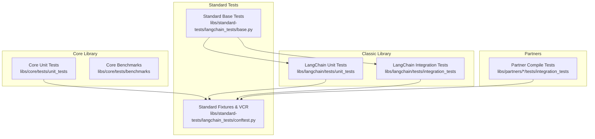
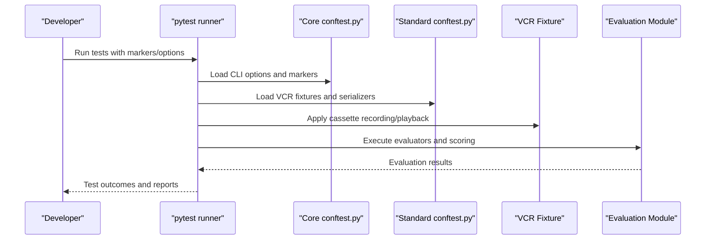
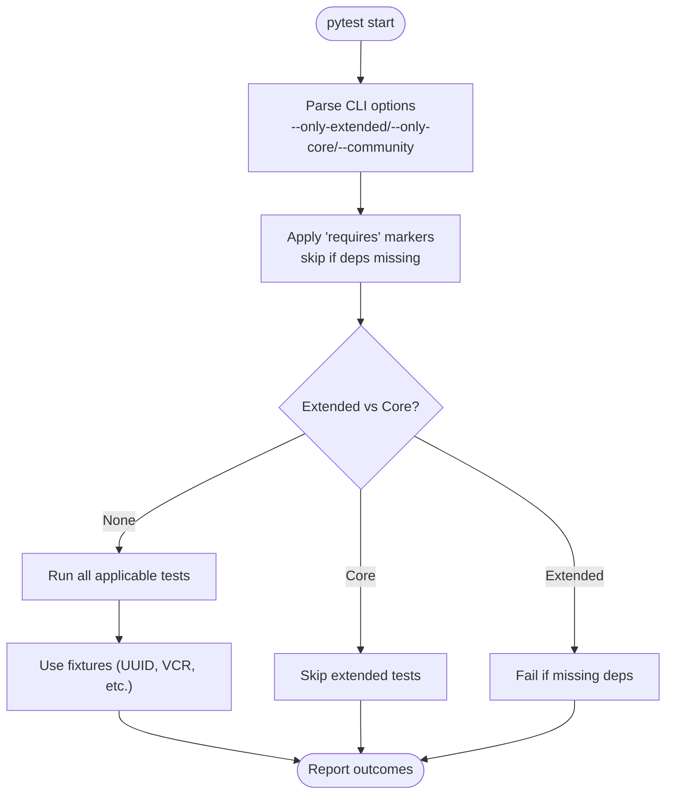
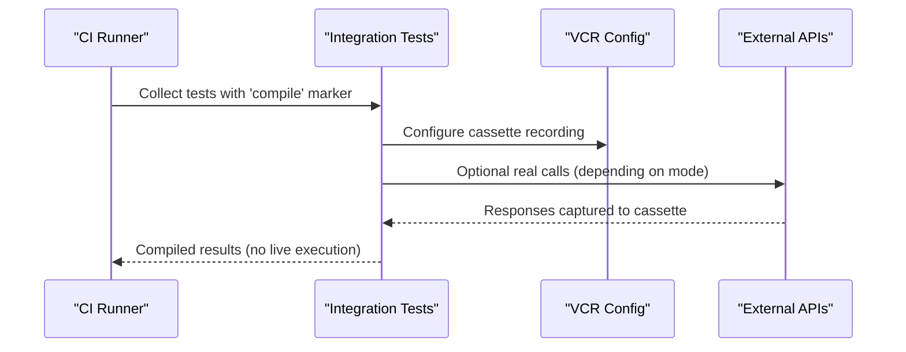
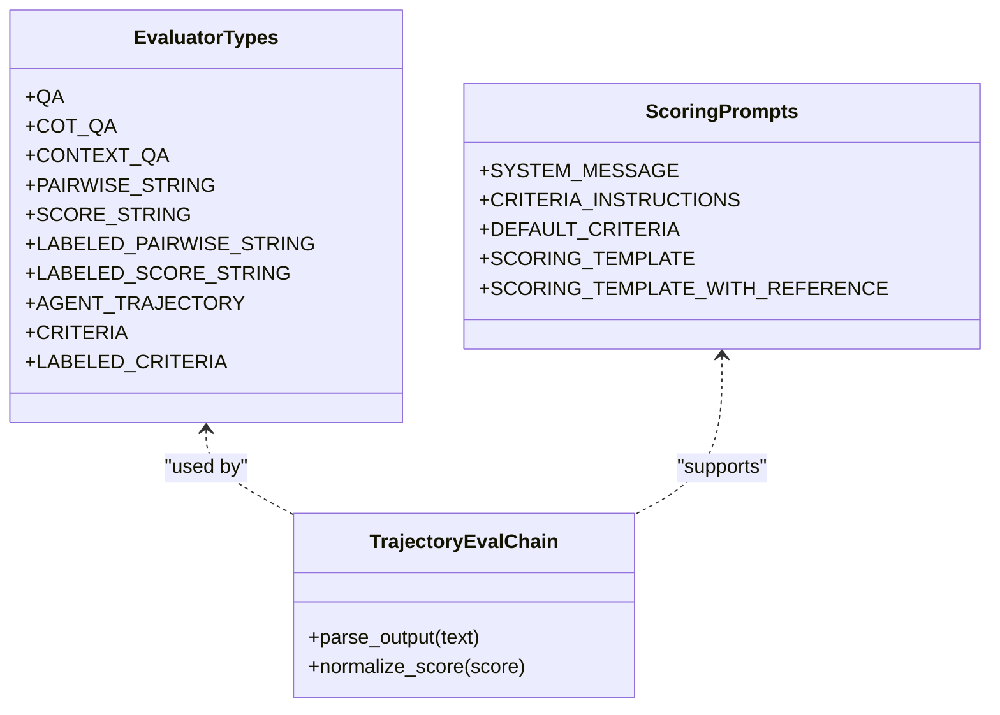
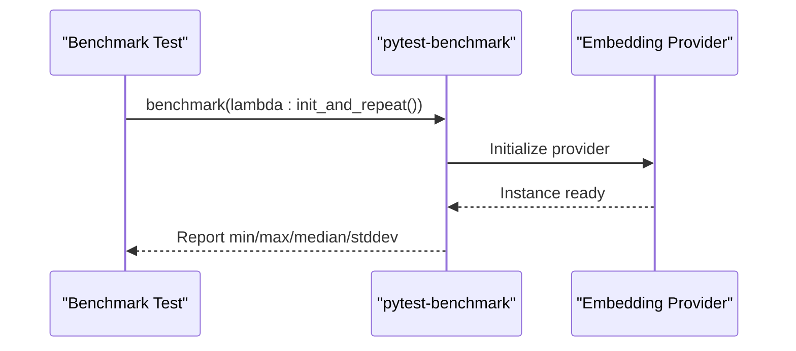
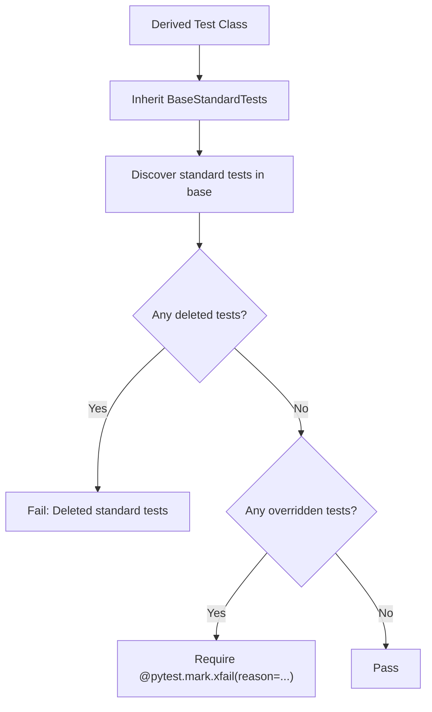
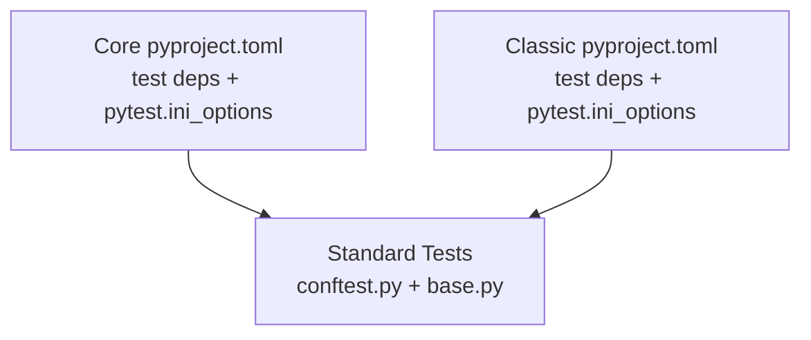

# Testing and Quality Assurance

<cite>
**Referenced Files in This Document**
- [libs/core/tests/unit_tests/conftest.py](file://libs/core/tests/unit_tests/conftest.py)
- [libs/langchain/tests/unit_tests/conftest.py](file://libs/langchain/tests/unit_tests/conftest.py)
- [libs/core/pyproject.toml](file://libs/core/pyproject.toml)
- [libs/langchain/pyproject.toml](file://libs/langchain/pyproject.toml)
- [libs/standard-tests/langchain_tests/conftest.py](file://libs/standard-tests/langchain_tests/conftest.py)
- [libs/standard-tests/langchain_tests/base.py](file://libs/standard-tests/langchain_tests/base.py)
- [libs/partners/nomic/tests/unit_tests/test_standard.py](file://libs/partners/nomic/tests/unit_tests/test_standard.py)
- [libs/langchain/langchain_classic/evaluation/schema.py](file://libs/langchain/langchain_classic/evaluation/schema.py)
- [libs/langchain/langchain_classic/evaluation/scoring/prompt.py](file://libs/langchain/langchain_classic/evaluation/scoring/prompt.py)
- [libs/langchain/langchain_classic/evaluation/agents/trajectory_eval_chain.py](file://libs/langchain/langchain_classic/evaluation/agents/trajectory_eval_chain.py)
- [libs/partners/chroma/tests/integration_tests/test_compile.py](file://libs/partners/chroma/tests/integration_tests/test_compile.py)
- [libs/partners/qdrant/tests/integration_tests/test_compile.py](file://libs/partners/qdrant/tests/integration_tests/test_compile.py)
- [libs/partners/xai/tests/integration_tests/test_compile.py](file://libs/partners/xai/tests/integration_tests/test_compile.py)
- [libs/partners/huggingface/tests/integration_tests/test_compile.py](file://libs/partners/huggingface/tests/integration_tests/test_compile.py)
</cite>

## Table of Contents
1. [Introduction](#introduction)
2. [Project Structure](#project-structure)
3. [Core Components](#core-components)
4. [Architecture Overview](#architecture-overview)
5. [Detailed Component Analysis](#detailed-component-analysis)
6. [Dependency Analysis](#dependency-analysis)
7. [Performance Considerations](#performance-considerations)
8. [Troubleshooting Guide](#troubleshooting-guide)
9. [Conclusion](#conclusion)
10. [Appendices](#appendices)

## Introduction
This document describes LangChain’s testing and quality assurance framework for LLM applications. It covers unit, integration, and end-to-end testing strategies; the testing infrastructure including fixtures, mocking, and utilities; evaluation frameworks for agents and responses; benchmarking and performance testing; and regression testing practices. It also provides practical guidance for writing tests across chains, agents, memory, and other components, setting up test environments, automating quality checks, and addressing LLM-specific challenges such as reproducibility, cost, and evaluation metrics. Guidance on CI pipelines, coverage requirements, and quality gates is included.

## Project Structure
LangChain organizes tests across libraries and modules:
- Core library tests: unit and benchmark tests under libs/core/tests
- Classic library tests: unit and integration tests under libs/langchain/tests
- Standardized testing utilities: shared fixtures and base classes under libs/standard-tests
- Partner integrations: integration tests with compile placeholders under libs/partners/*/tests

Key testing configuration is centralized in per-library pyproject.toml files and pytest configuration via conftest.py files.

**Diagram sources**
- [libs/core/tests/unit_tests/conftest.py](file://libs/core/tests/unit_tests/conftest.py#L1-L124)
- [libs/langchain/tests/unit_tests/conftest.py](file://libs/langchain/tests/unit_tests/conftest.py#L1-L99)
- [libs/standard-tests/langchain_tests/conftest.py](file://libs/standard-tests/langchain_tests/conftest.py#L1-L128)
- [libs/standard-tests/langchain_tests/base.py](file://libs/standard-tests/langchain_tests/base.py#L1-L63)
- [libs/partners/chroma/tests/integration_tests/test_compile.py](file://libs/partners/chroma/tests/integration_tests/test_compile.py#L1-L6)

**Section sources**
- [libs/core/tests/unit_tests/conftest.py](file://libs/core/tests/unit_tests/conftest.py#L1-L124)
- [libs/langchain/tests/unit_tests/conftest.py](file://libs/langchain/tests/unit_tests/conftest.py#L1-L99)
- [libs/standard-tests/langchain_tests/conftest.py](file://libs/standard-tests/langchain_tests/conftest.py#L1-L128)
- [libs/standard-tests/langchain_tests/base.py](file://libs/standard-tests/langchain_tests/base.py#L1-L63)
- [libs/partners/chroma/tests/integration_tests/test_compile.py](file://libs/partners/chroma/tests/integration_tests/test_compile.py#L1-L6)

## Core Components
- Test orchestration and configuration
  - pytest configuration and custom CLI options are defined in per-library conftest.py files.
  - Options include toggling extended/core-only runs and enabling community tests.
- Standardized fixtures and VCR cassettes
  - A custom VCR serializer and persister are provided to safely record and replay external HTTP interactions with compression and header filtering.
- Evaluation framework
  - Built-in evaluators for QA, chain-of-thought QA, context-aware QA, pairwise/string scoring, labeled variants, agent trajectories, and criteria-based evaluation.
- Benchmarking
  - Benchmarks are integrated via pytest-benchmark; examples demonstrate measuring initialization time for embeddings.

Practical implications:
- Use pytest markers and CLI options to control test scope and dependencies.
- Use VCR fixtures to isolate network calls and reduce cost and flakiness.
- Leverage standardized evaluation prompts and evaluators for consistent quality measurement.
- Add benchmarks to detect regressions in performance-sensitive operations.

**Section sources**
- [libs/core/tests/unit_tests/conftest.py](file://libs/core/tests/unit_tests/conftest.py#L38-L124)
- [libs/langchain/tests/unit_tests/conftest.py](file://libs/langchain/tests/unit_tests/conftest.py#L9-L99)
- [libs/standard-tests/langchain_tests/conftest.py](file://libs/standard-tests/langchain_tests/conftest.py#L102-L128)
- [libs/langchain/langchain_classic/evaluation/schema.py](file://libs/langchain/langchain_classic/evaluation/schema.py#L24-L507)
- [libs/langchain/langchain_classic/evaluation/scoring/prompt.py](file://libs/langchain/langchain_classic/evaluation/scoring/prompt.py#L1-L53)
- [libs/partners/nomic/tests/unit_tests/test_standard.py](file://libs/partners/nomic/tests/unit_tests/test_standard.py#L1-L17)

## Architecture Overview
The testing architecture combines per-library pytest configuration, shared VCR fixtures, and standardized base tests. Integration tests often use “compile” markers to pre-compile without executing live calls.

**Diagram sources**
- [libs/core/tests/unit_tests/conftest.py](file://libs/core/tests/unit_tests/conftest.py#L38-L124)
- [libs/standard-tests/langchain_tests/conftest.py](file://libs/standard-tests/langchain_tests/conftest.py#L102-L128)
- [libs/langchain/langchain_classic/evaluation/schema.py](file://libs/langchain/langchain_classic/evaluation/schema.py#L24-L507)

## Detailed Component Analysis

### Unit Testing Infrastructure
- CLI options and markers
  - Core and classic libraries define custom CLI flags to toggle extended/core-only runs and enable community tests.
  - A generic “requires” marker allows skipping tests when optional dependencies are unavailable.
- Deterministic identifiers
  - Core’s conftest includes a deterministic UUID fixture to improve reproducibility in tests relying on random IDs.

**Diagram sources**
- [libs/core/tests/unit_tests/conftest.py](file://libs/core/tests/unit_tests/conftest.py#L38-L124)
- [libs/langchain/tests/unit_tests/conftest.py](file://libs/langchain/tests/unit_tests/conftest.py#L9-L99)

**Section sources**
- [libs/core/tests/unit_tests/conftest.py](file://libs/core/tests/unit_tests/conftest.py#L12-L124)
- [libs/langchain/tests/unit_tests/conftest.py](file://libs/langchain/tests/unit_tests/conftest.py#L9-L99)

### Integration Testing and Compile Placeholders
- Compile markers
  - Integration tests include placeholder tests marked to compile without executing live calls, reducing CI runtime and cost.
- VCR cassettes
  - Shared VCR configuration ensures consistent recording and playback of HTTP interactions across integrations.

**Diagram sources**
- [libs/partners/chroma/tests/integration_tests/test_compile.py](file://libs/partners/chroma/tests/integration_tests/test_compile.py#L1-L6)
- [libs/partners/qdrant/tests/integration_tests/test_compile.py](file://libs/partners/qdrant/tests/integration_tests/test_compile.py#L1-L6)
- [libs/partners/xai/tests/integration_tests/test_compile.py](file://libs/partners/xai/tests/integration_tests/test_compile.py#L1-L6)
- [libs/partners/huggingface/tests/integration_tests/test_compile.py](file://libs/partners/huggingface/tests/integration_tests/test_compile.py#L1-L6)
- [libs/standard-tests/langchain_tests/conftest.py](file://libs/standard-tests/langchain_tests/conftest.py#L102-L128)

**Section sources**
- [libs/partners/chroma/tests/integration_tests/test_compile.py](file://libs/partners/chroma/tests/integration_tests/test_compile.py#L1-L6)
- [libs/partners/qdrant/tests/integration_tests/test_compile.py](file://libs/partners/qdrant/tests/integration_tests/test_compile.py#L1-L6)
- [libs/partners/xai/tests/integration_tests/test_compile.py](file://libs/partners/xai/tests/integration_tests/test_compile.py#L1-L6)
- [libs/partners/huggingface/tests/integration_tests/test_compile.py](file://libs/partners/huggingface/tests/integration_tests/test_compile.py#L1-L6)
- [libs/standard-tests/langchain_tests/conftest.py](file://libs/standard-tests/langchain_tests/conftest.py#L102-L128)

### Evaluation Framework
- Evaluators
  - Enumerated evaluator types include QA, CoT-QA, context-aware QA, pairwise and scored string evaluators, labeled variants, agent trajectory, and criteria-based evaluation.
- Scoring prompts
  - Prompts define templates for rating responses on a 1–10 scale and incorporate ground-truth references when available.
- Trajectory evaluation
  - Specialized chains parse scores from model outputs and normalize them for downstream use.

**Diagram sources**
- [libs/langchain/langchain_classic/evaluation/schema.py](file://libs/langchain/langchain_classic/evaluation/schema.py#L24-L507)
- [libs/langchain/langchain_classic/evaluation/scoring/prompt.py](file://libs/langchain/langchain_classic/evaluation/scoring/prompt.py#L1-L53)
- [libs/langchain/langchain_classic/evaluation/agents/trajectory_eval_chain.py](file://libs/langchain/langchain_classic/evaluation/agents/trajectory_eval_chain.py#L73-L97)

**Section sources**
- [libs/langchain/langchain_classic/evaluation/schema.py](file://libs/langchain/langchain_classic/evaluation/schema.py#L24-L507)
- [libs/langchain/langchain_classic/evaluation/scoring/prompt.py](file://libs/langchain/langchain_classic/evaluation/scoring/prompt.py#L1-L53)
- [libs/langchain/langchain_classic/evaluation/agents/trajectory_eval_chain.py](file://libs/langchain/langchain_classic/evaluation/agents/trajectory_eval_chain.py#L73-L97)

### Benchmarking and Performance Testing
- Benchmark fixtures
  - Tests can leverage pytest-benchmark to measure performance characteristics such as initialization time.
- Example usage
  - An embedding initialization benchmark demonstrates capturing repeated operations and reporting metrics.

**Diagram sources**
- [libs/partners/nomic/tests/unit_tests/test_standard.py](file://libs/partners/nomic/tests/unit_tests/test_standard.py#L1-L17)

**Section sources**
- [libs/partners/nomic/tests/unit_tests/test_standard.py](file://libs/partners/nomic/tests/unit_tests/test_standard.py#L1-L17)

### Regression Testing Practices
- Standard base tests
  - A base class enforces that standard tests are not accidentally overridden and require justification when expected to fail.
- Usage pattern
  - Derived test classes inherit the base and assert that no required standard tests are deleted and that overrides are explicitly marked with expected failure reasons.

**Diagram sources**
- [libs/standard-tests/langchain_tests/base.py](file://libs/standard-tests/langchain_tests/base.py#L1-L63)

**Section sources**
- [libs/standard-tests/langchain_tests/base.py](file://libs/standard-tests/langchain_tests/base.py#L1-L63)

## Dependency Analysis
Per-library configuration defines testing dependencies and pytest options. Core and classic libraries rely on shared testing utilities and VCR configurations.

**Diagram sources**
- [libs/core/pyproject.toml](file://libs/core/pyproject.toml#L47-L64)
- [libs/langchain/pyproject.toml](file://libs/langchain/pyproject.toml#L54-L79)
- [libs/standard-tests/langchain_tests/conftest.py](file://libs/standard-tests/langchain_tests/conftest.py#L102-L128)

**Section sources**
- [libs/core/pyproject.toml](file://libs/core/pyproject.toml#L47-L64)
- [libs/langchain/pyproject.toml](file://libs/langchain/pyproject.toml#L54-L79)
- [libs/standard-tests/langchain_tests/conftest.py](file://libs/standard-tests/langchain_tests/conftest.py#L102-L128)

## Performance Considerations
- Use VCR cassettes to avoid real network calls and stabilize timing measurements.
- Prefer deterministic fixtures (e.g., deterministic UUIDs) to reduce variability in tests.
- Integrate pytest-benchmark for targeted performance checks and regression detection.
- Limit expensive operations in unit tests; reserve heavy benchmarks for dedicated suites.

[No sources needed since this section provides general guidance]

## Troubleshooting Guide
Common issues and remedies:
- Missing optional dependencies
  - Tests marked with “requires” are skipped if dependencies are not installed; use CLI flags to enforce extended runs or skip accordingly.
- Network flakiness
  - Use VCR cassettes to record and replay HTTP interactions; ensure headers are filtered to prevent secrets leakage.
- Community tests
  - Enable community tests via CLI flag when running tests that require community modules.
- Deterministic failures
  - Apply deterministic UUID fixtures to remove randomness in identifiers.

**Section sources**
- [libs/core/tests/unit_tests/conftest.py](file://libs/core/tests/unit_tests/conftest.py#L52-L116)
- [libs/langchain/tests/unit_tests/conftest.py](file://libs/langchain/tests/unit_tests/conftest.py#L31-L99)
- [libs/standard-tests/langchain_tests/conftest.py](file://libs/standard-tests/langchain_tests/conftest.py#L92-L128)

## Conclusion
LangChain’s testing framework emphasizes reproducibility, isolation of external dependencies, and standardized evaluation. By leveraging per-library pytest configuration, shared VCR fixtures, built-in evaluators, and benchmarking, teams can implement robust unit, integration, and end-to-end testing strategies. Applying standardized base tests and compile placeholders further strengthens reliability and reduces costs. Adopting these practices supports continuous integration pipelines, coverage goals, and quality gates for production deployments.

[No sources needed since this section summarizes without analyzing specific files]

## Appendices

### Practical Testing Examples and Patterns
- Chains
  - Write unit tests that mock LLM/chat model responses and assert chain outputs for given inputs.
  - Use VCR cassettes for integration tests that call external APIs.
- Agents
  - Test agent loops with deterministic actions and parse outputs using evaluation prompts; validate trajectory scoring.
- Memory
  - Verify memory persistence and retrieval semantics with controlled inputs and deterministic IDs.
- Evaluation
  - Use built-in evaluators for QA and trajectory tasks; customize scoring prompts for domain-specific criteria.

[No sources needed since this section provides general guidance]

### Continuous Integration and Quality Gates
- CI pipeline stages
  - Install dependencies from per-library pyproject.toml test groups.
  - Run unit tests with core-only or extended modes depending on job scope.
  - Execute integration tests with compile placeholders; optionally run selected live tests with VCR cassettes.
- Coverage and quality gates
  - Enforce minimum coverage thresholds and require passing standard base tests.
  - Gate merges on successful benchmark runs and evaluation passes.

[No sources needed since this section provides general guidance]