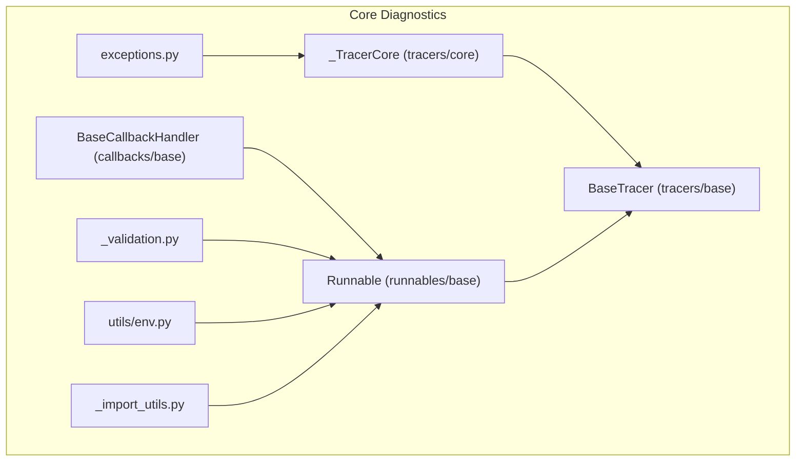
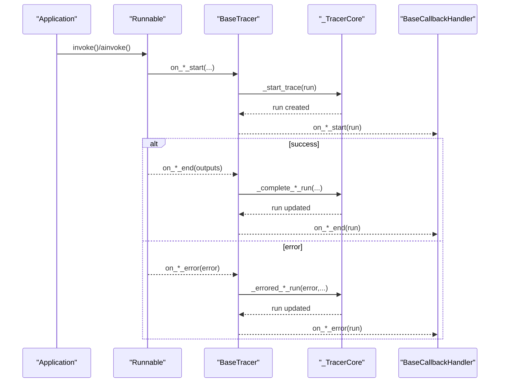
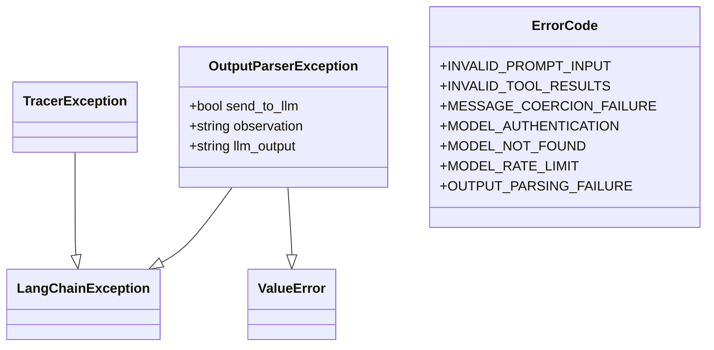
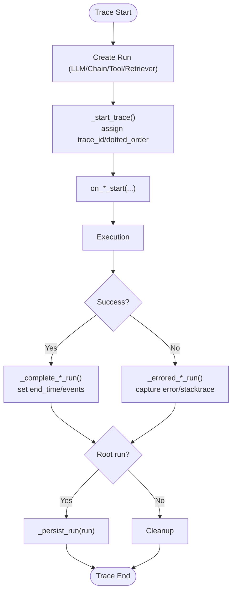
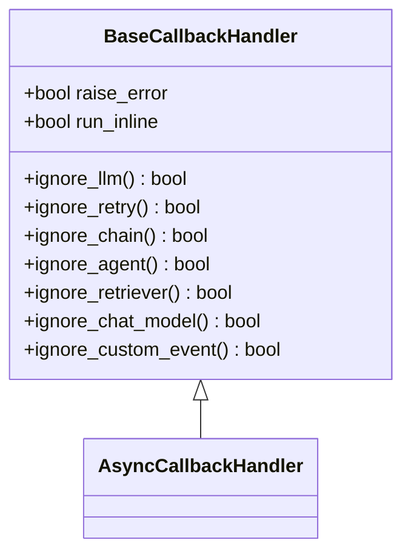
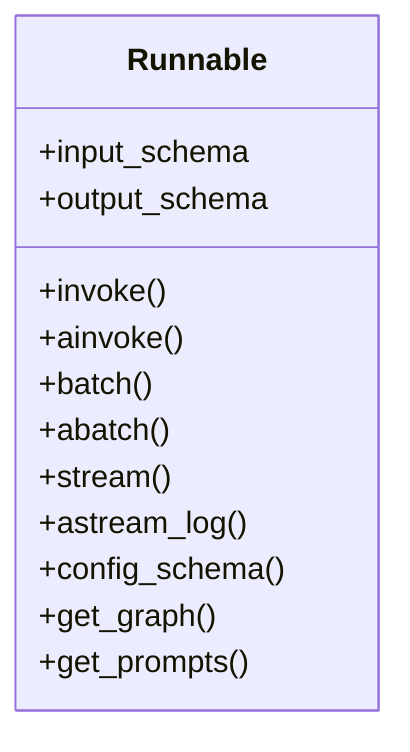
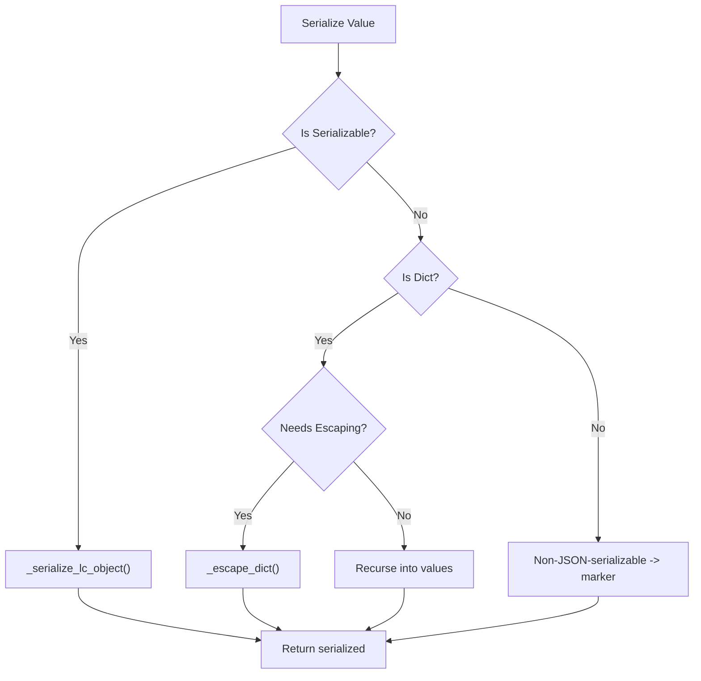
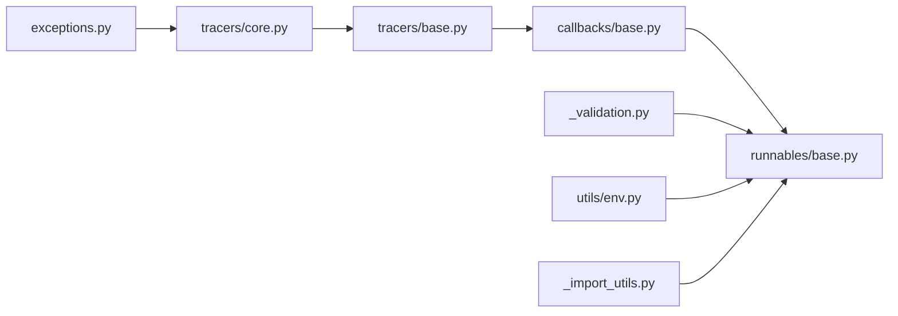

# Troubleshooting and FAQ

<cite>
**Referenced Files in This Document**
- [exceptions.py](file://libs/core/langchain_core/exceptions.py)
- [base.py (tracers/base)](file://libs/core/langchain_core/tracers/base.py)
- [base.py (tracers/core)](file://libs/core/langchain_core/tracers/core.py)
- [schemas.py (tracers/schemas)](file://libs/core/langchain_core/tracers/schemas.py)
- [base.py (callbacks/base)](file://libs/core/langchain_core/callbacks/base.py)
- [base.py (runnables/base)](file://libs/core/langchain_core/runnables/base.py)
- [_validation.py (load/_validation)](file://libs/core/langchain_core/load/_validation.py)
- [env.py (utils/env)](file://libs/core/langchain_core/utils/env.py)
- [_import_utils.py](file://libs/core/langchain_core/_import_utils.py)
- [README.md (root)](file://README.md)
- [README.md (core)](file://libs/core/README.md)
- [README.md (classic)](file://libs/langchain/README.md)
</cite>

## Table of Contents
1. [Introduction](#introduction)
2. [Project Structure](#project-structure)
3. [Core Components](#core-components)
4. [Architecture Overview](#architecture-overview)
5. [Detailed Component Analysis](#detailed-component-analysis)
6. [Dependency Analysis](#dependency-analysis)
7. [Performance Considerations](#performance-considerations)
8. [Troubleshooting Guide](#troubleshooting-guide)
9. [Conclusion](#conclusion)
10. [Appendices](#appendices)

## Introduction
This document provides a comprehensive troubleshooting and FAQ guide for the LangChain framework. It focuses on diagnosing and resolving issues encountered during installation, configuration, and usage of LangChain components. It covers systematic debugging approaches for import errors, runtime exceptions, and performance bottlenecks. It also addresses provider integration problems, authentication failures, connectivity issues, and debugging techniques for agents, chains, and complex workflows. Guidance is included for trace analysis, error isolation, performance troubleshooting (memory leaks, slow execution, resource exhaustion), best practices, common misconceptions, recommended patterns, migration and compatibility concerns across versions and Python environments, and escalation paths for complex issues.

## Project Structure
LangChain’s core diagnostics and tracing capabilities live primarily in the langchain-core package. Key areas relevant to troubleshooting include:
- Exception and error code definitions
- Tracing and run lifecycle management
- Callback handlers for instrumentation
- Serialization validation and safety
- Environment variable helpers
- Import utilities for lazy-loading and dynamic attributes

**Diagram sources**
- [exceptions.py](file://libs/core/langchain_core/exceptions.py#L1-L94)
- [base.py (tracers/core)](file://libs/core/langchain_core/tracers/core.py#L1-L120)
- [base.py (tracers/base)](file://libs/core/langchain_core/tracers/base.py#L1-L120)
- [base.py (callbacks/base)](file://libs/core/langchain_core/callbacks/base.py#L1-L120)
- [base.py (runnables/base)](file://libs/core/langchain_core/runnables/base.py#L1-L120)
- [_validation.py (load/_validation)](file://libs/core/langchain_core/load/_validation.py#L1-L60)
- [env.py (utils/env)](file://libs/core/langchain_core/utils/env.py#L1-L40)
- [_import_utils.py](file://libs/core/langchain_core/_import_utils.py#L1-L42)

**Section sources**
- [README.md (root)](file://README.md#L1-L77)
- [README.md (core)](file://libs/core/README.md#L1-L48)
- [README.md (classic)](file://libs/langchain/README.md#L1-L38)

## Core Components
- Exceptions and error codes: Centralized error handling and standardized messages with links to official troubleshooting pages.
- Tracers: Structured run lifecycle capture for LLMs, chains, tools, retrievers, and chat models, including retries and error events.
- Callback handlers: Extensible hooks for instrumentation and debugging across run types.
- Runnables: Core abstraction for composing, invoking, batching, streaming, and retrying components with robust configuration and schema inference.
- Validation utilities: Serialization safety to avoid injection-like issues in serialized objects.
- Environment helpers: Utilities to check environment variables and fetch values from dictionaries or environment.
- Import utilities: Dynamic attribute resolution for lazy-loading and safe fallbacks.

**Section sources**
- [exceptions.py](file://libs/core/langchain_core/exceptions.py#L1-L94)
- [base.py (tracers/base)](file://libs/core/langchain_core/tracers/base.py#L1-L120)
- [base.py (tracers/core)](file://libs/core/langchain_core/tracers/core.py#L1-L120)
- [base.py (callbacks/base)](file://libs/core/langchain_core/callbacks/base.py#L1-L120)
- [base.py (runnables/base)](file://libs/core/langchain_core/runnables/base.py#L1-L260)
- [_validation.py (load/_validation)](file://libs/core/langchain_core/load/_validation.py#L1-L120)
- [env.py (utils/env)](file://libs/core/langchain_core/utils/env.py#L1-L87)
- [_import_utils.py](file://libs/core/langchain_core/_import_utils.py#L1-L42)

## Architecture Overview
The diagnostic architecture centers on run lifecycle tracing and callback hooks. Tracers record start, end, error, and retry events per run type. Callback handlers can intercept these events for logging, metrics, or custom actions. Runnables orchestrate execution and expose configuration and schema introspection to aid debugging.

**Diagram sources**
- [base.py (tracers/base)](file://libs/core/langchain_core/tracers/base.py#L50-L120)
- [base.py (tracers/core)](file://libs/core/langchain_core/tracers/core.py#L108-L150)
- [base.py (callbacks/base)](file://libs/core/langchain_core/callbacks/base.py#L240-L320)

## Detailed Component Analysis

### Exception and Error Code System
- Defines a hierarchy of LangChain-specific exceptions and a dedicated tracer exception base class.
- Provides an OutputParserException tailored for parsing failures with optional feedback loops to the model.
- Introduces an ErrorCode enum and a helper to attach a standardized troubleshooting link to error messages.

**Diagram sources**
- [exceptions.py](file://libs/core/langchain_core/exceptions.py#L7-L94)

**Section sources**
- [exceptions.py](file://libs/core/langchain_core/exceptions.py#L1-L94)

### Tracing and Run Lifecycle Management
- _TracerCore manages run creation, updates, and persistence, including parent-child run relationships and dotted ordering for trace IDs.
- BaseTracer extends _TracerCore and BaseCallbackHandler to integrate with run lifecycle hooks for LLMs, chains, tools, retrievers, and chat models.
- Supports token streaming, retry events, and error capture with stack traces.

**Diagram sources**
- [base.py (tracers/core)](file://libs/core/langchain_core/tracers/core.py#L108-L150)
- [base.py (tracers/base)](file://libs/core/langchain_core/tracers/base.py#L40-L120)

**Section sources**
- [base.py (tracers/core)](file://libs/core/langchain_core/tracers/core.py#L1-L200)
- [base.py (tracers/base)](file://libs/core/langchain_core/tracers/base.py#L1-L200)
- [schemas.py (tracers/schemas)](file://libs/core/langchain_core/tracers/schemas.py#L1-L15)

### Callback Handlers and Instrumentation
- BaseCallbackHandler defines hooks for LLM, chain, tool, retriever, and chat model lifecycle events.
- Provides flags to selectively ignore certain run types and control error propagation.
- Async variants enable asynchronous instrumentation for streaming and concurrent operations.

**Diagram sources**
- [base.py (callbacks/base)](file://libs/core/langchain_core/callbacks/base.py#L435-L485)
- [base.py (callbacks/base)](file://libs/core/langchain_core/callbacks/base.py#L487-L500)

**Section sources**
- [base.py (callbacks/base)](file://libs/core/langchain_core/callbacks/base.py#L1-L200)

### Runnables: Composition, Invocation, and Debugging
- Runnable defines a unified interface for invoke, batch, stream, and astream_log with built-in optimizations.
- Offers schema inference for input, output, and config, plus graph visualization and prompt discovery.
- Integrates with tracers and callback managers for comprehensive diagnostics.

**Diagram sources**
- [base.py (runnables/base)](file://libs/core/langchain_core/runnables/base.py#L124-L260)

**Section sources**
- [base.py (runnables/base)](file://libs/core/langchain_core/runnables/base.py#L1-L300)

### Serialization Safety and Injection Prevention
- Escapes user-provided dicts that resemble LangChain objects during serialization to prevent accidental instantiation.
- Unescapes values during deserialization to preserve user data integrity.

**Diagram sources**
- [_validation.py (load/_validation)](file://libs/core/langchain_core/load/_validation.py#L69-L145)

**Section sources**
- [_validation.py (load/_validation)](file://libs/core/langchain_core/load/_validation.py#L1-L175)

### Environment Variables and Configuration Helpers
- env_var_is_set checks presence and truthiness of environment variables.
- get_from_dict_or_env retrieves values from a dict or environment with fallbacks and raises clear errors when missing.

**Section sources**
- [env.py (utils/env)](file://libs/core/langchain_core/utils/env.py#L1-L87)

### Dynamic Imports and Lazy Loading
- import_attr enables safe dynamic imports from packages/modules and raises informative errors when modules or attributes are missing.

**Section sources**
- [_import_utils.py](file://libs/core/langchain_core/_import_utils.py#L1-L42)

## Dependency Analysis
The diagnostic subsystem exhibits clear separation of concerns:
- Exceptions feed into tracing and error reporting.
- Tracers depend on core run lifecycle and schema definitions.
- Callback handlers integrate with tracers and runnables.
- Validation utilities protect serialization boundaries.
- Environment helpers and import utilities support configuration and dynamic loading.

**Diagram sources**
- [exceptions.py](file://libs/core/langchain_core/exceptions.py#L1-L94)
- [base.py (tracers/core)](file://libs/core/langchain_core/tracers/core.py#L1-L120)
- [base.py (tracers/base)](file://libs/core/langchain_core/tracers/base.py#L1-L120)
- [base.py (callbacks/base)](file://libs/core/langchain_core/callbacks/base.py#L1-L120)
- [base.py (runnables/base)](file://libs/core/langchain_core/runnables/base.py#L1-L120)
- [_validation.py (load/_validation)](file://libs/core/langchain_core/load/_validation.py#L1-L60)
- [env.py (utils/env)](file://libs/core/langchain_core/utils/env.py#L1-L40)
- [_import_utils.py](file://libs/core/langchain_core/_import_utils.py#L1-L42)

**Section sources**
- [base.py (tracers/core)](file://libs/core/langchain_core/tracers/core.py#L1-L120)
- [base.py (callbacks/base)](file://libs/core/langchain_core/callbacks/base.py#L1-L120)
- [base.py (runnables/base)](file://libs/core/langchain_core/runnables/base.py#L1-L120)

## Performance Considerations
- Use batch and concurrency features exposed by Runnables to reduce overhead and improve throughput.
- Prefer streaming APIs where available to lower latency and enable early feedback.
- Monitor retry events captured by tracers to identify transient failures and adjust retry policies.
- Validate and limit intermediate outputs to avoid excessive memory growth in long chains.
- Use schema inference and graph visualization to detect redundant or overly complex compositions.
- Employ callback handlers to instrument timing and resource usage per run type.

[No sources needed since this section provides general guidance]

## Troubleshooting Guide

### Installation and Import Issues
- Symptom: ImportError or AttributeError when importing LangChain components.
- Diagnosis:
  - Verify installed package matches intended distribution (core vs classic).
  - Confirm environment variables for credentials are set appropriately.
  - Use dynamic import utilities to diagnose missing modules or attributes.
- Actions:
  - Reinstall the correct package variant.
  - Set required environment variables or pass explicit configuration.
  - Use import_attr to isolate missing module/attribute errors.

**Section sources**
- [README.md (root)](file://README.md#L25-L40)
- [README.md (core)](file://libs/core/README.md#L13-L25)
- [README.md (classic)](file://libs/langchain/README.md#L13-L24)
- [_import_utils.py](file://libs/core/langchain_core/_import_utils.py#L1-L42)

### Authentication and Provider Integration Failures
- Symptom: Authentication errors or rate limits when calling model providers.
- Diagnosis:
  - Check environment variables for API keys and endpoint configurations.
  - Inspect error codes emitted by the exception system for standardized messages.
  - Review tracer events for retry attempts and error payloads.
- Actions:
  - Set or verify environment variables for provider credentials.
  - Adjust retry/backoff policies via runnables.
  - Consult provider dashboards for quota/rate-limit status.

**Section sources**
- [env.py (utils/env)](file://libs/core/langchain_core/utils/env.py#L1-L87)
- [exceptions.py](file://libs/core/langchain_core/exceptions.py#L67-L94)
- [base.py (tracers/core)](file://libs/core/langchain_core/tracers/core.py#L246-L274)

### Connectivity and Network Problems
- Symptom: Timeouts, connection resets, or intermittent failures.
- Diagnosis:
  - Observe retry events captured by tracers.
  - Inspect error stack traces recorded in errored runs.
  - Validate network configuration and proxy settings.
- Actions:
  - Increase timeouts and tune retry parameters.
  - Use callback handlers to log network-level events.
  - Switch to more resilient endpoints or regional mirrors.

**Section sources**
- [base.py (tracers/core)](file://libs/core/langchain_core/tracers/core.py#L246-L327)
- [base.py (callbacks/base)](file://libs/core/langchain_core/callbacks/base.py#L394-L409)

### Runtime Exceptions and Error Isolation
- Symptom: Unexpected exceptions during chain/tool/agent execution.
- Diagnosis:
  - Use OutputParserException to signal parsing errors and optionally feed observations back to the model.
  - Capture stack traces via tracer error handling.
  - Utilize callback handlers to intercept and log exceptions.
- Actions:
  - Wrap tool execution with error handling strategies (bool, str, or callable).
  - Raise standardized exceptions to trigger proper error handling paths.
  - Add custom callback handlers to enrich logs and metrics.

**Section sources**
- [exceptions.py](file://libs/core/langchain_core/exceptions.py#L15-L65)
- [base.py (callbacks/base)](file://libs/core/langchain_core/callbacks/base.py#L118-L126)
- [base.py (tracers/core)](file://libs/core/langchain_core/tracers/core.py#L305-L327)

### Trace Analysis and Workflow Debugging
- Symptom: Difficulty understanding where a chain or agent went wrong.
- Diagnosis:
  - Enable tracing and review run events (start, end, error, retry).
  - Use dotted ordering and trace IDs to reconstruct parent-child relationships.
  - Visualize chain structure via graph and prompt discovery.
- Actions:
  - Attach console or custom tracers to capture detailed run metadata.
  - Use astream_log to observe intermediate results incrementally.
  - Narrow down failing run type (LLM, chain, tool, retriever) using tracer hooks.

**Section sources**
- [base.py (tracers/core)](file://libs/core/langchain_core/tracers/core.py#L108-L150)
- [base.py (runnables/base)](file://libs/core/langchain_core/runnables/base.py#L584-L617)

### Performance Troubleshooting
- Symptom: Slow execution, memory spikes, or resource exhaustion.
- Diagnosis:
  - Monitor retry frequency and durations.
  - Inspect intermediate outputs and schema sizes.
  - Profile callback timings and resource usage.
- Actions:
  - Reduce batch sizes or increase concurrency limits thoughtfully.
  - Stream outputs to minimize memory footprint.
  - Simplify chain graphs and remove redundant steps.

**Section sources**
- [base.py (tracers/core)](file://libs/core/langchain_core/tracers/core.py#L246-L327)
- [base.py (runnables/base)](file://libs/core/langchain_core/runnables/base.py#L124-L200)

### Migration and Compatibility
- Symptom: Breaking changes or dependency conflicts when upgrading versions.
- Diagnosis:
  - Review release and versioning policies linked in documentation.
  - Check environment variable names and defaults for changed providers.
  - Validate Python version compatibility and pinned dependency versions.
- Actions:
  - Follow documented upgrade steps and versioning policy.
  - Pin compatible versions of dependencies to avoid drift.
  - Use environment helpers to migrate configuration gradually.

**Section sources**
- [README.md (root)](file://README.md#L35-L40)
- [README.md (core)](file://libs/core/README.md#L39-L41)
- [env.py (utils/env)](file://libs/core/langchain_core/utils/env.py#L60-L87)

### Step-by-Step Diagnostic Procedures
- Procedure A: Import/Installation Failure
  1. Confirm installed package variant.
  2. Check environment variables for required credentials.
  3. Attempt dynamic import with import_attr to locate missing module/attribute.
  4. Reinstall or adjust environment accordingly.

- Procedure B: Provider Authentication Failure
  1. Verify environment variables for API keys.
  2. Inspect standardized error codes and messages.
  3. Review tracer retry events and error payloads.
  4. Adjust credentials or rate limits.

- Procedure C: Chain/Agent Execution Failure
  1. Enable tracing and attach callback handlers.
  2. Capture run events and stack traces.
  3. Use OutputParserException for structured parsing errors.
  4. Narrow run type and isolate failing component.

- Procedure D: Performance Bottlenecks
  1. Observe retry events and durations.
  2. Stream outputs and reduce intermediate payloads.
  3. Simplify chain graphs and tune concurrency.
  4. Profile callback timings and resource usage.

**Section sources**
- [_import_utils.py](file://libs/core/langchain_core/_import_utils.py#L1-L42)
- [env.py (utils/env)](file://libs/core/langchain_core/utils/env.py#L1-L87)
- [exceptions.py](file://libs/core/langchain_core/exceptions.py#L15-L65)
- [base.py (tracers/core)](file://libs/core/langchain_core/tracers/core.py#L246-L327)
- [base.py (runnables/base)](file://libs/core/langchain_core/runnables/base.py#L124-L200)

### Escalation Paths
- For persistent issues, collect:
  - Full stack traces from errored runs
  - Tracer event logs (start/end/error/retry)
  - Callback handler logs and metrics
  - Environment variable dumps and dependency versions
- Use official documentation links embedded in error messages for standardized guidance.

**Section sources**
- [exceptions.py](file://libs/core/langchain_core/exceptions.py#L79-L94)
- [README.md (root)](file://README.md#L35-L40)

## Conclusion
LangChain’s diagnostic toolkit—exceptions, tracers, callbacks, runnables, validation utilities, environment helpers, and import utilities—provides a robust foundation for troubleshooting. By systematically applying trace analysis, error isolation, and performance tuning, most issues can be identified and resolved efficiently. For complex scenarios, escalate with comprehensive logs and standardized error references.

[No sources needed since this section summarizes without analyzing specific files]

## Appendices

### Frequently Asked Questions (FAQ)
- Q: How do I get standardized error messages with troubleshooting links?
  - A: Use the exception system that attaches official troubleshooting URLs to error messages.

- Q: How can I capture detailed traces for my chains and agents?
  - A: Enable tracers and callback handlers to capture run events, retries, and errors.

- Q: How do I safely serialize complex configurations?
  - A: Rely on validation utilities that escape user dicts to prevent injection-like issues.

- Q: How do I migrate between versions without breaking changes?
  - A: Follow documented release and versioning policies and validate environment variables and dependencies.

- Q: How do I debug slow chains or agents?
  - A: Stream outputs, monitor retry events, simplify graphs, and profile callback timings.

**Section sources**
- [exceptions.py](file://libs/core/langchain_core/exceptions.py#L79-L94)
- [base.py (tracers/base)](file://libs/core/langchain_core/tracers/base.py#L1-L120)
- [base.py (callbacks/base)](file://libs/core/langchain_core/callbacks/base.py#L1-L120)
- [_validation.py (load/_validation)](file://libs/core/langchain_core/load/_validation.py#L1-L120)
- [README.md (root)](file://README.md#L35-L40)
- [README.md (core)](file://libs/core/README.md#L39-L41)