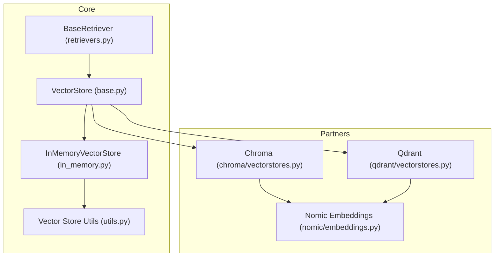
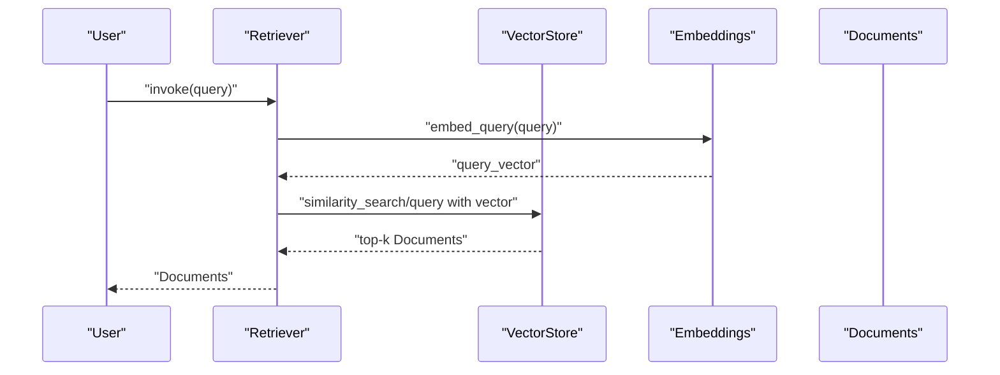
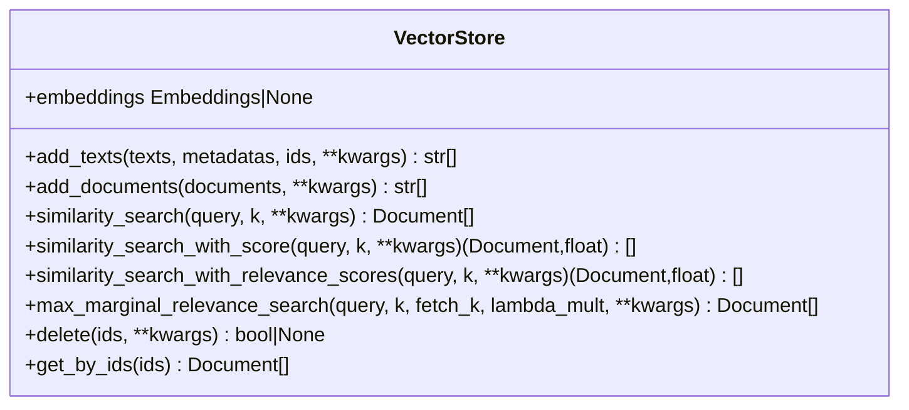
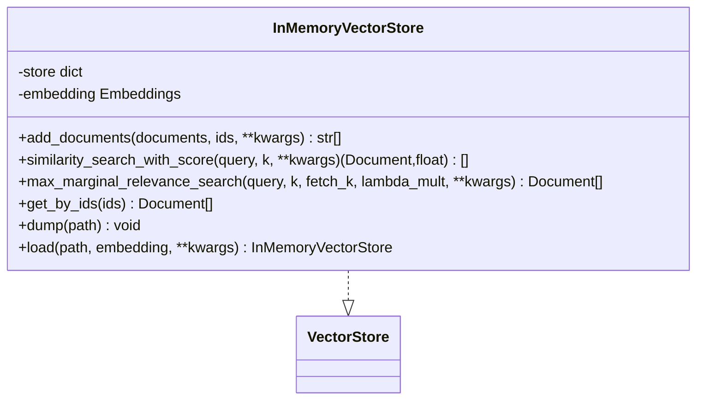
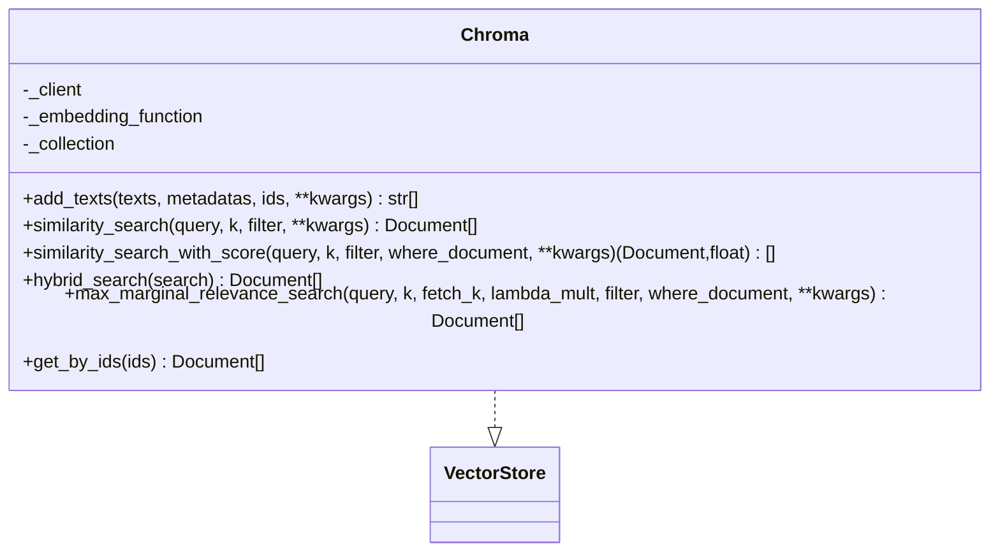
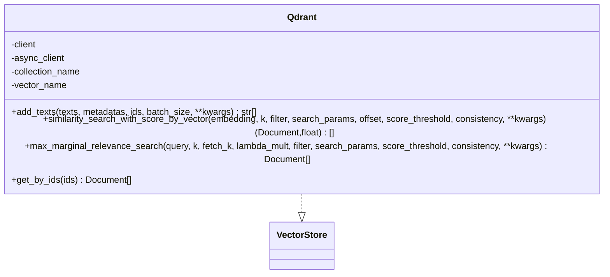
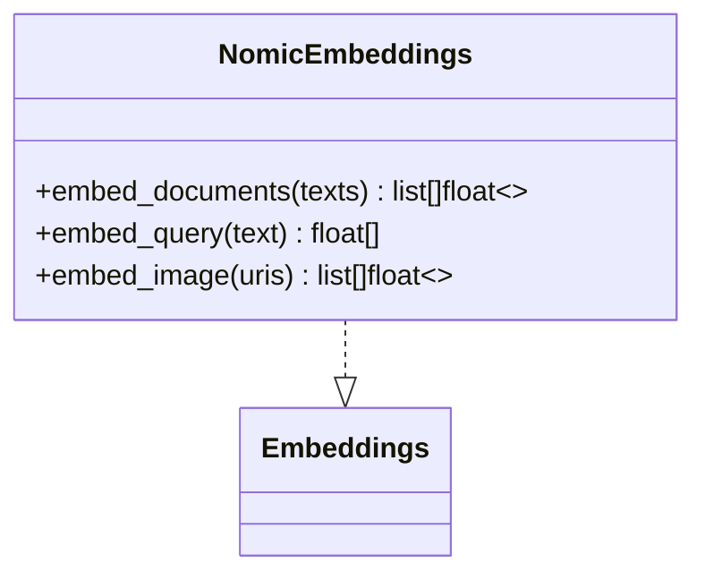
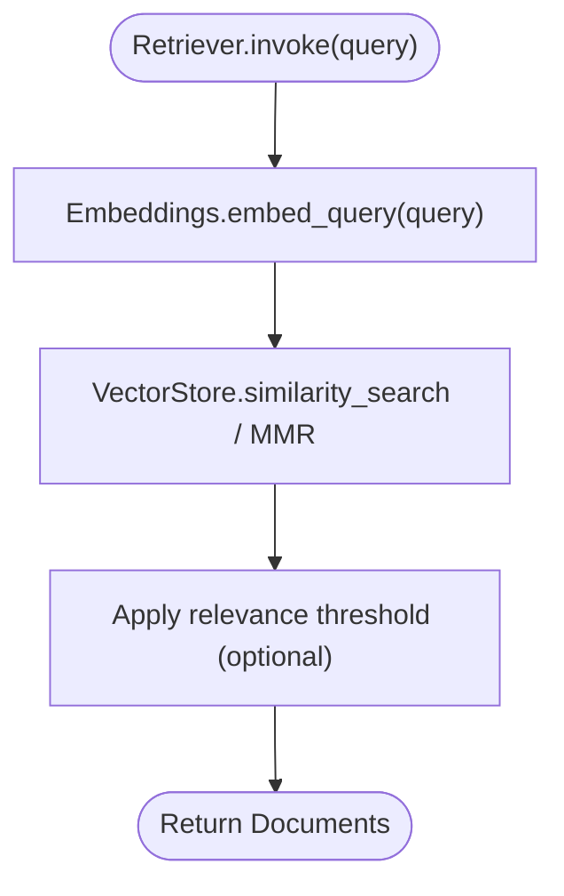
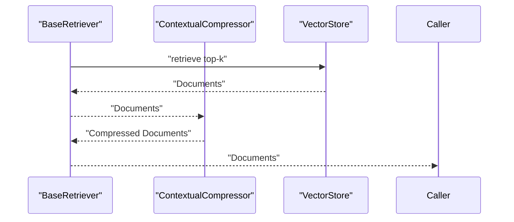
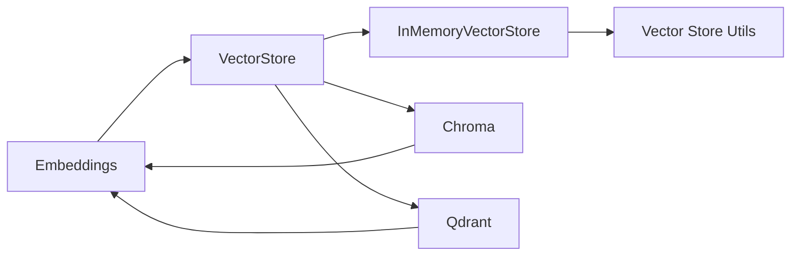

# Vector Stores and Retrieval

<cite>
**Referenced Files in This Document**
- [vectorstores/__init__.py](file://libs/core/langchain_core/vectorstores/__init__.py)
- [vectorstores/base.py](file://libs/core/langchain_core/vectorstores/base.py)
- [vectorstores/in_memory.py](file://libs/core/langchain_core/vectorstores/in_memory.py)
- [vectorstores/utils.py](file://libs/core/langchain_core/vectorstores/utils.py)
- [retrievers.py](file://libs/core/langchain_core/retrievers.py)
- [chroma/vectorstores.py](file://libs/partners/chroma/langchain_chroma/vectorstores.py)
- [qdrant/vectorstores.py](file://libs/partners/qdrant/langchain_qdrant/vectorstores.py)
- [nomic/embeddings.py](file://libs/partners/nomic/langchain_nomic/embeddings.py)
</cite>

## Table of Contents
1. [Introduction](#introduction)
2. [Project Structure](#project-structure)
3. [Core Components](#core-components)
4. [Architecture Overview](#architecture-overview)
5. [Detailed Component Analysis](#detailed-component-analysis)
6. [Dependency Analysis](#dependency-analysis)
7. [Performance Considerations](#performance-considerations)
8. [Troubleshooting Guide](#troubleshooting-guide)
9. [Conclusion](#conclusion)
10. [Appendices](#appendices)

## Introduction
This document explains LangChain’s vector store and retrieval system with a focus on:
- Vector store concepts and how they enable semantic search and retrieval-augmented generation (RAG)
- The vector store abstraction and supported providers (including in-memory, Chroma, Qdrant, and others)
- Retrieval strategies (similarity search, hybrid search, and contextual compression)
- Embedding integration, index management, and query optimization
- The retriever system and how it connects vector stores to LLM applications
- Practical examples, scaling, backup strategies, and maintenance procedures
- Guidance for choosing vector stores and implementing custom integrations

## Project Structure
LangChain organizes vector store abstractions and implementations across core and partner libraries:
- Core vector store abstractions live under langchain_core
- Provider-specific implementations live under langchain_* packages in the partners directory
- Retrievers are defined in langchain_core and used to wrap vector stores

**Diagram sources**
- [vectorstores/base.py](file://libs/core/langchain_core/vectorstores/base.py#L43-L800)
- [vectorstores/in_memory.py](file://libs/core/langchain_core/vectorstores/in_memory.py#L34-L547)
- [retrievers.py](file://libs/core/langchain_core/retrievers.py#L55-L329)
- [vectorstores/utils.py](file://libs/core/langchain_core/vectorstores/utils.py#L35-L158)
- [chroma/vectorstores.py](file://libs/partners/chroma/langchain_chroma/vectorstores.py#L155-L1460)
- [qdrant/vectorstores.py](file://libs/partners/qdrant/langchain_qdrant/vectorstores.py#L1-L800)
- [nomic/embeddings.py](file://libs/partners/nomic/langchain_nomic/embeddings.py#L13-L150)

**Section sources**
- [vectorstores/__init__.py](file://libs/core/langchain_core/vectorstores/__init__.py#L1-L54)
- [vectorstores/base.py](file://libs/core/langchain_core/vectorstores/base.py#L43-L800)
- [vectorstores/in_memory.py](file://libs/core/langchain_core/vectorstores/in_memory.py#L34-L547)
- [retrievers.py](file://libs/core/langchain_core/retrievers.py#L55-L329)
- [vectorstores/utils.py](file://libs/core/langchain_core/vectorstores/utils.py#L35-L158)
- [chroma/vectorstores.py](file://libs/partners/chroma/langchain_chroma/vectorstores.py#L155-L1460)
- [qdrant/vectorstores.py](file://libs/partners/qdrant/langchain_qdrant/vectorstores.py#L1-L800)
- [nomic/embeddings.py](file://libs/partners/nomic/langchain_nomic/embeddings.py#L13-L150)

## Core Components
- VectorStore: Defines the canonical interface for storing and querying embeddings, including add_texts/add_documents, similarity search, MMR, relevance scoring, and async variants.
- InMemoryVectorStore: A lightweight, dictionary-backed implementation suitable for development and small datasets.
- BaseRetriever: A generic retriever interface that can wrap vector stores and other retrieval mechanisms.
- VectorStoreRetriever: A concrete retriever adapter that bridges VectorStore instances to the retriever interface, enabling standardized retrieval workflows.

Key capabilities:
- Indexing: add_texts, add_documents, get_by_ids, delete
- Retrieval: similarity_search, similarity_search_with_score, similarity_search_with_relevance_scores, max_marginal_relevance_search, and async equivalents
- Relevance scoring normalization and threshold filtering
- Integration with Embeddings for query and document vectorization

**Section sources**
- [vectorstores/base.py](file://libs/core/langchain_core/vectorstores/base.py#L43-L800)
- [vectorstores/in_memory.py](file://libs/core/langchain_core/vectorstores/in_memory.py#L34-L547)
- [retrievers.py](file://libs/core/langchain_core/retrievers.py#L55-L329)

## Architecture Overview
The retrieval pipeline connects user queries to relevant documents via embeddings and vector stores, optionally filtered and compressed.

**Diagram sources**
- [retrievers.py](file://libs/core/langchain_core/retrievers.py#L178-L295)
- [vectorstores/base.py](file://libs/core/langchain_core/vectorstores/base.py#L360-L784)
- [vectorstores/in_memory.py](file://libs/core/langchain_core/vectorstores/in_memory.py#L358-L416)

## Detailed Component Analysis

### VectorStore Abstraction
The VectorStore defines a unified interface for:
- Adding data: add_texts/add_documents with optional IDs and metadata
- Deleting and fetching by ID
- Similarity search and MMR
- Relevance scoring normalization and threshold filtering
- Async variants for all operations

Important behaviors:
- Relevance score normalization depends on the underlying store’s distance metric
- Threshold filtering ensures only sufficiently relevant results are returned
- Async wrappers delegate to sync implementations when async methods are not overridden

**Diagram sources**
- [vectorstores/base.py](file://libs/core/langchain_core/vectorstores/base.py#L43-L800)

**Section sources**
- [vectorstores/base.py](file://libs/core/langchain_core/vectorstores/base.py#L43-L800)

### InMemoryVectorStore
A dictionary-backed implementation that:
- Stores vectors and metadata keyed by IDs
- Computes cosine similarity using numpy
- Supports filters for retrieval
- Provides MMR via a dedicated function
- Offers persistence via dump/load

**Diagram sources**
- [vectorstores/in_memory.py](file://libs/core/langchain_core/vectorstores/in_memory.py#L34-L547)

**Section sources**
- [vectorstores/in_memory.py](file://libs/core/langchain_core/vectorstores/in_memory.py#L34-L547)
- [vectorstores/utils.py](file://libs/core/langchain_core/vectorstores/utils.py#L35-L158)

### Chroma Vector Store
Chroma integration supports:
- Multiple client modes: local persistent, HTTP client, and cloud client
- Text and image embedding ingestion
- Metadata filtering and document content filtering
- Hybrid search using dense/sparse embeddings
- MMR and relevance scoring normalization based on collection distance metric

**Diagram sources**
- [chroma/vectorstores.py](file://libs/partners/chroma/langchain_chroma/vectorstores.py#L155-L1200)

**Section sources**
- [chroma/vectorstores.py](file://libs/partners/chroma/langchain_chroma/vectorstores.py#L155-L1200)

### Qdrant Vector Store
Qdrant integration supports:
- Local and remote clients, REST/gRPC
- Rich filtering and pagination
- Score thresholds and read consistency
- MMR and hybrid fusion strategies
- Batched upserts and async helpers

**Diagram sources**
- [qdrant/vectorstores.py](file://libs/partners/qdrant/langchain_qdrant/vectorstores.py#L1-L800)

**Section sources**
- [qdrant/vectorstores.py](file://libs/partners/qdrant/langchain_qdrant/vectorstores.py#L1-L800)

### Embeddings Integration
Embeddings are central to vectorization:
- Nomic embeddings support remote, local, and dynamic inference modes with task-specific embedding calls
- Vector stores rely on Embeddings to produce query and document vectors

**Diagram sources**
- [nomic/embeddings.py](file://libs/partners/nomic/langchain_nomic/embeddings.py#L13-L150)

**Section sources**
- [nomic/embeddings.py](file://libs/partners/nomic/langchain_nomic/embeddings.py#L13-L150)

### Retrievers and Retrieval Strategies
Retrievers standardize retrieval:
- BaseRetriever defines the runnable interface and callback integration
- VectorStoreRetriever adapts VectorStore to the retriever interface
- Supported strategies:
  - similarity: nearest neighbors by vector distance
  - similarity_score_threshold: similarity with a relevance threshold
  - mmr: maximize relevance while encouraging diversity

**Diagram sources**
- [retrievers.py](file://libs/core/langchain_core/retrievers.py#L178-L295)
- [vectorstores/base.py](file://libs/core/langchain_core/vectorstores/base.py#L293-L784)

**Section sources**
- [retrievers.py](file://libs/core/langchain_core/retrievers.py#L55-L329)
- [vectorstores/base.py](file://libs/core/langchain_core/vectorstores/base.py#L293-L784)

### Contextual Compression
Contextual compression reduces retrieved documents to the most relevant subset given the query:
- Wrap a base retriever with a compressor to filter or reorder results
- Supports both sync and async compression

**Diagram sources**
- [retrievers.py](file://libs/core/langchain_core/retrievers.py#L178-L295)

**Section sources**
- [retrievers.py](file://libs/core/langchain_core/retrievers.py#L55-L329)

## Dependency Analysis
Vector store implementations depend on:
- Embeddings for vectorization
- External clients (Chroma, Qdrant) for indexing and querying
- Utility modules for similarity and MMR computations

**Diagram sources**
- [vectorstores/base.py](file://libs/core/langchain_core/vectorstores/base.py#L43-L800)
- [vectorstores/in_memory.py](file://libs/core/langchain_core/vectorstores/in_memory.py#L34-L547)
- [chroma/vectorstores.py](file://libs/partners/chroma/langchain_chroma/vectorstores.py#L155-L1200)
- [qdrant/vectorstores.py](file://libs/partners/qdrant/langchain_qdrant/vectorstores.py#L1-L800)
- [vectorstores/utils.py](file://libs/core/langchain_core/vectorstores/utils.py#L35-L158)
- [nomic/embeddings.py](file://libs/partners/nomic/langchain_nomic/embeddings.py#L13-L150)

**Section sources**
- [vectorstores/base.py](file://libs/core/langchain_core/vectorstores/base.py#L43-L800)
- [vectorstores/in_memory.py](file://libs/core/langchain_core/vectorstores/in_memory.py#L34-L547)
- [chroma/vectorstores.py](file://libs/partners/chroma/langchain_chroma/vectorstores.py#L155-L1200)
- [qdrant/vectorstores.py](file://libs/partners/qdrant/langchain_qdrant/vectorstores.py#L1-L800)
- [vectorstores/utils.py](file://libs/core/langchain_core/vectorstores/utils.py#L35-L158)
- [nomic/embeddings.py](file://libs/partners/nomic/langchain_nomic/embeddings.py#L13-L150)

## Performance Considerations
- Indexing
  - Batch uploads where supported (e.g., Qdrant batch_size)
  - Prefer sparse/dense hybrid strategies for recall and speed trade-offs (Chroma hybrid_search)
- Query optimization
  - Use relevance thresholds to prune low-similarity results
  - Apply filters to reduce candidate sets (metadata/document filters)
  - MMR improves diversity and reduces redundancy
- Embedding caching
  - Cache embeddings to avoid recomputation across runs
- Hardware acceleration
  - Use simsimd-compatible similarity when available for faster cosine similarity
  - Prefer GPU-backed embeddings for large-scale workloads

[No sources needed since this section provides general guidance]

## Troubleshooting Guide
Common issues and resolutions:
- Missing or mismatched IDs during add_documents/add_texts
  - Ensure IDs match the number of texts/metadatas or omit to auto-generate
- Relevance score normalization errors
  - Verify the underlying store’s distance metric and provide a relevance_score_fn if needed
- MMR dependency errors
  - Install numpy for MMR computation in in-memory and Chroma stores
- Chroma metadata validation
  - Complex metadata may require filtering before upsert; see Chroma store error guidance
- Qdrant local async limitations
  - Some local async clients are not interoperable; use appropriate client combinations

**Section sources**
- [vectorstores/base.py](file://libs/core/langchain_core/vectorstores/base.py#L43-L800)
- [vectorstores/in_memory.py](file://libs/core/langchain_core/vectorstores/in_memory.py#L435-L448)
- [chroma/vectorstores.py](file://libs/partners/chroma/langchain_chroma/vectorstores.py#L560-L577)
- [qdrant/vectorstores.py](file://libs/partners/qdrant/langchain_qdrant/vectorstores.py#L208-L212)

## Conclusion
LangChain’s vector store and retrieval system provides a robust, extensible foundation for semantic search and RAG:
- The VectorStore abstraction unifies indexing and querying across providers
- Built-in strategies (similarity, MMR, relevance thresholds) and contextual compression enable precise, efficient retrieval
- Integrations with Chroma and Qdrant offer scalable production deployments, while InMemoryVectorStore supports rapid iteration
- Proper embedding integration, index tuning, and retriever configuration are essential for performance and reliability

[No sources needed since this section summarizes without analyzing specific files]

## Appendices

### Practical Examples and Patterns
- Building a retrieval pipeline
  - Initialize an Embeddings model and a VectorStore
  - Add documents via add_documents or add_texts
  - Configure a retriever (VectorStoreRetriever) with desired search_type and search_kwargs
  - Invoke the retriever with a query to obtain relevant documents
- Choosing a vector store
  - InMemoryVectorStore: small datasets, local development, fast iteration
  - Chroma: flexible, metadata filtering, hybrid search, image ingestion
  - Qdrant: advanced filtering, pagination, consistency controls, hybrid fusion
- Scaling and maintenance
  - Use batched upserts and pagination
  - Persist and snapshot vector stores where applicable
  - Monitor embedding latency and cache aggressively
  - Tune k, fetch_k, and lambda_mult for MMR to balance recall and diversity

[No sources needed since this section provides general guidance]